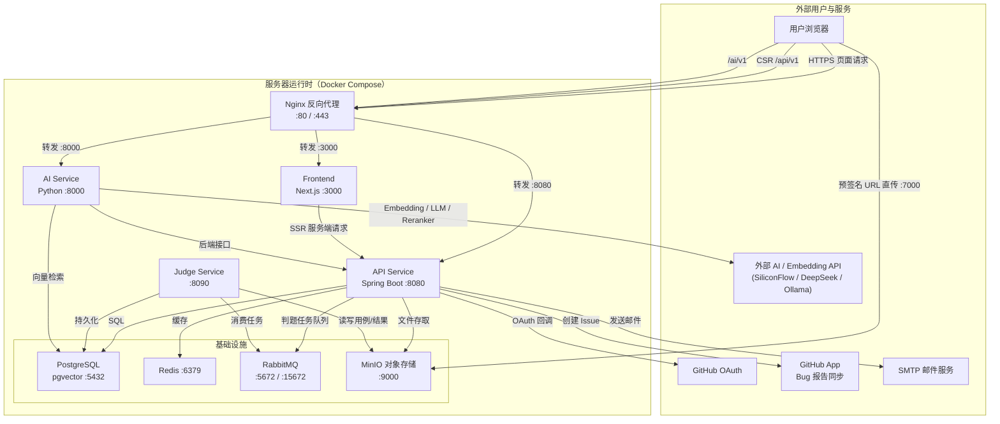

# 技术架构

## 前端技术栈

| 技术 | 版本 | 说明 |
|------|------|------|
| React | 19.2.0 | UI 框架 |
| Next.js | 15.1.0 | 全栈框架，支持 SSR/ISR |
| TypeScript | 5.9.3 | 类型安全 |
| Ant Design | 6.3.0 | UI 组件库 |
| Zustand | 5.0.11 | 状态管理 |
| Axios | 1.13.5 | HTTP 客户端 |
| pnpm | 9.15.0 | 包管理器 |

## 后端技术栈

| 技术 | 版本 | 说明 |
|------|------|------|
| Java | 21 | 编程语言 |
| Spring Boot | 3.5.10 | 后端框架 |
| Spring Security | - | 安全框架 |
| Spring Data Redis | - | 缓存支持 |
| Spring Validation | - | 参数校验 |
| Spring AOP | - | 切面编程 |
| JWT (jjwt) | 0.12.5 | 认证令牌 |
| MyBatis-Plus | 3.5.7 | ORM 框架 |
| MinIO / 阿里云 OSS | - | 对象存储 |
| PostgreSQL | - | 关系数据库 |

## DDD 四层架构

后端采用 DDD 分层架构：

```
api/              # API 层：Controller、DTO、Converter
application/      # 应用层：Service、Command、Result、编排
domain/           # 领域层：Entity、Repository 接口、DomainService、VO
infrastructure/   # 基础设施层：RepositoryImpl、Mapper、Config、外部客户端
```

层间返回类型约定见 [03-05-层间约定](../03-开发指南/03-05-层间约定.md)。

## 运行时架构

下图展示服务器运行时架构与核心通信链路（不含 CI/CD，CI/CD 详见 [04-03-CI-CD自动部署](../04-运维部署/04-03-CI-CD自动部署.md)）。AI 服务请求在生产环境通过 Nginx 反向代理到 `/ai/v1`，与 `/api/v1` 统一入口；本地开发可按配置直连 `ai-service:8000`。



## 相关文档

- [02-01-项目简介](./02-01-项目简介.md)
- [02-03-核心模块](./02-03-核心模块.md)
- [03-02-后端开发规范](../03-开发指南/03-02-后端开发规范.md)
- [04-03-CI-CD自动部署](../04-运维部署/04-03-CI-CD自动部署.md)
