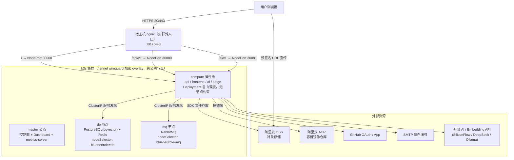
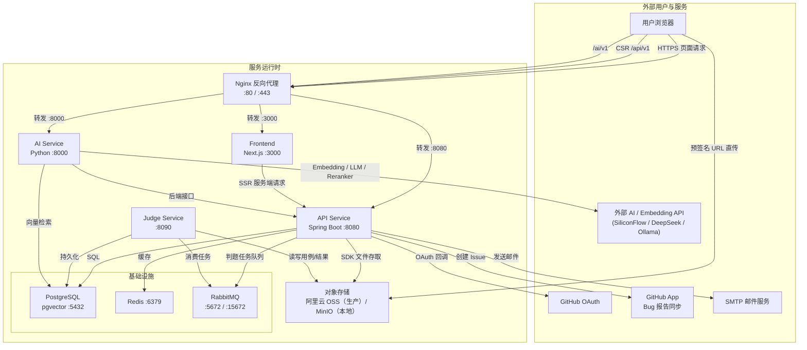

# 技术架构

## 前端技术栈

| 技术 | 版本 | 说明 |
|------|------|------|
| React | 19.2.0 | UI 框架 |
| Next.js | 15.1.0 | 全栈框架，支持 SSR/ISR |
| TypeScript | 5.9.3 | 类型安全 |
| Ant Design | 6.3.0 | UI 组件库 |
| Zustand | 5.0.11 | 状态管理 |
| Axios | 1.13.5 | HTTP 客户端 |
| pnpm | 9.15.0 | 包管理器 |

## 后端技术栈

| 技术 | 版本 | 说明 |
|------|------|------|
| Java | 21 | 编程语言 |
| Spring Boot | 3.5.10 | 后端框架 |
| Spring Security | - | 安全框架 |
| Spring Data Redis | - | 缓存支持 |
| Spring Validation | - | 参数校验 |
| Spring AOP | - | 切面编程 |
| JWT (jjwt) | 0.12.5 | 认证令牌 |
| MyBatis-Plus | 3.5.7 | ORM 框架 |
| MinIO / 阿里云 OSS | - | 对象存储 |
| PostgreSQL | - | 关系数据库 |

## DDD 四层架构

后端采用 DDD 分层架构：

```
api/              # API 层：Controller、DTO、Converter
application/      # 应用层：Service、Command、Result、编排
domain/           # 领域层：Entity、ReadModel、Repository 接口、DomainService、值对象
infrastructure/   # 基础设施层：RepositoryImpl、Mapper、Config、外部客户端
```

层间返回类型约定见 [03-05-层间约定](../03-开发指南/03-05-层间约定.md)。

## 集群架构

生产环境采用 **k3s 集群 + Helm 部署**（从零搭建手册见 [deploy/CLUSTER-SETUP.md](../../deploy/CLUSTER-SETUP.md)）。集群不关心业务服务（api / frontend / ai / judge）落在哪个节点——它们作为 Deployment 无约束自由调度；**只有持久化服务（PostgreSQL / Redis / RabbitMQ）通过 `nodeSelector` 绑定节点**。对象存储使用阿里云 OSS，不自建 MinIO。

下图展示 k3s 集群内部节点角色、对外暴露端口与外部资源的网络拓扑：


```mermaid
flowchart TB
    Browser["用户浏览器"]

    subgraph Cluster["k3s 集群（flannel wireguard 加密 overlay，跨公网节点）"]
        Master["master 节点<br/>控制面 + Dashboard + metrics-server"]
        DbNode["db 节点<br/>PostgreSQL(pgvector) + Redis<br/>nodeSelector: bluenet/role=db"]
        MqNode["mq 节点<br/>RabbitMQ<br/>nodeSelector: bluenet/role=mq"]
        Compute["compute 弹性池<br/>api / frontend / ai / judge<br/>Deployment 自由调度，无节点约束"]
    end

    Nginx["宿主机 nginx（集群外入口）<br/>:80 / :443"]

    subgraph External["外部资源"]
        OSS["阿里云 OSS<br/>对象存储"]
        ACR["阿里云 ACR<br/>容器镜像仓库"]
        GitHub["GitHub OAuth / App"]
        SMTP["SMTP 邮件服务"]
        ExtAI["外部 AI / Embedding API<br/>(SiliconFlow / DeepSeek / Ollama)"]
    end

    Browser -->|"HTTPS 80/443"| Nginx
    Nginx -->|"/ → NodePort 30000"| Compute
    Nginx -->|"/api/v1 → NodePort 30080"| Compute
    Nginx -->|"/ai/v1 → NodePort 30081"| Compute
    Browser -->|"预签名 URL 直传"| OSS

    Compute -->|"ClusterIP 服务发现"| DbNode
    Compute -->|"ClusterIP 服务发现"| MqNode
    Compute -->|"SDK 文件存取"| OSS
    Compute -->|"拉镜像"| ACR
    Compute --> GitHub
    Compute --> SMTP
    Compute --> ExtAI
```

对外暴露端口（云安全组层面）：

| 端口 | 来源 | 用途 |
|------|------|------|
| 80/443 TCP | 0.0.0.0/0 | 宿主机 nginx 公网业务入口 |
| 6443 TCP | 运维 IP | k3s API |
| 51820 UDP | 集群节点互指 | flannel wireguard 隧道 |
| 30000–32767 TCP | 仅 nginx 节点 IP | NodePort（不直接对公网开放） |
| 22 TCP | 运维 IP | SSH |

> PostgreSQL / Redis / RabbitMQ 端口不对公网开放，仅通过集群内 ClusterIP 访问。

## 服务架构

下图展示服务组成与服务间通信链路（逻辑视图，不含具体服务器分布；CI/CD 流程详见 [04-03-CI-CD自动部署](../04-运维部署/04-03-CI-CD自动部署.md)）。AI 服务请求在生产环境通过 Nginx 反向代理到 `/ai/v1`，与 `/api/v1` 统一入口；本地开发可按配置直连 `ai-service:8000`。


```mermaid
flowchart TB
    subgraph External["外部用户与服务"]
        Browser["用户浏览器"]
        GitHubOAuth["GitHub OAuth"]
        GitHubApp["GitHub App<br/>Bug 报告同步"]
        SMTP["SMTP 邮件服务"]
        ExtAI["外部 AI / Embedding API<br/>(SiliconFlow / DeepSeek / Ollama)"]
    end

    subgraph Runtime["服务运行时"]
        Nginx["Nginx 反向代理<br/>:80 / :443"]
        Frontend["Frontend<br/>Next.js :3000"]
        Backend["API Service<br/>Spring Boot :8080"]
        Judge["Judge Service<br/>:8090"]
        AI["AI Service<br/>Python :8000"]

        subgraph Infra["基础设施"]
            DB["PostgreSQL<br/>pgvector :5432"]
            Redis["Redis :6379"]
            RabbitMQ["RabbitMQ<br/>:5672 / :15672"]
        end

        OSS["对象存储<br/>阿里云 OSS（生产）/ MinIO（本地）"]
    end

    Browser -->|"HTTPS 页面请求"| Nginx
    Nginx -->|"转发 :3000"| Frontend
    Browser -->|"CSR /api/v1"| Nginx
    Nginx -->|"转发 :8080"| Backend
    Browser -->|"预签名 URL 直传"| OSS
    Browser -->|"/ai/v1"| Nginx
    Nginx -->|"转发 :8000"| AI

    Frontend -->|"SSR 服务端请求"| Backend

    Backend -->|"SQL"| DB
    Backend -->|"缓存"| Redis
    Backend -->|"判题任务队列"| RabbitMQ
    Backend -->|"SDK 文件存取"| OSS
    Backend -->|"OAuth 回调"| GitHubOAuth
    Backend -->|"创建 Issue"| GitHubApp
    Backend -->|"发送邮件"| SMTP

    Judge -->|"消费任务"| RabbitMQ
    Judge -->|"读写用例/结果"| OSS
    Judge -->|"持久化"| DB

    AI -->|"向量检索"| DB
    AI -->|"后端接口"| Backend
    AI -->|"Embedding / LLM / Reranker"| ExtAI
```

## 相关文档

- [02-01-项目简介](./02-01-项目简介.md)
- [02-03-核心模块](./02-03-核心模块.md)
- [03-02-后端开发规范](../03-开发指南/03-02-后端开发规范.md)
- [04-03-CI-CD自动部署](../04-运维部署/04-03-CI-CD自动部署.md)
