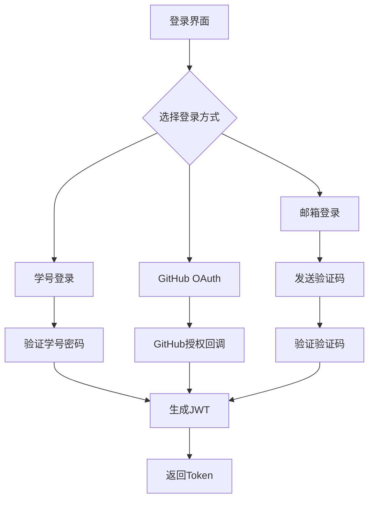
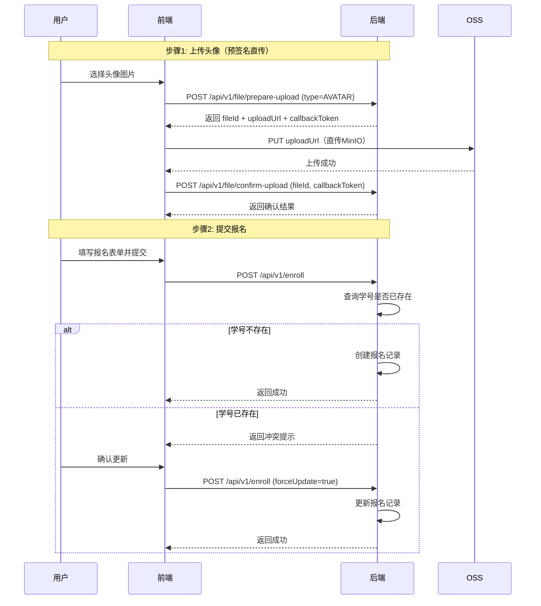
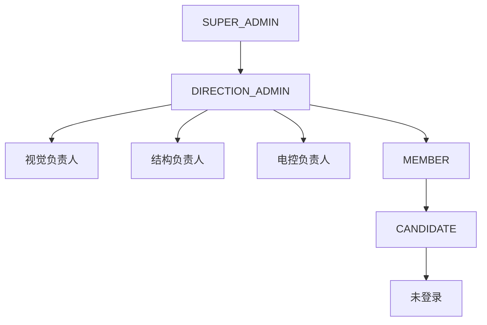

# 后端开发规范

## 技术栈

| 技术 | 版本 | 说明 |
|------|------|------|
| Java | 21 | 编程语言 |
| Spring Boot | 3.5.10 | 后端框架 |
| Spring Security | - | 安全框架 |
| Spring Data Redis | - | 缓存支持 |
| Spring Validation | - | 参数校验 |
| Spring AOP | - | 切面编程 |
| JWT (jjwt) | 0.12.5 | 认证令牌 |
| MyBatis-Plus | 3.5.7 | ORM 框架 |
| MinIO / 阿里云 OSS | - | 对象存储 |
| PostgreSQL | - | 关系数据库 |

## DDD 项目结构

```
src/backend/src/main/java/com/bluenet/web/
├── api/                          # API层（接口适配层）
│   ├── controller/               # 控制器
│   │   └── v1/
│   ├── converter/                # API层转换器（RequestDTO → Command）
│   └── dto/                      # 数据传输对象
├── application/                  # 应用层（用例层）
│   ├── command/                  # 命令对象（写操作参数，按聚合分包）
│   ├── query/                    # 查询参数（读操作参数）
│   ├── result/                   # 应用层结果对象
│   ├── message/                  # 消息相关
│   └── service/                  # 应用服务
├── domain/                       # 领域层（核心业务层）
│   ├── exception/                # 领域异常
│   ├── model/
│   │   ├── entity/               # 实体类
│   │   ├── enumerate/            # 枚举类
│   │   ├── readmodel/            # 读模型
│   │   ├── result/               # 领域结果对象
│   │   └── vo/                   # 值对象（无 *VO 后缀）
│   ├── repository/               # 仓储接口
│   └── service/                  # 领域服务
├── infrastructure/               # 基础设施层
│   ├── config/                   # 配置类
│   ├── repository/               # 仓储实现
│   │   ├── converter/            # 仓储转换器
│   │   ├── impl/                 # 仓储实现
│   │   └── mapper/               # MyBatis Mapper
│   └── security/                 # 安全相关
└── BluenetBackendApplication.java
```

## 分层职责

| 层级 | 职责 |
|------|------|
| API 层 | 接收请求、参数校验、DTO 转换、返回响应 |
| 应用层 | 编排业务用例、对象转换、消息处理、事务边界 |
| 领域层 | 核心业务逻辑、领域规则、实体管理 |
| 基础设施层 | 技术实现、外部依赖集成 |

## 功能模块

### 1. 认证模块

**登录方式**：
- 学号 + 密码登录
- 邮箱验证码登录
- GitHub OAuth 登录

**认证流程**：


### 2. 报名模块

**报名流程**：


**报名状态**：

| 状态 | 说明 |
|------|------|
| pending | 待审核 |
| approved | 已通过 |
| rejected | 已拒绝 |

### 3. 文件模块

#### 文件分类体系

| 枚举值 | 存储值 | 描述 | 对象 Key 前缀 | 权限控制 |
|--------|--------|------|--------------|----------|
| `AVATAR` | `avatar` | 用户头像 | `avatar/` | 团队成员可见或本人头像 |
| `NORMAL_IMG` | `normal-img` | 普通图片 | `normal-img/` | 公开可见 |
| `ASSESSMENT_ATTACHMENT` | `assessment-attachment` | 考题附件 | `assessment-attachment/` | 同方向用户可见 |
| `WORK` | `work` | 考生作品文件 | `work/` | 本人或团队成员可见 |
| `QRCODE` | `qrcode` | 二维码图片 | `qrcode/` | 公开可见 |

#### 文件存储结构

```
对象存储 bucket（storage.bucket）
├── avatar/
│   └── avatar-{uuid}.jpg
├── normal-img/
│   └── normal_img-{uuid}.jpg
├── assessment-attachment/
│   └── assessment_attachment-{uuid}.pdf
├── work/
│   └── work-{uuid}.zip
└── qrcode/
    └── qrcode-{uuid}.png
```

#### 文件命名规则

- **格式**：`{fileType}-{uuid}.{ext}`
- **示例**：`avatar-123e4567-e89b-12d3-a456-426614174000.jpg`
- 文件名中的 fileType 使用枚举名称的小写形式（如 `normal_img`），对象 Key 前缀使用 `FileType.getValue()`（如 `normal-img`）

#### 文件上传接口（预签名直传）

| 步骤 | 接口 | 路径 | 说明 |
|------|------|------|------|
| 1 | 预签名上传准备 | `POST /api/v1/file/prepare-upload` | 生成预签名 PUT URL 和回调令牌 |
| 2 | 直传 OSS | `PUT {uploadUrl}` | 前端直接上传文件到对象存储 |
| 3 | 上传确认 | `POST /api/v1/file/confirm-upload` | 前端回调后端，校验文件并激活记录 |

说明：
- `prepare-upload` 时指定文件类型、文件名、Content-Type、文件大小
- 返回 `fileId`、`uploadUrl`、`callbackToken`
- `AVATAR` 和 `NORMAL_IMG` 类型允许匿名上传
- 旧的 `POST /api/v1/file/upload` 接口已废弃

#### 文件下载接口

- `GET /api/v1/file/download/{fileId}` — 统一下载接口，自动根据文件类型进行权限验证

### 4. 成员模块

- 基本信息（姓名、方向、职责）
- 微信二维码
- GitHub 链接
- 项目经历、竞赛获奖、实习经历

### 5. 考核模块

**考核结构**：
```
方向（计算机视觉/结构设计/嵌入式开发）
├── 轮次（一轮/二轮）
│   ├── 入学年份
│   │   ├── 题目列表
```

**题目类型**：

| 类型 | 说明 |
|------|------|
| file_upload | 文件上传题 |
| algorithm | 算法题 |
| single_choice | 单选题 |
| multiple_choice | 多选题 |

**考核时间属性**：

| 属性 | 说明 |
|------|------|
| `timeLimit` | 是否限时考核 |
| `timeLimitMinutes` | 限时分钟数 |
| `allowTeam` | 是否允许组队答题 |
| `resultsPublishedAt` | 考核结果发布时间 |

### 6. 考核队伍模块

- 创建队伍：当前用户自动成为队长，生成 6 位邀请码
- 加入队伍：通过邀请码加入
- 离开队伍：成员可离开，队长不能离开
- 转让队长
- 解散队伍：仅队长可操作

### 7. 算法判题模块

- 基于 RabbitMQ 异步分发判题任务
- 交换机：`algorithm.judge`（DirectExchange）
- 队列：`algorithm.judge.formal`、`algorithm.judge.run`、`algorithm.judge.test-data`
- 流程：Run → Submit → Poll

### 8. Bug 报告模块

- 任何人可提交（无需登录），支持最多 3 张截图
- 可选同步到 GitHub Issue
- 管理员可查看、更新状态

## 角色权限

### 角色层级



### 权限说明

| 角色 | 权限范围 |
|------|----------|
| SUPER_ADMIN | 所有权限，可管理所有方向 |
| DIRECTION_ADMIN | 管理对应方向的考核时间、题目 |
| MEMBER | 查看报名、评论评分 |
| CANDIDATE | 参加考核、查看自己成绩 |

## API 接口

所有接口以 `/api/v1` 为前缀。详细接口列表参考 `diagrams/接口总览.xmind`。

| 模块 | 路径 | 说明 |
|------|------|------|
| 认证 | /auth | 登录、登出 |
| 用户 | /user | 用户信息管理 |
| 消息 | /message | 验证码、消息模板 |
| 文件 | /file | 文件上传下载 |
| 报名 | /enroll | 报名管理 |
| 考核 | /assessment | 考核时间、题目、答案、评判、决策、会话、统计 |
| 考核队伍 | /assessment-teams | 组队答题管理 |
| 算法判题 | /algorithm-judge | 算法题运行、提交、轮询 |
| Bug 报告 | /bug-reports | Bug 提交与跟踪 |
| 审计 | /audit | 日志查询 |

## 开发规范

### Controller 层规范

#### 包结构约定

- 所有 Controller 必须按领域/聚合根放入 `v1/` 下的子包中，`v1` 根包禁止直接存放任何 Controller 文件。
- Admin Controller 统一放在 `v1/admin/` 包下。
- 子包命名使用小写，多个单词直接拼接（如 `learningpath`、`bugreport`）。

#### 类命名约定

| 类型 | 命名规则 | 示例 |
|------|----------|------|
| 控制器 | `XxxController.java` | `MemberController.java` |
| 管理端控制器 | `AdminXxxController.java` | `AdminEnrollController.java` |

#### 异常处理约定

- Controller 层方法**禁止**自行 try-catch 并返回 `ResponseMessage.error()`。
- 所有业务异常统一交由 `@ControllerAdvice`（`GlobalExceptionHandler`）处理。
- 仅允许在需要返回非 200 HTTP 状态码的场景中使用 try-catch + `ResponseEntity`。

✅ 正确示例：
```java
@GetMapping("/{id}")
public ResponseMessage<MemberDTO> getMember(@PathVariable Long id) {
    MemberResult result = memberAppService.getMemberById(id);
    return ResponseMessage.success(memberResponseConverter.toDTO(result));
}
```

❌ 错误示例：
```java
@GetMapping("/{id}")
public ResponseMessage<MemberDTO> getMember(@PathVariable Long id) {
    try {
        MemberResult result = memberAppService.getMemberById(id);
        return ResponseMessage.success(memberResponseConverter.toDTO(result));
    } catch (DataNotFound e) {
        return ResponseMessage.error(404, e.getMessage());  // 不要这样做
    }
}
```

### 类命名规范

| 类型 | 命名规则 | 示例 |
|------|----------|------|
| 应用服务接口 | `XxxAppService.java` | `MemberAppService.java` |
| 应用服务实现 | `XxxAppServiceImpl.java` | `MemberAppServiceImpl.java` |
| 领域服务实现 | `XxxDomainServiceImpl.java` | `EnrollDomainServiceImpl.java` |
| 仓储接口 | `XxxRepository.java` | `UserRepository.java` |
| API 请求转换器 | `XxxRequestConverter.java` | `MemberRequestConverter.java` |
| API 响应转换器 | `XxxResponseConverter.java` | `MemberResponseConverter.java` |
| 命令对象 | `XxxCommands.java` | `MemberCommands.java` |
| 查询参数 | `XxxQuery.java` / `GetXxxQuery.java` | `GetMemberListQuery.java` |
| 应用层结果对象 | `XxxResult.java` | `MemberResult.java` |
| 读模型 | `XxxReadModel.java` | `AchievementReadModel.java` |
| Mapper | `XxxMapper.java` | `UserMapper.java` |
| 实体类 | 实体名（PascalCase） | `User.java` |
| 枚举类 | 实体名（PascalCase） | `Direction.java` |
| 值对象 | 语义化名称（**禁止**使用 `*VO` 后缀） | `QuestionContent.java` |
| 配置类 | `XxxConfig.java` / `XxxProperties.java` | `SecurityConfig.java` |
| 异常类 | 描述性名词 | `BadRequest.java`、`DataNotFound.java` |

### DTO 命名规范

| 类型 | 命名规则 | 示例 |
|------|----------|------|
| 请求 DTO | `{动作}{实体}RequestDTO.java` | `CreateEnrollmentRequestDTO.java` |
| 响应 DTO | `{实体}ResponseDTO.java` 或 `{实体}DTO.java` | `UserAuthResponseDTO.java` |
| 列表查询 DTO | `{实体}ListQueryDTO.java` | `EnrollmentListQueryDTO.java` |
| 详情 DTO | `{实体}DetailDTO.java` | `MemberDetailDTO.java` |
| 简要 DTO | `{实体}BriefDTO.java` | `MemberBriefDTO.java` |
| 统计 DTO | `{实体}StatisticsDTO.java` | `EnrollmentStatisticsDTO.java` |
| 分页 DTO | `PageDTO.java` | `PageDTO<T>` |
| 通用响应 | `ResponseMessage.java` | `ResponseMessage<T>` |

### 方法命名规范

| 操作类型 | 方法前缀 | 示例 |
|----------|----------|------|
| 查询单个 | `get` / `find` | `getMemberById()` |
| 查询列表 | `list` / `getAll` | `listMembers()` |
| 分页查询 | `page` / `getPaged` | `pageEnrollments()` |
| 创建 | `create` | `createEnrollment()` |
| 更新 | `update` | `updateProfile()` |
| 删除 | `delete` | `deleteCompetition()` |
| 验证 | `verify` | `verifyEmail()` |
| 提交 | `submit` | `submitAnswer()` |
| 审核 | `approve` / `reject` | `approveEnrollment()` |
| 统计 | `statistics` / `count` | `getEnrollmentStatistics()` |
| 判断存在 | `exists` | `existsByUsername()` |
| 校验 | `validate` / `check` | `validatePermission()` |
| 转换 | `to{目标类型}` | `toDTO()`、`toEntity()` |

### 类型转换链

```
RequestDTO → Command → Entity → Result → ResponseDTO
                  ↑       ↑
              Query   ReadModel
```

| 转换步骤 | 源类型 | 目标类型 | 转换器位置 |
|----------|--------|----------|-----------|
| 1a | `RequestDTO` | `Command` | `api/converter/{aggregate}/XxxRequestConverter.java` |
| 1b | `RequestDTO` / QueryString | `Query` | `api/converter/{aggregate}/XxxRequestConverter.java` |
| 2 | `Command` | `Entity` | `AppServiceImpl` 通过工厂方法 |
| 3 | `DO` ↔ `Entity` | `Entity` ↔ `DO` | `infrastructure/repository/converter/XxxRepositoryConverter.java` |
| 4a | `Entity` | `Application Result` | `AppServiceImpl` 直接构造 |
| 4b | `ReadModel` | `Application Result` | `AppServiceImpl` 直接透传或简单构造 |
| 4c | `Entity` | `Domain Result` | `DomainServiceImpl` 直接构造 |
| 5 | `Result` | `ResponseDTO` | `api/converter/{aggregate}/XxxResponseConverter.java` |

核心规则：
- Repository 接口优先返回 `Entity`；为性能需要在 SQL 层做投影时，可返回 `ReadModel`。
- Repository 接口**禁止**返回 `*VO`、Application `*Result` 等上层对象。
- `infrastructure/repository/converter/` 使用**显式字段映射**，禁止使用 `BeanUtils.copyProperties`。
- API ResponseConverter 的 public 方法**禁止**直接接收 `domain.model.entity` 包下的领域实体参数。

### Entity 行为化规范

```java
@Data
@NoArgsConstructor(access = AccessLevel.PRIVATE)
public class College {
    private Long id;
    private String name;

    private College(Long id, String name) {
        this.id = id;
        this.name = name;
    }

    public static College create(String name) {
        if (name == null || name.isBlank()) throw new IllegalArgumentException("...");
        return new College(null, name.trim());
    }

    public static College reconstruct(Long id, String name) {
        return new College(id, name);
    }

    public void rename(String newName) {
        if (newName == null || newName.isBlank()) throw new IllegalArgumentException("...");
        this.name = newName.trim();
    }
}
```

规范要点：
- 无参构造必须为 `PRIVATE`
- 提供 `create(...)` 工厂方法（构造时校验）
- 提供 `reconstruct(...)` 工厂方法（从数据库重建，跳过校验）
- 领域行为方法直接修改状态
- **禁止在 Entity 中使用 Builder**

### DomainService 保留标准

仅保留含实际业务逻辑的 DomainService：

| 保留的 DomainService | 保留原因 |
|---------------------|---------|
| `AssessmentAnswerDomainService` | 答案提交/更新规则、时间窗口、淘汰判断、团队同步 |
| `AssessmentDecisionDomainService` | 考生最终通过决策算法、跨轮次淘汰规则 |
| `AssessmentJudgementDomainService` | 判题逻辑、评分计算 |
| `AssessmentTeamDomainService` | 组队生命周期规则 |
| `AuthDomainService` | 本地登录校验 |
| `FileDomainService` | 文件存储、关联查询、下载权限校验 |
| `QrcodeDomainService` | 二维码生成、级联删除 |
| `VerificationCodeDomainService` | 验证码生成与校验 |

删除标准：
- 仅做参数透传、直接调用 Repository 的纯代理型 DomainService → 删除
- 业务逻辑已下沉到 Entity 行为方法 → 删除
- 含跨聚合协调、复杂算法、外部服务调用的 → 保留

### 变量命名规范

| 类型 | 命名规则 | 示例 |
|------|----------|------|
| 类成员变量 | camelCase | `memberRoleId` |
| 常量 | UPPER_SNAKE_CASE | `MAX_PAGE_SIZE` |
| 布尔变量 | `is`/`has`/`can` 前缀 | `isActive`、`hasPermission` |
| 集合变量 | 复数形式 | `members` |
| Map 变量 | `xxxMap` 或 `xxxByKey` | `usersById` |

### 数据库命名规范

| 类型 | 命名规则 | 示例 |
|------|----------|------|
| 表名 | `tb_` + 小写下划线 | `tb_user` |
| 字段名 | 小写下划线 | `student_id` |
| 索引名 | `idx_` + 表名 + 字段 | `idx_user_student_id` |
| 外键名 | `fk_` + 表名 + 关联表 | `fk_user_role` |

### 枚举规范

枚举类使用 `@EnumValue` 注解标记存储值，采用**小写下划线**格式：

```java
@Getter
public enum Direction {
    COMPUTER_VISION("computer_vision", "计算机视觉"),
    STRUCTURAL_DESIGN("structural_design", "结构设计"),
    EMBEDDED("embedded", "嵌入式开发");

    @EnumValue
    private final String value;
    private final String description;

    Direction(String value, String description) {
        this.value = value;
        this.description = description;
    }
}
```

| 场景 | 格式 | 示例 |
|------|------|------|
| Java 代码引用 | 大写下划线 | `Direction.COMPUTER_VISION` |
| 数据库存储 | 小写下划线 | `computer_vision` |
| API 请求参数 | 小写下划线 | `?direction=computer_vision` |
| API 响应 JSON | 小写下划线 | `"direction": "computer_vision"` |

项目使用 `EnumConverterFactory` 处理字符串到枚举的转换：优先匹配 `@EnumValue` 值，其次大写匹配，最后不区分大小写匹配。

### API 参数示例

```bash
# 成员列表按方向筛选
GET /api/v1/members?direction=computer_vision

# 报名列表按状态筛选
GET /api/v1/admin/enrollments?status=pending
```

## 相关文档

- [03-01-新人上手](./03-01-新人上手.md)
- [03-04-接口设计规范](./03-04-接口设计规范.md)
- [03-05-层间约定](./03-05-层间约定.md)
- [03-06-数据库规范](./03-06-数据库规范.md)
- [03-07-安全开发规范](./03-07-安全开发规范.md)
- [03-08-测试规范手册](./03-08-测试规范手册.md)
- [05-01-数据库设计](../05-参考手册/05-01-数据库设计.md)
- [diagrams/接口总览.xmind](../diagrams/接口总览.xmind)
