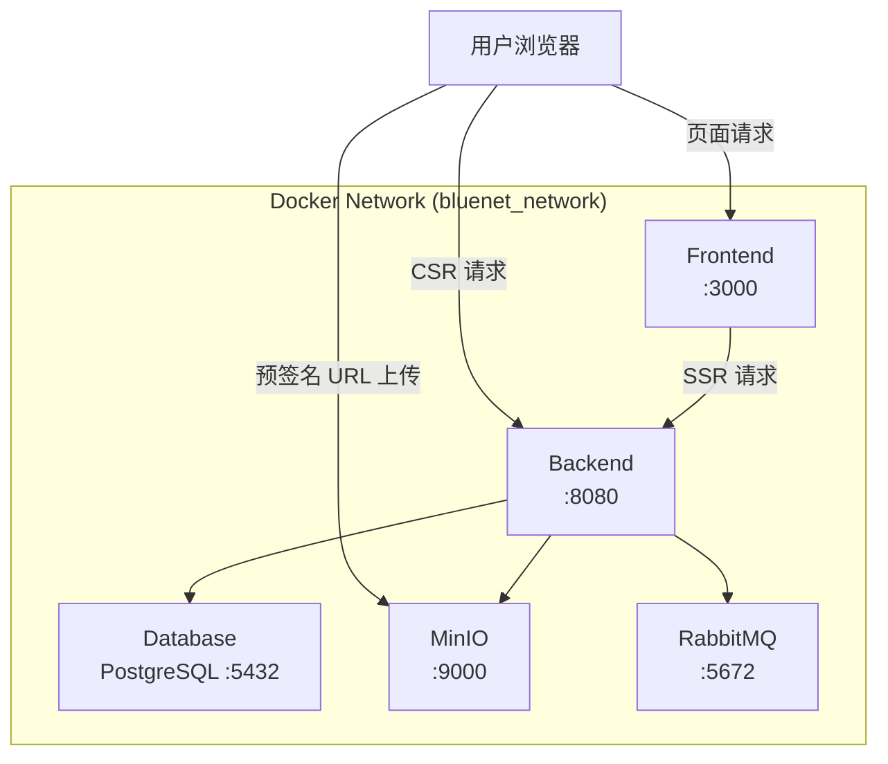

# Docker 部署

## 服务架构



说明：
- SSR 请求在 Docker 内部网络中使用 `backend` 主机名。
- CSR 请求由浏览器发起，使用 `NEXT_PUBLIC_BACKEND_HOST`。
- 文件直传 OSS 时，浏览器直接使用 `MINIO_PUBLIC_URL` 访问 MinIO，不经过后端。

## Profile 分组

| Profile | 包含服务 | 用途 |
|---------|----------|------|
| `full` | 所有服务 | 完整部署 |
| `infra` | database, rabbitmq, oss | 仅基础设施 |
| `app` | backend, frontend | 仅应用服务 |

## 常用命令

```bash
cd docker

# 启动所有服务
docker compose --profile full up -d

# 仅启动基础设施（本地开发后端）
docker compose --profile infra up -d

# 仅启动应用服务（使用外部数据库）
docker compose --profile app up -d

# 查看日志
docker compose logs -f backend
docker compose logs -f frontend

# 停止服务
docker compose --profile full down

# 重新构建
docker compose --profile full build --no-cache
docker compose --profile full up -d
```

或在项目根目录显式指定：

```bash
docker compose -p bluenet -f docker/docker-compose.yml --env-file docker/.env up -d database redis rabbitmq oss
```

## Docker 环境变量文件

Docker Compose 使用 `docker/.env` 文件加载环境变量。该文件通过 IDEA 运行配置的 `--env-file docker/.env` 参数传入，或在命令行中自动被 Docker Compose 读取。

**重要区别**：
- `docker/.env`：Docker 部署专用，数据库/缓存/消息队列/存储的主机名使用 Docker 容器名（如 `database`、`redis`、`oss`）。
- `src/backend/.env`：本地启动后端专用，主机名使用 `localhost`。

```bash
cp docker/.env.example docker/.env
# 编辑 docker/.env，特别注意 MINIO_PUBLIC_URL 需填写宿主机可访问的外部地址
```

## GitHub App 私钥挂载

若启用 GitHub Issue 同步，需将私钥文件挂载到容器中：

```bash
MSYS_NO_PATHCONV=1 docker run -d \
  --name backend-api-dev \
  --network bluenet_network \
  -p 8080:8080 \
  -v "/host/path/to/bluenet-web-bug-sync-pkcs8.pem:/app/bluenet-web-bug-sync-pkcs8.pem" \
  -e GITHUB_APP_ID=your_app_id \
  -e GITHUB_APP_PRIVATE_KEY_PATH=/app/bluenet-web-bug-sync-pkcs8.pem \
  # ... 其他环境变量
  bluenet-api-service:latest
```

> Windows Git Bash 用户需设置 `MSYS_NO_PATHCONV=1`，避免路径被自动转换。

## 端口映射

| 服务 | 容器端口 | 主机端口 | 说明 |
|------|---------|---------|------|
| Frontend | 3000 | 3000 | 前端服务 |
| Backend | 8080 | 8080 | 后端 API |
| Backend Debug | 8088 | 18088 | 远程调试 |
| PostgreSQL | 5432 | 15432 | 数据库 |
| RabbitMQ | 5672 | 5672 | 消息队列 |
| RabbitMQ UI | 15672 | 15672 | 管理界面 |
| MinIO API | 9000 | 7000 | 对象存储 API |
| MinIO Console | 7001 | 7001 | 管理控制台 |

## 构建后端镜像

```bash
cd src/backend
docker build -t bluenet-api-service:latest -f docker/api-service.Dockerfile .
```

## 相关文档

- [04-01-环境配置](./04-01-环境配置.md)
- [04-03-CI-CD自动部署](./04-03-CI-CD自动部署.md)
- [04-06-运维手册](./04-06-运维手册.md)
- [03-07-安全开发规范](../03-开发指南/03-07-安全开发规范.md)
