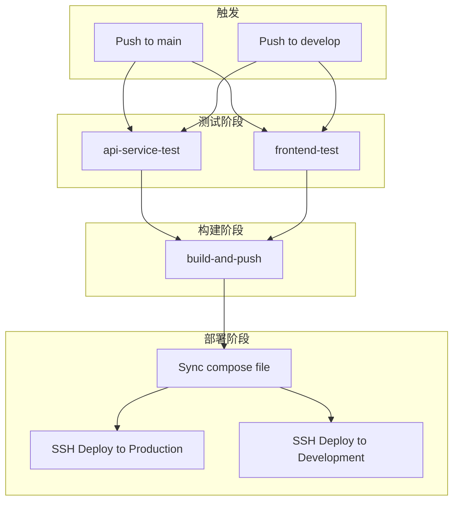

# CI-CD自动部署

本文档介绍如何配置 GitHub Actions 自动部署流程。

## 架构概览



## 前置条件

### 1. 服务器要求

- Docker 和 Docker Compose 已安装
- SSH 访问权限
- 端口开放：
  - `3000` - 前端服务
  - `8080` - 后端服务
  - `15432` - PostgreSQL（可选，仅调试用）
  - `15672` - RabbitMQ 管理界面（可选）
  - `7000/7001` - MinIO（可选）

### 2. 生成 SSH 密钥

在本地执行：

```bash
ssh-keygen -t ed25519 -C "github-actions-deploy" -f deploy_key
```

这会生成两个文件：
- `deploy_key` - 私钥（添加到 GitHub Secrets）
- `deploy_key.pub` - 公钥（添加到服务器）

### 3. 配置服务器

将公钥添加到服务器的 `~/.ssh/authorized_keys`：

```bash
# 在服务器上执行
echo "你的公钥内容" >> ~/.ssh/authorized_keys
chmod 600 ~/.ssh/authorized_keys
```

创建部署目录（生产环境和开发环境分开）：

```bash
# 生产环境
mkdir -p /opt/bluenet-prod
cd /opt/bluenet-prod

# 开发环境（可以在同一台服务器或不同服务器）
mkdir -p /opt/bluenet-dev
```

创建环境变量文件：

**生产环境** (`/opt/bluenet-prod/.env`)：
```bash
cat > .env << 'EOF'
GITHUB_OWNER=your-org-name
DB_PASSWORD=your_secure_db_password
MINIO_PASSWORD=your_secure_minio_password
JWT_SECRET=your_jwt_secret_key
MAIL_USERNAME=your_email@example.com
MAIL_PASSWORD=your_email_password
EOF
chmod 600 .env
```

**开发环境** (`/opt/bluenet-dev/.env`)：
```bash
cat > .env << 'EOF'
GITHUB_OWNER=your-org-name
DB_PASSWORD=your_dev_db_password
MINIO_PASSWORD=your_dev_minio_password
JWT_SECRET=your_dev_jwt_secret
MAIL_USERNAME=your_email@example.com
MAIL_PASSWORD=your_email_password
EOF
chmod 600 .env
```

> **注意**：`GITHUB_OWNER` 应填写仓库所属者：
> - **组织仓库**：填写组织名称（如 `bluenet-team`）
> - **个人仓库**：填写 GitHub 用户名

## GitHub Secrets 配置

在 GitHub 仓库中配置以下 Secrets：

**路径**：Settings → Secrets and variables → Actions → New repository secret

### 通用 Secrets（兼容兜底）

以下 Secrets 作为所有环境的后备凭据。当环境专属凭据未配置时，CI/CD 会自动回退到这些通用凭据。

| Secret 名称 | 说明 | 示例 |
|-------------|------|------|
| `DEPLOY_USER` | SSH 用户名 | `root` 或 `deploy` |
| `DEPLOY_KEY` | SSH 私钥（完整内容） | `[SSH_PRIVATE_KEY_CONTENT]` |
| `DEPLOY_PORT` | SSH 端口（可选） | `22`（默认） |

### 环境专属 SSH 凭据（推荐）

为了安全隔离，建议为生产环境和开发环境配置**独立的 SSH 密钥对**。CI/CD 流水线会根据分支自动选择对应环境的凭据，采用四级 fallback 机制：

```
服务专属环境凭据    e.g. DATABASE_DEPLOY_USER_PROD
      ↓ 不存在
服务专属通用凭据    e.g. DATABASE_DEPLOY_USER
      ↓ 不存在
通用环境凭据        e.g. DEPLOY_USER_PROD
      ↓ 不存在
通用通用凭据        e.g. DEPLOY_USER
```

#### 生产环境 SSH 凭据（main 分支）

| Secret 名称 | 说明 | 示例 |
|-------------|------|------|
| `DEPLOY_USER_PROD` | 生产环境 SSH 用户名 | `root` 或 `deploy` |
| `DEPLOY_KEY_PROD` | 生产环境 SSH 私钥 | `[SSH_PRIVATE_KEY_CONTENT]` |
| `DEPLOY_PORT_PROD` | 生产环境 SSH 端口 | `22` |

#### 开发环境 SSH 凭据（develop 分支）

| Secret 名称 | 说明 | 示例 |
|-------------|------|------|
| `DEPLOY_USER_DEV` | 开发环境 SSH 用户名 | `root` 或 `deploy` |
| `DEPLOY_KEY_DEV` | 开发环境 SSH 私钥 | `[SSH_PRIVATE_KEY_CONTENT]` |
| `DEPLOY_PORT_DEV` | 开发环境 SSH 端口 | `22` |

#### 基础设施服务环境专属凭据（可选）

如果数据库、Redis、RabbitMQ 部署在独立服务器上且需要完全独立的 SSH 密钥，可配置以下 Secrets：

| Secret 名称 | 说明 |
|-------------|------|
| `DATABASE_DEPLOY_USER_PROD` / `DATABASE_DEPLOY_USER_DEV` | 数据库部署 SSH 用户名 |
| `DATABASE_DEPLOY_KEY_PROD` / `DATABASE_DEPLOY_KEY_DEV` | 数据库部署 SSH 私钥 |
| `DATABASE_DEPLOY_PORT_PROD` / `DATABASE_DEPLOY_PORT_DEV` | 数据库部署 SSH 端口 |
| `REDIS_DEPLOY_USER_PROD` / `REDIS_DEPLOY_USER_DEV` | Redis 部署 SSH 用户名 |
| `REDIS_DEPLOY_KEY_PROD` / `REDIS_DEPLOY_KEY_DEV` | Redis 部署 SSH 私钥 |
| `REDIS_DEPLOY_PORT_PROD` / `REDIS_DEPLOY_PORT_DEV` | Redis 部署 SSH 端口 |
| `RABBITMQ_DEPLOY_USER_PROD` / `RABBITMQ_DEPLOY_USER_DEV` | RabbitMQ 部署 SSH 用户名 |
| `RABBITMQ_DEPLOY_KEY_PROD` / `RABBITMQ_DEPLOY_KEY_DEV` | RabbitMQ 部署 SSH 私钥 |
| `RABBITMQ_DEPLOY_PORT_PROD` / `RABBITMQ_DEPLOY_PORT_DEV` | RabbitMQ 部署 SSH 端口 |

> **注意**：
> - 如果基础设施和应用服务部署在相同机器上，只需配置 `DEPLOY_*_PROD`/`DEPLOY_*_DEV` 即可，无需额外配置服务级别的 `_PROD`/`_DEV` 凭据。
> - 如果未配置环境专属凭据，CI/CD 会自动回退到现有通用凭据（`DEPLOY_USER`、`DEPLOY_KEY` 等），确保向后兼容。

### 生成独立 SSH 密钥对

为不同环境生成独立的 SSH 密钥：

```bash
# 生产环境密钥
ssh-keygen -t ed25519 -C "github-actions-deploy-prod" -f deploy_key_prod

# 开发环境密钥
ssh-keygen -t ed25519 -C "github-actions-deploy-dev" -f deploy_key_dev
```

将公钥分别添加到对应服务器的 `~/.ssh/authorized_keys`：

```bash
# 在生产服务器上执行
cat deploy_key_prod.pub >> ~/.ssh/authorized_keys

# 在开发服务器上执行
cat deploy_key_dev.pub >> ~/.ssh/authorized_keys
```

私钥内容分别粘贴到 GitHub Secrets：`DEPLOY_KEY_PROD` 和 `DEPLOY_KEY_DEV`。

### 生产环境 Secrets（main 分支）

| Secret 名称 | 说明 | 示例 |
|-------------|------|------|
| `DEPLOY_HOST_PROD` | 生产服务器 IP 或域名 | `prod.example.com` |
| `DEPLOY_PATH_PROD` | 生产环境部署目录 | `/opt/bluenet-prod` |

### 开发环境 Secrets（develop 分支）

| Secret 名称 | 说明 | 示例 |
|-------------|------|------|
| `DEPLOY_HOST_DEV` | 开发服务器 IP 或域名 | `dev.example.com` |
| `DEPLOY_PATH_DEV` | 开发环境部署目录 | `/opt/bluenet-dev` |

> **注意**：生产环境和开发环境可以部署在同一台服务器（不同目录），也可以部署在不同服务器。如果部署在不同服务器，强烈建议配置独立的 SSH 密钥对。

### 分支与环境对应关系

| 分支 | 环境 | 镜像标签 | 部署路径 | 部署主机 |
|------|------|----------|----------|----------|
| `main` | 生产环境 | `latest` | `DEPLOY_PATH_PROD` | `DEPLOY_HOST_PROD` |
| `develop` | 开发环境 | `develop` | `DEPLOY_PATH_DEV` | `DEPLOY_HOST_DEV` |

### 添加 SSH 私钥到 Secrets

```bash
# 复制私钥内容（包含 BEGIN 和 END 行）
cat deploy_key | pbcopy  # macOS
cat deploy_key | xclip -selection clipboard  # Linux
```

然后粘贴到 `DEPLOY_KEY` Secret 中。

## GHCR 镜像仓库配置

### 1. 镜像可见性

镜像推送后默认是私有的，有两种方式让服务器拉取：

**方式一：公开镜像（推荐）**

1. 进入 GitHub 仓库 → Packages
2. 点击对应镜像
3. Package settings → Change visibility → Public

**方式二：使用 PAT 认证**

1. 创建 Personal Access Token（需要 `read:packages` 权限）
2. 在服务器上登录：

```bash
echo YOUR_PAT_TOKEN | docker login ghcr.io -u YOUR_USERNAME --password-stdin
```

### 2. 镜像地址格式

```
ghcr.io/<owner>/bluenet-api-service:latest
ghcr.io/<owner>/bluenet-frontend:latest
```

- **组织仓库**：`ghcr.io/bluenet-team/bluenet-api-service:latest`
- **个人仓库**：`ghcr.io/username/bluenet-api-service:latest`

## 工作流文件说明

工作流文件位于 `.github/workflows/test_and_build.yml`。

### 触发条件

```yaml
on:
  push:
    branches: [ main ]
  pull_request:
    branches: [ main ]
  workflow_dispatch:
    branches:
      - develop
      - main
```

- **Push to main**：完整流程（测试 → 构建 → 部署）
- **PR to main**：仅测试
- **手动触发**：可在 Actions 页面手动运行

### Job 依赖关系

| Job | 依赖 | 触发条件 |
|-----|------|----------|
| `api-service-test` | 无 | 所有触发 |
| `frontend-test` | 无 | 所有触发 |
| `build-and-push` | api-service-test, frontend-test | 仅 main push |
| `deploy` | build-and-push | 仅 main push |

## 部署流程详解

### 1. 同步 Compose 文件

```yaml
- name: Sync compose file to server
  uses: appleboy/scp-action@v0.1.7
  with:
    source: "docker/docker-compose.yml"
    target: ${{ secrets.DEPLOY_PATH }}
```

将 `docker/docker-compose.yml` 上传到服务器部署目录。

### 2. SSH 部署

```yaml
- name: Deploy to server via SSH
  uses: appleboy/ssh-action@v1.0.3
  script: |
    docker compose --profile full pull
    docker compose --profile full up -d --remove-orphans
    docker image prune -f
```

执行步骤：
1. 登录 GHCR
2. 拉取最新镜像
3. 重启服务
4. 清理旧镜像

## Docker Compose 配置

### 环境变量控制

`docker-compose.yml` 通过环境变量支持开发和生产环境：

| 环境变量 | 开发环境（默认） | 生产环境 |
|----------|------------------|----------|
| `API_SERVICE_IMAGE` | `bluenet-api-service:latest` | `ghcr.io/xxx/bluenet-api-service:latest` |
| `FRONTEND_IMAGE` | `bluenet-frontend:latest` | `ghcr.io/xxx/bluenet-frontend:latest` |
| `RESTART_POLICY` | `no` | `unless-stopped` |
| `DB_PASSWORD` | 默认密码 | 从 `.env` 读取 |
| `MINIO_PASSWORD` | 默认密码 | 从 `.env` 读取 |

### Profile 分组

| Profile | 包含服务 | 用途 |
|---------|----------|------|
| `full` | 所有服务 | 完整部署 |
| `infra` | database, rabbitmq, oss | 仅基础设施 |
| `app` | backend, frontend | 仅应用服务 |

### 使用示例

```bash
# 开发环境 - 本地构建
docker compose --profile full up -d

# 仅启动基础设施
docker compose --profile infra up -d

# 生产环境 - 使用 .env 文件
docker compose --profile full pull
docker compose --profile full up -d
```

## 手动部署

如果需要手动部署：

```bash
# 1. 登录 GHCR
echo $PAT_TOKEN | docker login ghcr.io -u $USERNAME --password-stdin

# 2. 进入部署目录
cd /opt/bluenet

# 3. 拉取最新镜像
docker compose --profile full pull

# 4. 重启服务
docker compose --profile full up -d --remove-orphans

# 5. 查看日志
docker compose logs -f api-service
docker compose logs -f frontend
```

## 常见问题

### 1. 镜像拉取失败

**错误**：`unauthorized: authentication required`

**解决**：
- 确保镜像已公开，或
- 在服务器上使用 PAT 登录 GHCR

### 2. SSH 连接失败

**错误**：`Permission denied (publickey)`

**解决**：
- 检查 `DEPLOY_KEY` 是否完整（包含 BEGIN 和 END 行）
- 确认公钥已添加到服务器的 `~/.ssh/authorized_keys`

### 3. 服务启动失败

**排查步骤**：

```bash
# 查看容器状态
docker compose ps

# 查看日志
docker compose logs backend
docker compose logs frontend

# 检查环境变量
docker compose config
```

### 4. 数据库连接失败

**检查**：
- 确认 `DB_PASSWORD` 在 `.env` 中正确配置
- 确认数据库容器正常运行

```bash
# 测试数据库连接
docker compose exec database psql -U postgres -d blue_net
```

## 回滚操作

如果部署出现问题，可以回滚到之前的版本：

```bash
# 查看可用镜像版本
docker images | grep bluenet

# 使用特定版本启动
API_SERVICE_IMAGE=ghcr.io/xxx/bluenet-api-service:abc123 \
FRONTEND_IMAGE=ghcr.io/xxx/bluenet-frontend:abc123 \
docker compose --profile full up -d
```

## 监控与日志

### 查看实时日志

```bash
# 所有服务
docker compose logs -f

# 特定服务
docker compose logs -f backend
docker compose logs -f frontend
```

### 查看资源使用

```bash
docker stats
```

## 安全建议

1. **敏感信息**：所有密码和密钥都应通过 `.env` 文件管理
2. **文件权限**：
   ```bash
   chmod 600 /opt/bluenet/.env
   ```
3. **定期更新**：定期更新基础镜像版本
4. **备份**：定期备份数据库数据

## 前端环境变量配置

### 重要说明

Next.js 的 `NEXT_PUBLIC_*` 环境变量在 **构建时** 被打包进 JavaScript 代码，**运行时设置无效**。

### 配置方式

前端环境变量通过 CI/CD 构建时的 `build-args` 传入：

```yaml
# .github/workflows/test_and_build.yml
- name: Build frontend image
  uses: docker/build-push-action@v5
  with:
    build-args: |
      BUILD_BACKEND_HOST=${{ steps.vars.outputs.deploy_host }}
      BUILD_BACKEND_PORT=8080
      NEXT_PUBLIC_BACKEND_HOST=${{ steps.vars.outputs.deploy_host }}
      NEXT_PUBLIC_BACKEND_PORT=8080
      NEXT_PUBLIC_SSL_ENABLED=false
      NEXT_PUBLIC_AI_SERVICE_HOST=${{ vars.AI_SERVICE_HOST }}
      NEXT_PUBLIC_AI_SERVICE_PORT=${{ vars.AI_SERVICE_PORT || '8000' }}
      NEXT_PUBLIC_AI_SERVICE_SSL_ENABLED=${{ vars.AI_SERVICE_SSL_ENABLED || vars.SSL_ENABLED }}
      NEXT_PUBLIC_AI_SERVICE_PREFIX=${{ vars.AI_SERVICE_PREFIX || '/ai/v1' }}
```

> 注意：`AI_SERVICE_HOST` 没有默认值，必须在 GitHub Variables 中显式设置。如果 AI 服务使用独立域名（例如 `ai.example.com`），请填写该域名。

### 变量说明

| 变量 | 用途 | 何时生效 |
|------|------|----------|
| `BUILD_BACKEND_HOST/PORT` | SSR 服务端请求后端 | 构建时 |
| `NEXT_PUBLIC_BACKEND_HOST/PORT` | 客户端浏览器请求后端 | 构建时（打包进 JS） |
| `NEXT_PUBLIC_AI_SERVICE_*` | 客户端浏览器请求 AI 客服服务 | 构建时（打包进 JS） |

### 常见问题

#### 前端登录报错 `ERR_FAILED` 请求 `localhost:8080`

**原因**：`NEXT_PUBLIC_*` 未在构建时传入，使用了默认值 `localhost:8080`

**解决**：确保 CI/CD 构建时正确传入 `build-args`

#### 切换域名

修改 CI/CD 中的 `NEXT_PUBLIC_BACKEND_HOST` 值，重新触发构建部署即可。

### 本地开发

本地开发时使用 `src/frontend/.env.example` 中的默认值（`localhost:8080`）即可。

## 相关文档

- [04-01-环境配置](./04-01-环境配置.md)
- [04-02-Docker部署](./04-02-Docker部署.md)
- [04-04-多服务器部署](./04-04-多服务器部署.md)
- [04-06-运维手册](./04-06-运维手册.md)
