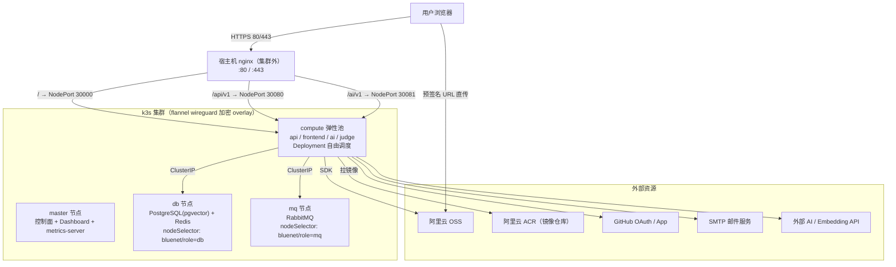

# 集群部署（k3s + Helm）

本文档描述 BlueNet 生产集群部署架构：k3s 集群 + 唯一 Helm chart（`deploy/charts/bluenet`）。**从零搭建集群、安装步骤、踩坑记录详见 [deploy/CLUSTER-SETUP.md](../../deploy/CLUSTER-SETUP.md)**，发布/回滚流程详见 [deploy/README.md](../../deploy/README.md)。

## 核心原则

| 决策 | 说明 |
|------|------|
| 业务服务不绑定节点 | api / frontend / ai / judge 以 Deployment 形式**自由调度**，集群不关心它们落在哪个节点 |
| 只有"数据"决定节点 | 持久化服务（PostgreSQL / Redis / RabbitMQ）通过 `nodeSelector bluenet/role` 绑定 db / mq 节点 |
| 一个 chart 覆盖全部服务 | 通用模板 + 每服务 values（`values/api.yaml` … `values/rabbitmq.yaml`），一服务一 release |
| 对象存储用阿里云 OSS | 不自建 MinIO，业务服务通过 OSS SDK 访问 |
| 外部 nginx + NodePort | 集群内不用 ingress-controller；宿主机 nginx（集群外）转发到 NodePort |
| 镜像 tag 不可变 | `<svc>-<版本号>`，回滚的前提 |

## 节点角色

示例为 5 台 2C2G 跨云服务器（节点间仅公网可达，flannel 走 wireguard 加密隧道）：

| 节点 | label | 承载 |
|------|-------|------|
| master | `bluenet/role=compute` | k3s 控制面 + Dashboard + metrics-server（也参与业务调度） |
| db | `bluenet/role=db` | PostgreSQL(pgvector) + Redis |
| mq | `bluenet/role=mq` | RabbitMQ；宿主机 nginx（集群外入口） |
| compute-1 / compute-2 | `bluenet/role=compute` | 业务弹性池 |

## 集群架构

下图展示 k3s 集群内部节点角色、对外暴露端口与外部资源的网络拓扑：

## 对外端口与安全组

| 节点 | 方向 | 端口/协议 | 来源 | 用途 |
|------|------|----------|------|------|
| 全部节点 | 入 | 22/TCP | 运维 IP | SSH |
| master | 入 | 6443/TCP | 运维 IP | k3s API |
| 全部节点 | 入 | 51820/UDP | 集群节点互指 | flannel wireguard 隧道 |
| 全部节点 | 入 | 10250/TCP | 集群节点互指 | metrics-server 抓 kubelet |
| nginx 节点 | 入 | 80,443/TCP | 0.0.0.0/0 | 公网业务入口 |
| 全部节点 | 入 | 30000-32767/TCP | 仅 nginx 节点 IP | NodePort |
| 全部节点 | 出 | 全部 | — | 拉镜像、OSS、GitHub、LLM API |

> PostgreSQL / Redis / RabbitMQ 不对公网开放，仅集群内 ClusterIP 访问；持久卷使用 local-path（有状态服务单副本，节点宕机 = 服务不可用，靠备份兜底）。

## 入口路由（宿主机 nginx → NodePort）

| 路径 | NodePort | 服务 |
|------|----------|------|
| `/` | 30000 | frontend |
| `/api/v1` | 30080 | api-service |
| `/ai/v1` | 30081 | ai-service |

## 外部依赖

| 依赖 | 说明 |
|------|------|
| 阿里云 ACR | 业务镜像 `<svc>-<版本号>`（不可变）+ 浮动别名；基础镜像（PG/Redis/RabbitMQ）单独 namespace |
| 阿里云 OSS | bucket + AK/SK，预签名直传 |
| 域名 + SSL | A 记录指向 nginx 节点 |
| 第三方凭据 | GitHub OAuth / App、LLM API Key（硅基流动 / DeepSeek）、SMTP 授权码 |

## 发布与回滚（摘要）

- **发布**：提升 `trigger/<svc>` 版本号并 push → CI 构建镜像推 ghcr → CD 中转推 ACR → `helm upgrade --install bluenet-<svc>`（详见 [04-03-CI-CD自动部署](./04-03-CI-CD自动部署.md) 与 `cd-helm-deploy.yml`）。
- **回滚**：`helm rollback bluenet-<svc> <revision>`（镜像 tag 不可变，旧版本始终可拉取）。

## 相关文档

- [deploy/CLUSTER-SETUP.md](../../deploy/CLUSTER-SETUP.md) — 从零搭建手册（含 19 个踩坑记录）
- [deploy/charts/bluenet/README.md](../../deploy/charts/bluenet/README.md) — chart 字段速查
- [04-02-Docker部署](./04-02-Docker部署.md) — 单机 Docker Compose（本地/开发）
- [04-03-CI-CD自动部署](./04-03-CI-CD自动部署.md) — CI/CD 流水线
- [02-02-技术架构](../02-项目概述/02-02-技术架构.md) — 集群/服务架构总览
