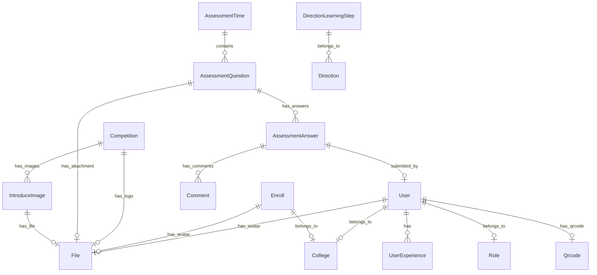

# 数据库设计

## 概述

数据库使用 PostgreSQL，所有表以 `tb_` 为前缀。

### 数据库规范

#### 表设计规范

- 所有表以 `tb_` 为前缀
- **不使用**软删除字段，数据直接物理删除
- **不需要** `created_at`、`updated_at`、`created_by`、`updated_by` 等审计字段，除非有特殊业务需求
- 使用 `tb_audit` 表统一记录操作审计日志
- 用户表 `tb_user.disable` 为账号封禁标识，非软删除

#### 迁移脚本规范

- **不要**在数据库迁移脚本中添加权限的默认值
- 权限数据应通过代码初始化或管理后台配置
- 迁移脚本只负责表结构定义，不包含业务初始数据

#### 特殊审计字段场景

以下表因业务需要保留审计字段：

| 表名 | 审计字段 | 说明 |
|------|----------|------|
| tb_competition | created_at, updated_at | 竞赛创建和更新时间 |
| tb_comment | created_at, updated_at | 评论时间记录 |
| tb_audit | action_time | 审计日志操作时间 |
| tb_user_experience | start_time, end_time | 经历时间段 |

## ER图

## 数据表

### 1. 用户表 (tb_user)

用户基本信息表，存储团队成员和考生信息。

| 字段 | 类型 | 说明 |
|------|------|------|
| id | BIGINT | 主键，自增 |
| student_id | VARCHAR(20) | 学号，唯一 |
| email | VARCHAR(100) | 邮箱 |
| role_id | BIGINT | 角色ID，关联 tb_role |
| password | VARCHAR(255) | 密码（哈希存储） |
| username | VARCHAR(50) | 用户名 |
| nickname | VARCHAR(50) | 昵称 |
| college_id | BIGINT | 学院ID，关联 tb_college |
| major | VARCHAR(100) | 专业 |
| direction | ENUM | 方向（computer_vision/structural_design/embedded） |
| gender | ENUM | 性别（male/female/unknown） |
| job | VARCHAR(100) | 职责 |
| avatar_id | BIGINT | 头像文件ID，关联 tb_file |
| disable | BOOLEAN | 是否禁用 |
| qrcode_id | BIGINT | 二维码ID，关联 tb_qrcode |
| github_id | VARCHAR(100) | GitHub ID |
| github_username | VARCHAR(100) | GitHub用户名 |
| internal_referral_code | VARCHAR(10) | 内推码 |
| bio | TEXT | 个人简介 |
| assessment_grade_year | INT | 考核入学年份（如 2024、2025） |

---

### 2. 角色表 (tb_role)

用户角色定义。

| 字段 | 类型 | 说明 |
|------|------|------|
| id | BIGINT | 主键，自增 |
| name | VARCHAR(50) | 角色名称 |

**预设角色**:
| ID | 名称 | 说明 |
|------|------|------|
| 1 | 考核成员 | CANDIDATE |
| 2 | 团队成员 | MEMBER |
| 3 | 方向管理员 | DIRECTION_ADMIN |
| 4 | 超级管理员 | SUPER_ADMIN |

---

### 3. 学院表 (tb_college)

学院信息表。

| 字段 | 类型 | 说明 |
|------|------|------|
| id | BIGINT | 主键，自增 |
| name | VARCHAR(100) | 学院名称 |

---

### 4. 报名表 (tb_enroll)

报名信息表。

| 字段 | 类型 | 说明 |
|------|------|------|
| id | BIGINT | 主键，自增 |
| username | VARCHAR(50) | 姓名 |
| student_id | VARCHAR(20) | 学号 |
| password | VARCHAR(255) | 初始密码（明文，发放后删除） |
| internal_referral_code | VARCHAR(10) | 内推码 |
| college_id | BIGINT | 学院ID |
| major | VARCHAR(100) | 专业 |
| direction | ENUM | 报名方向 |
| avatar_id | BIGINT | 头像文件ID |
| status | ENUM | 状态（pending/approved/rejected） |
| email | VARCHAR(100) | 邮箱 |
| introduction | TEXT | 自我介绍 |

---

### 5. 文件表 (tb_file)

文件元信息表，存储系统中所有文件的元数据信息。

| 字段 | 类型 | 说明 |
|------|------|------|
| id | BIGINT | 主键，自增 |
| name | VARCHAR(255) | 文件名 |
| type | ENUM | 文件类型（见下方 FileType 枚举说明） |
| url | VARCHAR(500) | 文件URL（已废弃，文件下载通过 API 接口实现） |
| status | ENUM | 文件状态（pending/active/rejected） |
| created_at | DATETIME | 文件记录创建时间 |

#### FileType 枚举说明

文件类型通过 `FileType` 枚举进行一级分类，对应对象存储中的 Key 前缀：

| 枚举值 | 存储值 | 描述 | 对象 Key 前缀 | 权限控制 |
|--------|--------|------|--------------|----------|
| `AVATAR` | `avatar` | 用户头像 | `avatar/` | 团队成员可见或本人头像 |
| `NORMAL_IMG` | `normal-img` | 普通图片（介绍图片） | `normal-img/` | 公开可见 |
| `ASSESSMENT_ATTACHMENT` | `assessment-attachment` | 考题附件 | `assessment-attachment/` | 同方向用户可见 |
| `WORK` | `work` | 考生作品文件 | `work/` | 本人或团队成员可见 |
| `QRCODE` | `qrcode` | 二维码图片 | `qrcode/` | 公开可见 |

**注意**：
- 对象存储使用配置的单一 bucket，FileType 枚举的存储值（`value`）作为对象 Key 前缀
- 文件命名规则：`{fileType}-{uuid}.{ext}`（如 `avatar-123e4567-e89b-12d3-a456-426614174000.jpg`）

---

### 6. 软件资源表 (tb_software_resource)

软件资源库表，仅存储外部下载链接元数据，不托管实际文件。

| 字段 | 类型 | 说明 |
|------|------|------|
| id | BIGINT | 主键，自增 |
| name | VARCHAR(255) | 软件名称 |
| direction | VARCHAR(50) | 所属方向：`general` / `computer_vision` / `structural_design` / `embedded` |
| category | VARCHAR(100) | 分类（如 IDE、工具链） |
| description | TEXT | 描述或使用说明 |
| external_url | VARCHAR(2048) | 外部下载链接 |
| sort_order | INT | 排序权重，越小越靠前 |
| status | VARCHAR(50) | 状态：`active` / `disabled` |

**索引**：
- `idx_software_resource_direction_status`：支持按方向和状态筛选
- `idx_software_resource_status_sort`：支持列表排序

---

### 7. 竞赛表 (tb_competition)

竞赛信息表。

| 字段 | 类型 | 说明 |
|------|------|------|
| id | BIGINT | 主键，自增 |
| name | VARCHAR(200) | 竞赛全称 |
| short_name | VARCHAR(100) | 竞赛简称 |
| logo_file_id | BIGINT | Logo文件ID |
| summary | VARCHAR(500) | 简介 |
| detail | TEXT | 详细介绍 |
| sort_order | INT | 排序序号 |
| enabled | BOOLEAN | 是否启用 |
| created_at | DATETIME | 创建时间 |
| updated_at | DATETIME | 更新时间 |

---

### 8. 考核时间表 (tb_assessment_time)

考核轮次时间表。

| 字段 | 类型 | 说明 |
|------|------|------|
| id | BIGINT | 主键，自增 |
| direction | ENUM | 方向 |
| epoch | INT | 轮次（1=一轮, 2=二轮） |
| start_time | DATETIME | 开始时间 |
| end_time | DATETIME | 结束时间 |
| time_limit | BOOLEAN | 是否限时 |
| time_limit_minutes | INT | 限时分钟数 |
| results_published_at | DATETIME | 考核结果发布时间，设置后考生可见评论和最终评分 |
| allow_team | BOOLEAN | 是否允许组队答题 |
| grade | INT | 入学年份（如 2024、2025），用于考核资格匹配 |

---

### 9. 考核题目表 (tb_assessment_question)

考核题目表。

| 字段 | 类型 | 说明 |
|------|------|------|
| id | BIGINT | 主键，自增 |
| assessment_time_id | BIGINT | 考核时间ID |
| question_no | INT | 题目序号 |
| question_type | ENUM | 题目类型（single_choice/multiple_choice/file_upload/algorithm） |
| title | VARCHAR(500) | 题目标题 |
| content | JSON | 题目内容（选项、答案等） |
| attachment_id | BIGINT | 附件文件ID |
| score | DECIMAL(5,2) | 分值 |

---

### 10. 考核答案表 (tb_assessment_answer)

考生答案表。

| 字段 | 类型 | 说明 |
|------|------|------|
| id | BIGINT | 主键，自增 |
| question_id | BIGINT | 题目ID |
| user_id | BIGINT | 用户ID |
| answer | JSON | 答案内容 |
| file_id | BIGINT | 上传文件ID（文件上传题） |
| team_id | BIGINT | 组队ID（组队答题时使用） |
| score | DECIMAL(5,2) | 得分 |
| submitted_at | DATETIME | 提交时间 |

---

### 11. 评论表 (tb_comment)

考核评论表。

| 字段 | 类型 | 说明 |
|------|------|------|
| id | BIGINT | 主键，自增 |
| answer_id | BIGINT | 答案ID |
| user_id | BIGINT | 评论用户ID |
| content | TEXT | 评论内容 |
| score | DECIMAL(5,2) | 评分 |
| created_at | DATETIME | 创建时间 |
| updated_at | DATETIME | 更新时间 |

---

### 12. 用户经历表 (tb_user_experience)

用户项目/实习经历表。竞赛经历已迁移到成就系统（tb_achievement + tb_user_achievement），不再由用户自行维护。

| 字段 | 类型 | 说明 |
|------|------|------|
| id | BIGINT | 主键，自增 |
| user_id | BIGINT | 用户ID |
| type | ENUM | 经历类型（project/internship） |
| title | VARCHAR(200) | 标题 |
| content | TEXT | 内容描述 |
| start_time | DATETIME | 开始时间 |
| end_time | DATETIME | 结束时间 |

---

### 13. 方向学习步骤表 (tb_direction_learning_step)

各方向学习路径步骤表。

| 字段 | 类型 | 说明 |
|------|------|------|
| id | BIGINT | 主键，自增 |
| direction | ENUM | 方向 |
| step_number | INT | 步骤序号 |
| title | VARCHAR(200) | 步骤标题 |
| video_url | VARCHAR(500) | 视频链接URL |

---

### 14. 审计日志表 (tb_audit)

操作审计日志表。

| 字段 | 类型 | 说明 |
|------|------|------|
| id | BIGINT | 主键，自增 |
| action | VARCHAR(100) | 操作类型 |
| action_arg | VARCHAR(4000) | 操作参数（JSON格式） |
| action_user_id | BIGINT | 操作人ID |
| action_time | DATETIME | 操作时间 |
| ip_address | VARCHAR(50) | 客户端IP |
| user_agent | VARCHAR(500) | 客户端User-Agent |
| remarks | VARCHAR(500) | 备注 |
| success_state | BOOLEAN | 操作状态 |

---

### 15. 消息模板表 (tb_message_template)

消息通知模板表。

| 字段 | 类型 | 说明 |
|------|------|------|
| id | BIGINT | 主键，自增 |
| code | VARCHAR(100) | 模板编码，唯一标识 |
| name | VARCHAR(100) | 模板名称 |
| subject | VARCHAR(200) | 消息主题 |
| content | TEXT | 消息内容 |
| description | VARCHAR(500) | 模板说明 |
| enabled | BOOLEAN | 是否启用 |

---

### 16. 验证码表 (tb_verify_code)

验证码记录表。

| 字段 | 类型 | 说明 |
|------|------|------|
| id | BIGINT | 主键，自增 |
| email | VARCHAR(100) | 邮箱 |
| code | VARCHAR(10) | 验证码 |
| type | VARCHAR(50) | 验证码类型 |
| expire_at | DATETIME | 过期时间 |
| used | BOOLEAN | 是否已使用 |

---

### 17. 二维码表 (tb_qrcode)

二维码信息表。

| 字段 | 类型 | 说明 |
|------|------|------|
| id | BIGINT | 主键，自增 |
| type | ENUM | 二维码类型 |
| content | VARCHAR(500) | 二维码内容 |
| file_id | BIGINT | 图片文件ID |

---

### 18. 成就表 (tb_achievement)

成就信息表。

| 字段 | 类型 | 说明 |
|------|------|------|
| id | BIGINT | 主键，自增 |
| title | VARCHAR(200) | 成就标题 |
| type | ENUM | 成就类型（paper/patent/competition） |
| relate_to | VARCHAR(200) | 关联项：论文为期刊名，专利为专利号（如"发明专利 ZL202310003456.7"），竞赛为赛项名 |
| achieve_at | DATE | 获奖/发表日期 |
| award_level | VARCHAR(20) | 奖项级别（national/provincial/school），仅type=competition时有效 |
| award_name | VARCHAR(50) | 奖项名称（一等奖/二等奖/三等奖），仅type=competition时有效 |
| file_id | BIGINT | 成就图片文件ID，关联 tb_file（可选，用于论文/专利成就的图片展示） |

---

### 19. 用户成就关联表 (tb_user_achievement)

用户与成就的关联表，由管理员在创建/更新成就时维护，删除成就时级联清理。

| 字段 | 类型 | 说明 |
|------|------|------|
| id | BIGINT | 主键，自增 |
| user_id | BIGINT | 用户ID |
| achievement_id | BIGINT | 成就ID |

约束：UNIQUE(user_id, achievement_id)；索引：idx_user_achievement_achievement_id(achievement_id)。

---

### 19.1 成就外部协作者表 (tb_achievement_external_member)

成就的非系统用户合作成员表，仅做展示，不建立唯一身份。删除成就时级联清理。

| 字段 | 类型 | 说明 |
|------|------|------|
| id | BIGINT | 主键，自增 |
| achievement_id | BIGINT | 成就ID |
| name | VARCHAR(100) | 外部协作者姓名 |
| display_order | INT | 展示顺序 |

索引：idx_achievement_external_member_achievement_id(achievement_id)。

---

### 20. 权限表 (tb_permission)

权限定义表。

| 字段 | 类型 | 说明 |
|------|------|------|
| id | BIGINT | 主键，自增 |
| name | VARCHAR(100) | 权限名称 |
| value | VARCHAR(100) | 权限值 |
| url | VARCHAR(200) | 操作URL |
| method | VARCHAR(10) | HTTP方法 |

---

### 21. 角色权限关联表 (tb_role_permission)

角色与权限的关联表。

| 字段 | 类型 | 说明 |
|------|------|------|
| id | BIGINT | 主键，自增 |
| role_id | BIGINT | 角色ID |
| permission_id | BIGINT | 权限ID |

---

### 22. Bug 报告表 (tb_bug_report)

Bug 报告表。

| 字段 | 类型 | 说明 |
|------|------|------|
| id | BIGINT | 主键，自增 |
| title | VARCHAR(200) | Bug 标题（简述） |
| description | TEXT | Bug 描述 |
| page_url | VARCHAR(2048) | 发生页面的 URL |
| environment_json | TEXT | 前端环境信息 JSON |
| reporter_email | VARCHAR(255) | 报告者邮箱（选填） |
| status | ENUM | 状态（PENDING/IN_PROGRESS/RESOLVED） |
| github_issue_url | VARCHAR(500) | 同步的 GitHub Issue URL |
| github_issue_number | INT | 同步的 GitHub Issue 编号 |

---

### 23. Bug 报告图片表 (tb_bug_report_image)

Bug 报告关联图片表。

| 字段 | 类型 | 说明 |
|------|------|------|
| id | BIGINT | 主键，自增 |
| bug_report_id | BIGINT | 关联的 Bug 报告 ID |
| file_id | BIGINT | 关联的文件 ID |

---

### 24. 考核评判结果表 (tb_assessment_judgement)

考核题目评判结果表。

| 字段 | 类型 | 说明 |
|------|------|------|
| id | BIGINT | 主键，自增 |
| answer_id | BIGINT | 答案ID |
| question_id | BIGINT | 题目ID |
| assessment_time_id | BIGINT | 考核时间ID |
| user_id | BIGINT | 考生用户ID |
| score | DECIMAL(10,2) | 本次评判得分 |
| max_score | DECIMAL(10,2) | 题目满分 |
| status | ENUM | 评判状态 |
| result_code | ENUM | 客观题标准结果码：AC/WA/TLE/RE/CE/MLE |
| source | ENUM | 评判来源：AUTO/MANUAL |
| reviewer_id | BIGINT | 人工评判人ID，系统评判为空 |
| reviewer_type | ENUM | 评判人类型 |
| comment | TEXT | 评判评论 |
| judged_at | DATETIME | 完成评判时间 |
| created_at | DATETIME | 创建时间 |
| updated_at | DATETIME | 更新时间 |

---

### 25. 考核决策表 (tb_assessment_decision)

考生考核最终通过决策表。

| 字段 | 类型 | 说明 |
|------|------|------|
| id | BIGINT | 主键，自增 |
| user_id | BIGINT | 考生用户ID |
| assessment_time_id | BIGINT | 考核时间ID |
| passed | BOOLEAN | 是否通过 |
| decided_by | BIGINT | 决策管理员ID |
| decision_comment | TEXT | 决策备注 |
| decided_at | DATETIME | 决策时间 |
| updated_at | DATETIME | 更新时间 |

---

### 26. 算法判题任务表 (tb_algorithm_judge_job)

算法题判题任务表。

| 字段 | 类型 | 说明 |
|------|------|------|
| id | BIGINT | 主键，自增 |
| answer_id | BIGINT | 正式提交答案ID，运行任务可为空 |
| question_id | BIGINT | 题目ID |
| assessment_time_id | BIGINT | 考核时间ID |
| user_id | BIGINT | 考生用户ID |
| language | ENUM | 提交语言 |
| source_code | TEXT | 源代码 |
| testcase_type | ENUM | 判题用例类型：DEFAULT_RUN/CUSTOM_RUN/FORMAL |
| custom_input | TEXT | 自定义运行输入 |
| status | ENUM | 判题任务状态 |
| retry_count | INT | 已重试次数 |
| max_retry_count | INT | 最大重试次数 |
| status_message | TEXT | 任务状态说明 |
| started_at | DATETIME | 开始执行时间 |
| finished_at | DATETIME | 结束执行时间 |
| created_at | DATETIME | 创建时间 |
| updated_at | DATETIME | 更新时间 |

---

### 27. 算法判题用例结果表 (tb_algorithm_judge_case_result)

算法题判题用例结果表。

| 字段 | 类型 | 说明 |
|------|------|------|
| id | BIGINT | 主键，自增 |
| judge_job_id | BIGINT | 判题任务ID |
| case_no | INT | 用例序号 |
| testcase_type | ENUM | 用例类型 |
| status | ENUM | 用例结果码 |
| input | TEXT | 输入 |
| expected_output | TEXT | 期望输出 |
| actual_output | TEXT | 实际输出 |
| stdout | TEXT | 标准输出 |
| stderr | TEXT | 标准错误 |
| time_used_ms | INT | 耗时毫秒 |
| memory_used_kb | INT | 内存KB |
| message | TEXT | 结果说明 |
| visible_to_candidate | BOOLEAN | 是否对考生可见 |
| created_at | DATETIME | 创建时间 |

---

### 28. 考核队伍表 (tb_assessment_team)

考核队伍表。

| 字段 | 类型 | 说明 |
|------|------|------|
| id | BIGINT | 主键，自增 |
| assessment_time_id | BIGINT | 所属考核时间ID |
| leader_id | BIGINT | 队长用户ID |
| name | VARCHAR(100) | 队伍名称 |
| invite_code | VARCHAR(10) | 邀请码，唯一 |
| status | ENUM | 队伍状态：ACTIVE/DISBANDED |
| created_at | DATETIME | 创建时间 |

---

### 29. 考核队伍成员表 (tb_assessment_team_member)

考核队伍成员表。

| 字段 | 类型 | 说明 |
|------|------|------|
| id | BIGINT | 主键，自增 |
| team_id | BIGINT | 所属队伍ID |
| user_id | BIGINT | 成员用户ID |
| joined_at | DATETIME | 加入时间 |

---

## 枚举值

### Direction（方向）

| 值 | 说明 |
|------|------|
| computer_vision | 计算机视觉 |
| structural_design | 结构设计 |
| embedded | 嵌入式开发 |

### EnrollStatus（报名状态）

| 值 | 说明 |
|------|------|
| pending | 待审核 |
| approved | 已通过 |
| rejected | 已拒绝 |

### Gender（性别）

| 值 | 说明 |
|------|------|
| male | 男 |
| female | 女 |
| unknown | 未知 |

### QuestionType（题目类型）

| 值 | 说明 |
|------|------|
| single_choice | 单选题 |
| multiple_choice | 多选题 |
| file_upload | 文件上传 |
| algorithm | 算法题 |

### FileType（文件类型）

| 值 | 说明 |
|------|------|
| avatar | 头像 |
| normal_img | 普通图片 |
| assessment_attachment | 考题附件 |
| work | 考生作品文件 |
| qrcode | 二维码 |

### ExperienceType（经历类型）

| 值 | 说明 |
|------|------|
| competition | 竞赛 |
| project | 项目 |
| internship | 实习 |

### AchievementType（成就类型）

| 值 | 说明 |
|------|------|
| paper | 论文 |
| patent | 专利 |
| competition | 竞赛 |

## 索引设计

### 主要索引

| 表名 | 索引名 | 字段 | 类型 |
|------|--------|------|------|
| tb_user | uk_student_id | student_id | UNIQUE |
| tb_user | idx_email | email | INDEX |
| tb_user | idx_role_id | role_id | INDEX |
| tb_user | idx_direction | direction | INDEX |
| tb_enroll | uk_student_id | student_id | UNIQUE |
| tb_enroll | idx_status | status | INDEX |
| tb_enroll | idx_direction | direction | INDEX |
| tb_assessment_time | idx_direction_epoch | direction, epoch | INDEX |
| tb_assessment_question | idx_assessment_time_id | assessment_time_id | INDEX |
| tb_assessment_answer | idx_question_user | question_id, user_id | INDEX |
| tb_user_experience | idx_user_id | user_id | INDEX |
| tb_audit | idx_action_time | action_time | INDEX |
| tb_audit | idx_action_user_id | action_user_id | INDEX |
