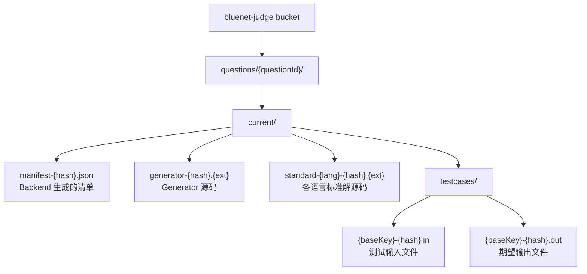

# 算法判题功能完整指南

本文档面向**管理员**（负责配置算法题和测试数据）、**考生**（参与算法题作答）以及**开发者**（维护判题服务），系统讲解算法判题的完整流程、配置方法和注意事项。

---

## 目录

1. [概述](#概述)
2. [核心概念](#核心概念)
3. [考题配置（管理员）](#考题配置管理员)
4. [Generator 代码编写规范](#generator-代码编写规范)
5. [标准解编写规范](#标准解编写规范)
6. [测试用例配置详解](#测试用例配置详解)
7. [书面用例 vs 运行用例 vs 正式测试用例](#书面用例-vs-运行用例-vs-正式测试用例)
8. [考生作答指南](#考生作答指南)
9. [判题结果状态码](#判题结果状态码)
10. [文件存储结构](#文件存储结构)
11. [配置参数汇总](#配置参数汇总)

---

## 概述

算法判题系统采用**独立 Judge Service** 架构：

- **Backend** 负责考题管理、考生交互、创建判题任务并投递到 RabbitMQ
- **Judge Service** 负责测试数据生成、标准解 benchmark、正式判题执行
- **沙箱（isolate）** 负责在隔离环境中编译和运行代码，限制 CPU、内存、网络等资源

整个流程分为六个阶段：


---

## 核心概念

| 术语 | 说明 |
|------|------|
| **Generator** | 由管理员编写的程序，接收结构化参数，通过 stdout 输出测试输入数据 |
| **标准解（Standard Solution）** | 由管理员编写的正确解法，用于生成期望输出（.out 文件）和 benchmark 测速 |
| **主标准解** | 生成正式测试数据时唯一使用的标准解语言，其他语言标准解仅用于 benchmark |
| **Manifest** | Backend 根据管理员配置生成的清单文件，描述测试用例列表和生成参数 |
| **书面用例（Examples）** | 展示在题面上的样例输入输出，供考生理解题意，不参与判题 |
| **运行用例（Run Testcases）** | 考生点击"运行"时默认执行的用例，用于自测，不参与得分 |
| **正式测试用例** | 由 generator 生成、存储在 OSS 的隐藏用例，用于正式提交判题和计分 |
| **Benchmark** | 对标准解在正式测试数据上多次运行，采集 p95 耗时和内存峰值 |
| **语言限制（Language Limit）** | 管理员确认的每语言时间限制、内存限制、输出限制，正式判题时使用 |

---

## 考题配置（管理员）

算法题配置分为三个标签页：

### 1. 题面信息

考生在答题页面看到的内容：

| 字段 | 说明 | 是否必填 |
|------|------|----------|
| 题干 | 支持 Markdown，描述题目要求 | 是 |
| 输入说明 | 描述标准输入格式和含义 | 建议填写 |
| 输出说明 | 描述标准输出格式要求 | 建议填写 |
| 数据范围 | 描述各参数的数据范围和约束 | 建议填写 |
| 题面样例（Examples） | 展示给考生的示例输入输出，可添加说明 | 至少一个 |
| 默认运行用例（Run Testcases） | 考生点击"运行"时默认执行的用例 | 可选 |
| 语言模板（Starter Code） | 每语言提供给考生的初始代码框架 | 至少一个 |

**语言模板的作用**：`starterCode` 的键（语言名）决定了该题允许考生提交哪些语言。只有同时配置了语言模板**且**确认了该语言资源限制的，才允许正式提交。

### 2. 判题配置

生成正式测试数据所需的核心配置：

#### Generator 配置

| 字段 | 说明 | 默认值 |
|------|------|--------|
| Generator 语言 | generator 源码的编程语言 | python |
| Generator 源码 | 生成测试数据的程序代码 | - |
| 主标准解语言 | 用于生成标准输出文件的标准解语言 | python |

#### Benchmark 参数

| 字段 | 说明 | 默认值 |
|------|------|--------|
| 测速次数 | 每个标准解在每个用例上重复运行的次数 | 5 |
| 限时倍率 | 建议限时 = p95 耗时 × 倍率 | 1.2 |
| 最小额外毫秒 | 建议限时至少比 p95 耗时多出的毫秒数 | 50 |
| 取整粒度(ms) | 建议限时向上取整到该粒度的倍数 | 50 |

**建议限时计算公式**：

```
suggestedLimit = ceil((p95Time * marginMultiplier + minExtraMs) / roundToMs) * roundToMs
```

#### 标准解源码

每个支持的语言都需要提供一个标准解。其中**主标准解语言**对应的标准解用于生成 `.out` 期望输出文件，其他语言标准解仅用于 benchmark 测速。

#### 测试用例生成配置

每个用例需要配置：

| 字段 | 说明 |
|------|------|
| 序号（caseNo） | 用例编号，从 1 开始递增 |
| 分类（category） | 用例类型，如 NORMAL、EDGE、MAXIMUM 等 |
| 权重（weight） | 该用例在计分中的权重，默认 1 |
| 隐藏（hidden） | 是否对考生隐藏该用例详情，正式用例建议勾选 |
| 样例（sample） | 是否标记为样例用例 |
| Generator 参数 JSON | 传给 generator 的结构化参数 |
| 说明 | 该用例的备注说明 |

### 3. 资源限制

测试数据生成完成后，Judge Service 会自动对每个语言的标准解进行 benchmark，生成建议限时。管理员需要在此页面：

1. 查看各语言标准解的 benchmark 结果（p95 耗时、最大耗时、峰值内存、建议限时）
2. 根据建议值调整并**确认**最终的资源限制
3. 只有已确认资源限制的语言，考生才能正式提交

确认的资源限制包含：

| 字段 | 说明 |
|------|------|
| 时间限制（ms） | 正式判题时程序允许的最大 CPU 时间 |
| 内存限制（KB） | 正式判题时程序允许的最大内存 |
| 输出限制（KB） | 正式判题时 stdout 允许的最大输出大小 |

---

## Generator 代码编写规范

Generator 是一个**标准输入输出程序**，Judge Service 通过以下方式调用它：

### 参数传递机制

1. 管理员在"Generator 参数 JSON"中填写结构化参数，例如：
   ```json
   {
     "n": 100,
     "maxValue": 1000000,
     "seed": 42
   }
   ```

2. Judge Service 在生成第 `i` 个用例时，将该用例的 `generatorArgs` **以 JSON 字符串形式通过 stdin 传入** generator

3. Generator 从 **stdin 读取 JSON 字符串**，解析后生成对应的测试数据

4. Generator 将生成的测试数据**写入 stdout**

### 编写要求

- **必须**从 `stdin` 读取输入参数
- **必须**将生成的测试数据输出到 `stdout`
- 不要输出调试信息到 stdout（会污染测试数据）
- 如果需要随机性，建议通过参数传入 seed 以保证可复现
- 支持语言：Python、C、C++、Java、JavaScript

### Python Generator 示例

```python
import json
import sys
import random

def generate():
    # 从 stdin 读取参数
    args = json.load(sys.stdin)
    n = args.get("n", 10)
    max_val = args.get("maxValue", 100)
    seed = args.get("seed", 0)

    random.seed(seed)

    # 第一行输出数据规模
    print(n)
    # 第二行输出 n 个随机整数
    nums = [random.randint(1, max_val) for _ in range(n)]
    print(" ".join(map(str, nums)))

if __name__ == "__main__":
    generate()
```

### C++ Generator 示例

```cpp
#include <bits/stdc++.h>
using namespace std;

int main() {
    // 从 stdin 读取 JSON 参数
    string jsonStr;
    getline(cin, jsonStr);

    // 简单解析（实际可使用 nlohmann/json 等库）
    // 这里假设参数格式固定：{"n":100,"maxValue":1000000,"seed":42}
    int n = 100, maxVal = 1000000, seed = 42;
    // ... 解析逻辑 ...

    srand(seed);

    cout << n << endl;
    for (int i = 0; i < n; i++) {
        if (i > 0) cout << " ";
        cout << (rand() % maxVal + 1);
    }
    cout << endl;
    return 0;
}
```

### 参数设计建议

| 场景 | 推荐参数 | 说明 |
|------|----------|------|
| 数据规模 | `n`, `m`, `q` | 控制输入数据量 |
| 数值范围 | `maxValue`, `minValue` | 控制生成数值的范围 |
| 随机种子 | `seed` | 保证相同参数生成相同数据，便于复现 |
| 特殊模式 | `mode`, `type` | 控制生成数据的特殊结构（如全相同、已排序、逆序等） |
| 边界控制 | `isEmpty`, `isMax` | 布尔参数控制是否生成边界情况 |

### 常见用例分类对应的参数设计

| 分类 | 参数示例 | 目的 |
|------|----------|------|
| `SAMPLE` | `{"n": 5, "maxValue": 10}` | 小规模，便于理解 |
| `NORMAL` | `{"n": 1000, "maxValue": 1000000}` | 常规规模 |
| `EDGE` | `{"n": 1, "maxValue": 1}` | 边界最小值 |
| `EMPTY` | `{"n": 0}` | 空数据 |
| `MINIMUM` | `{"n": 2}` | 最小非空规模 |
| `MAXIMUM` | `{"n": 100000, "maxValue": 1000000000}` | 最大规模，测试性能 |
| `WORST_CASE` | `{"n": 100000, "mode": "reverse_sorted"}` | 最坏情况数据构造 |

---

## 标准解编写规范

标准解是**已知正确的解法**，用于：
1. 生成正式测试用例的期望输出（.out 文件）
2. Benchmark 测速，推导建议限时

### 编写要求

- **必须**从 `stdin` 读取输入
- **必须**将答案输出到 `stdout`
- 算法复杂度应在合理范围内，确保能在 benchmark 时间内完成
- 内存使用应稳定，避免内存泄漏
- 支持语言：Python、C、C++、Java、JavaScript

### Python 标准解示例

```python
import sys

def solve():
    data = sys.stdin.read().strip().split()
    n = int(data[0])
    nums = list(map(int, data[1:1+n]))
    print(sum(nums))

if __name__ == "__main__":
    solve()
```

### 注意事项

- 标准解应使用**高效算法**。如果标准解本身超时，则测试数据生成会失败
- 建议标准解的时间复杂度优于或等于预期考生解法的平均复杂度
- 多语言标准解的算法逻辑应**一致**，确保生成的期望输出相同

---

## 测试用例配置详解

### 用例分类（Category）

| 分类 | 含义 | 使用场景 |
|------|------|----------|
| `SAMPLE` | 样例 | 小规模示例，帮助理解题意 |
| `NORMAL` | 常规 | 一般规模，覆盖常规场景 |
| `EDGE` | 边界 | 极端边界值（如 n=1, n=0） |
| `EMPTY` | 空数据 | 输入为空或最小有效输入 |
| `MINIMUM` | 最小规模 | 最小的非平凡输入 |
| `MAXIMUM` | 最大规模 | 接近上限的大规模数据 |
| `LARGE` | 长数据 | 特定维度的超长数据 |
| `RANDOM` | 随机 | 随机生成的数据 |
| `WORST_CASE` | 最坏情况 | 针对特定算法的最坏输入构造 |
| `SPECIAL` | 特殊构造 | 具有特殊性质的数据 |
| `REGRESSION` | 回归 | 用于验证历史 bug 修复的用例 |

### 用例属性

| 属性 | 说明 |
|------|------|
| **权重（weight）** | 计分时该用例的权重。最终得分 = 总分 × (通过用例权重和 / 总权重和) |
| **隐藏（hidden）** | 勾选后，考生作答时看不到该用例的输入输出详情（但提交后若出错会展示失败用例） |
| **样例（sample）** | 标记该用例是否为样例性质的用例，用于统计和展示 |

### 用例数量建议

- 最少需要 **1 个**用例配置（但建议至少 5-10 个以覆盖不同场景）
- 小规模题：5-10 个用例
- 中等规模题：10-20 个用例
- 复杂题：20+ 个用例，覆盖各种边界和性能场景

---

## 书面用例 vs 运行用例 vs 正式测试用例

这是三个**完全独立**的概念，容易混淆：

### 书面用例（Examples）

- **配置位置**：题面信息 → 题面样例
- **作用**：展示在题面上，帮助考生理解输入输出格式
- **是否参与判题**：**不参与**
- **对考生可见**：始终可见
- **存储位置**：存储在题目内容 JSON 中（数据库 `tb_assessment_question.content`）

### 运行用例（Run Testcases）

- **配置位置**：题面信息 → 默认运行用例
- **作用**：考生点击"运行"按钮时，默认使用这些用例测试代码
- **是否参与判题**：**不参与得分**
- **对考生可见**：运行后可见输入、期望输出、实际输出
- **存储位置**：存储在题目内容 JSON 中
- **优先级**：如果未配置运行用例，系统会自动使用**题面样例**作为运行用例

### 正式测试用例

- **配置位置**：判题配置 → 测试用例生成配置
- **作用**：考生**正式提交**后，Judge Service 使用这些用例进行判题和计分
- **是否参与判题**：**参与得分**
- **对考生可见**：
  - 提交前：不可见（hidden 为 true 时）
  - 提交后：若用例失败，展示失败用例的输入、期望输出、实际输出
- **存储位置**：存储在独立判题 OSS bucket（`bluenet-judge`）中，文件名为 `{hash}.in` 和 `{hash}.out`
- **生成方式**：由 generator 和标准解自动生成

**关键区别总结**：

| 维度 | 书面用例 | 运行用例 | 正式测试用例 |
|------|----------|----------|--------------|
| 配置者 | 管理员手动输入 | 管理员手动输入 | 由 generator + 标准解自动生成 |
| 可见性 | 题面展示 | 运行后展示 | 提交前隐藏，失败后展示 |
| 参与计分 | 否 | 否 | 是 |
| 可配置性 | 完全手动 | 完全手动 | 通过 generator 参数控制规模/模式 |
| 存储位置 | 数据库 | 数据库 | OSS + 数据库索引 |

---

## 考生作答指南

### 作答流程

1. 进入算法题详情页面，阅读题面、输入输出说明、数据范围、样例
2. 选择编程语言（下拉框仅展示已配置模板且已确认资源限制的语言）
3. 在代码编辑框中编写解法（基于语言模板修改）
4. **运行测试**：
   - **默认用例**：使用题目配置的 runTestcases（或题面样例）测试
   - **自定义输入**：输入自定义 stdin，查看 stdout 和 stderr
5. **正式提交**：提交后创建异步判题任务，可轮询查看结果

### 代码编写要求

- **必须从标准输入（stdin）读取数据**
- **必须将结果写入标准输出（stdout）**
- 不要使用文件读写
- 不要使用网络请求
- 不要在 stdout 输出调试信息（会干扰答案比对）

### 运行 vs 提交的区别

| 维度 | 运行（Run） | 提交（Submit） |
|------|-------------|----------------|
| 目的 | 自测调试 | 正式判题计分 |
| 用例来源 | 运行用例 / 自定义输入 | 正式测试用例（OSS 生成） |
| 资源限制 | 宽松默认（5s, 256MB） | 管理员确认的语言限制 |
| 是否影响得分 | 否 | 是 |
| 异步执行 | 是（RabbitMQ 队列） | 是（RabbitMQ 队列） |
| 结果保存 | 临时 | 持久化，生成评判记录 |

### 注意事项

1. **输出格式严格匹配**：系统会对 stdout 进行规范化处理（统一换行符为 `\n`，去除末尾空白），但中间内容和顺序必须完全一致
2. **语言选择**：只能选择题目配置了语言模板且管理员已确认资源限制的语言
3. **时间限制**：正式判题使用管理员确认的时间限制，通常比 benchmark 建议值稍宽松
4. **内存限制**：包含程序运行期间的所有内存使用（包括运行时开销）
5. **提交后不可修改**：每次提交会创建新的判题任务，之前的提交记录保留

---

## 判题结果状态码

| 状态码 | 含义 | 说明 |
|--------|------|------|
| `AC` | Accepted | 通过 |
| `WA` | Wrong Answer | 答案错误（输出与期望输出不匹配） |
| `TLE` | Time Limit Exceeded | 运行超时（超过该语言确认的时间限制） |
| `MLE` | Memory Limit Exceeded | 内存超限（超过该语言确认的内存限制） |
| `RE` | Runtime Error | 运行时错误（非零退出码） |
| `CE` | Compile Error | 编译失败 |

**最终结果显示规则**：
- 如果所有用例通过，最终结果为 `AC`
- 如果有用例失败，最终结果为**第一个失败用例**的状态码
- 得分按权重加权计算：通过用例的权重和 / 总权重和 × 题目分值

---

## 文件存储结构

判题相关文件存储在**独立的 OSS bucket**（`bluenet-judge`）中，与主应用文件隔离：



**注意**：
- 考生无法通过任何业务 API 直接访问 `bluenet-judge` bucket
- 每次生成新的测试数据会替换 `current/` 目录下的内容
- 历史配置不保留（系统只维护当前配置）

---

## 配置参数汇总

### 判题配置表（tb_judge_problem_config）

| 字段 | 类型 | 默认值 | 说明 |
|------|------|--------|------|
| generator_language | VARCHAR | - | Generator 源码语言 |
| generator_object_key | TEXT | - | Generator 在 OSS 中的对象键 |
| primary_standard_language | VARCHAR | - | 主标准解语言 |
| status | VARCHAR | DRAFT | 配置状态：DRAFT/GENERATING/GENERATED/BENCHMARKING/READY/FAILED |
| benchmark_repeat_times | INT | 5 | 每个用例 benchmark 重复次数 |
| margin_multiplier | DECIMAL | 1.5 | 限时倍率 |
| min_extra_ms | INT | 50 | 最小额外毫秒 |
| round_to_ms | INT | 50 | 取整粒度 |

### 标准解表（tb_judge_standard_solution）

| 字段 | 说明 |
|------|------|
| language | 标准解语言 |
| primary_solution | 是否为主标准解（用于生成 .out 文件） |
| benchmark_status | PENDING/DONE/FAILED |
| p95_time_ms | p95 耗时（毫秒） |
| max_time_ms | 最大耗时（毫秒） |
| peak_memory_kb | 峰值内存（KB） |
| suggested_time_limit_ms | 建议限时（毫秒） |

### 测试用例配置表（tb_judge_testcase_config）

| 字段 | 说明 |
|------|------|
| case_no | 用例序号 |
| category | 分类：SAMPLE/NORMAL/EDGE/... |
| generator_args | JSONB，传给 generator 的参数 |
| weight | 权重 |
| hidden | 是否隐藏 |
| sample | 是否样例 |

### 语言限制表（tb_judge_language_limit）

| 字段 | 说明 |
|------|------|
| language | 编程语言 |
| time_limit_ms | 时间限制（毫秒） |
| memory_limit_kb | 内存限制（KB） |
| output_limit_kb | 输出限制（KB） |
| confirmed | 是否已确认 |

---

## 常见问题

### Q: Generator 执行失败怎么办？
A: 检查以下几点：
1. Generator 是否从 stdin 正确读取参数
2. 参数 JSON 是否合法且能被 generator 解析
3. Generator 是否将数据输出到 stdout（不要输出到 stderr 或文件）
4. Generator 本身是否有语法错误或运行时异常

### Q: Benchmark 结果异常怎么办？
A: 可能原因：
1. 标准解算法复杂度过高，需要优化
2. 测试数据规模过大，需要调整 generator 参数
3. 标准解有 bug，在特定用例上运行错误

### Q: 考生提交后一直显示判题中？
A: 检查 Judge Service 是否正常运行、RabbitMQ 连接是否正常、沙箱环境（isolate）是否正确安装。

### Q: 如何修改已发布的测试数据？
A: 直接修改判题配置中的 generator、标准解或用例配置，保存后重新点击"生成测试数据"即可。系统会自动替换旧的测试数据。
