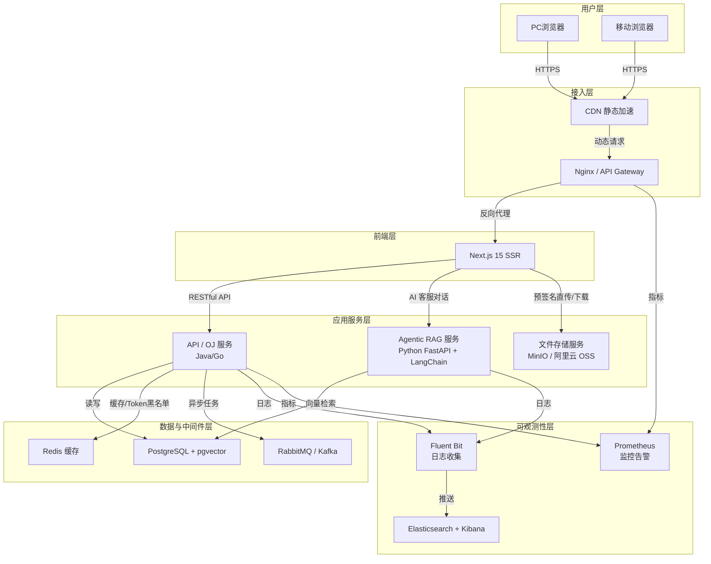
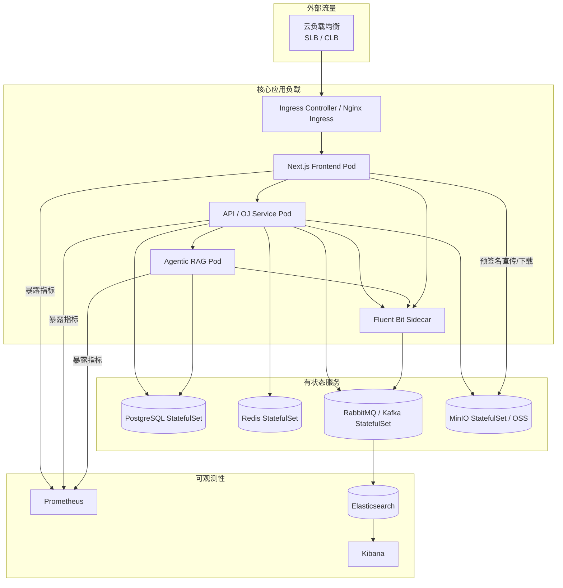

# 项目目标与现状

> 本文主要描述该项目是目标架构与当前现状。更新自2026/8/24 @IVEN-CN

## 项目目标

### 基本目标

本项目基础目标是

- 为蓝网团队打造一个长期维护的官方网站
- 该项目网站首屏打开速度应小于1s
- 该项目具备考核功能
- 该项目应具备报名管理相关功能
- 该项目应具备宣传功能，介绍实验室基本情况和招新3个方向
- 该项目应具有考核结果通知相关功能

### 必须包含的若干功能点

- 首屏速度快
- 用户登录：学生发起报名之后，来到实验室线下面试即可发放账号进行登录
- 用户角色与权限：应区分考生**团队成员、方向管理员、超级管理员**
- 宣传：
    1. 实验室位置
    2. 实验室基本情况
    3. 实验室办公场景照片
    4. 实验室设备照片
    5. 团队相关竞赛
    6. 团队已有成就
    7. 招新的三个方向
    8. 招新群二维码
- 考核：
    1. 设置三个方向的考核时间，每个方向每个年级的考核时间应该**互相独立**，并且可**以设置考核限时**
    2. 可以设置最终轮考核时间，该轮考核**允许组队**
    3. 考核应包含最基本的**文件上传类型**
    4. 每个方向的**团队成员**均可**对自己方向的考生进行作品评分、评论**
    5. 在非最终考核中，只有**方向管理员及以上的角色**可以决定考生是否通过本轮考核
    6. 在最终考核中，只有**超级管理员**可以决定考生是否通过本轮考核
    7. 最终考核通过后，考生的账号信息将被**提升为团队成员**，并且会**向考生的邮箱发送相关邮件信息**
    8. 不同年级、不同方向的考生不能看到其他方向的考核题以及考核时间

### 扩展功能点

- 登录方式除了学号登录外，应该还要支持邮箱登录以及其他第三方登录，如GitHub、微信等。
- 用户具有自己的账号主页，可以在主页中添加自己的个人简介
- 团队成员及以上角色，可以在个人主页中：
    1. 添加自己的微信二维码
    2. 绑定 GitHub 账号
    3. 修改邮箱
    4. 添加项目经历、实习经历
    5. 修改自己在所属方向的具体职务。如计算机视觉，可以区分为目标检测、ROS、机器人视觉、传统视觉或者软件开发，均为自主设置
- 所有在网站中团队成员及以上角色均会在特定页面中展出个人卡片，头像、项目经历、实习经历等信息均会被公开
- 考核类型除了文件上传类型之外，应该还要支持：
    1. 单选题
    2. 多选题
    3. 填空题
    4. OJ 算法题（类似于力扣）
- 应该有团队知识库，用于做AI智能客服，以在官网中回复学生的一些基本问题
- 该项目应该具有CICD流程
- 该项目至少为容器化部署

### 技术栈构想

- 前端nextjs：SSR服务端渲染，降低首屏加载延迟
- api/OJ服务
  - go：如果在低配机器上，应该尽可能选GO进行后端开发，以降低内存消耗
  - Java：在资源充足的条件下，可以选择Java进行开发
- Agentic RAG服务：Python FastAPI + LangChain/LangGraph，Agent的原生语言更适合Agent的流程编排
- 云数据库
  - PostgreSQL：搭配pgvector插件，实现关系型数据库与向量数据库的结合，可以避免引入多个数据库
  - milvus：高性能向量数据库面对海量向量检索时性能仍然优越
- 云Redis：缓存中间件，可以作为令牌黑白名单
- 云对象存储：阿里云 OSS / MinIO
  - 文件直传：前端通过后端申请预签名 URL，直接上传至对象存储，降低后端带宽
  - 预签名下载：后端生成带过期时间的预签名 URL，前端通过该地址直接下载文件
- 云消息队列
  - RabbitMQ：部署轻量化，运维简单，有基本的消息对接功能，基本满足该项目需求
  - Kafka：高性能高吞吐，可以作为日志系统的消息队列使用
- 日志收集：Fluent Bit：CNCF云原生基金会项目通过，sidecar容器部署收集容器的日志，并通过消息队列推送
- 日志可视化：Kibana+ES：ES接收日志收集器推送的日志消息，通过Kibana可视化
- 监控与告警：Prometheus：对业务容器进行健康检查和指标拉取，进行可视化以及邮件告警

### 整体技术架构图

### 云原生与高可用

> 在资源充足、**条件允许**的情况下，该项目应该以集群方式部署

如果满足了上述的所有技术栈，并进行集群部署，那该项目应该属于云原生项目

集群部署分两种情况：一种是 K8S 集群，一种是 serverless 容器服务。

如果使用 K8S 集群，可以使用云厂商的 ACK 托管服务，或者自建 K8S 集群。

---

如果选择自建 K8S 集群，需要至少 8 台服务器才能达到生产要求：

1. 节点分配：其中 3 台服务器作为主节点（Master），5 台服务器作为工作节点（Worker）
2. 配置要求：Master 节点至少需要 2C4G 的服务器才可以运行master控制面板

> 在资源受限的情况下，应该考虑使用K3S进行集群自建，但是同样需要8台服务器，如果主节点为1或2台服务器，可能出现脑裂的情况

---

如果是ACK集群托管，我们只需要购入ACK节点或者将服务器实例列为ACK托管范围即可。*但是ACK集群托管的价格往往较高*

如果服务器实例不在同一个云账号上，可以尝试使用阿里云的ACK Edge产品

---

对于serverless容器服务，我们则不需要关心服务器与集群的相关运维

### 云原生部署架构图

## 当前现状

### 功能完成度

#### 已完成

| 模块 | 已实现能力 |
|---|---|
| 宣传引流 | 首页、方向详情（计算机视觉/嵌入式/结构设计）、团队成就、竞赛展示、实验室环境、软件资源库、咨询群二维码 |
| 报名系统 | 报名表单、头像上传、内推码、报名审核管理 |
| 用户与权限 | 学号/邮箱/GitHub OAuth 登录、HttpOnly Cookie 认证、RBAC 权限、个人主页、项目/实习经历管理 |
| 考核系统 | 多轮次考核时间管理、限时、单选题、多选题、文件上传题、OJ 算法题、组队、评分、评论、决策发布、结果通知 |
| 算法判题 | 独立 judge-service、RabbitMQ 异步任务、isolate 沙箱、支持 Python/JavaScript/C/C++/Java |
| 知识库与 AI 客服 | 知识库文档管理、标签/分段管理、RAG 问答接口、AI 客服浮窗（SSE 流式对话） |
| Bug 报告 | 前端浮窗提交、截图上传、GitHub Issue 同步、Webhook 反向同步、轮询兜底 |
| 邮件通知 | SMTP 邮件服务、消息模板管理 |
| 审计日志 | 请求审计记录、查询界面 |
| 数据统计 | 管理后台基础统计与分析 |

#### 未完成 / 与目标差距

| 差距项 | 说明 |
|---|---|
| 填空题 | 题型枚举中未实现 `FILL_IN_BLANK` |
| 首屏性能验证 | 目标首屏 <1s，当前未实际测量 |
| 文档同步滞后 | 学院/竞赛/学习路径等管理后台界面已完成，但 `06-01-开发进度.md` 未更新 |
| K8s/Serverless 部署 | 当前为单机 Docker Compose，集群部署未实施 |
| 日志/监控可视化 | 目标中的 Fluent Bit + Kibana + Prometheus 未在 compose 中配置 |

### 技术栈现状

| 目标 | 当前实际 |
|---|---|
| 前端 Next.js SSR | Next.js 15.5.21 + React 19.2 + Ant Design 6.3 + Tailwind 4.2；方向详情、软件资源、实验室环境等页面使用 ISR（`revalidate = 3600`） |
| API/OJ 服务 Java | Spring Boot 3.5.10 + Java 21，独立 `judge-service` 模块 |
| Agentic RAG Python FastAPI + LangChain | Python FastAPI + LangGraph，提供 `/ai/v1/chat` 与 `/ai/v1/chat/stream` |
| PostgreSQL + pgvector | PostgreSQL 17 + pgvector，RAG 向量表存储于 `db_blue_net` |
| Redis | Redis 7，用于缓存与令牌管理 |
| RabbitMQ | RabbitMQ 3，用于考核判题、知识库解析等异步任务 |
| MinIO / 阿里云 OSS | 默认 MinIO，支持通过环境变量切换阿里云 OSS；文件直传与预签名下载已实现 |
| 云原生部署 | 当前为单机 Docker Compose，K8s/Serverless 未部署 |

### 部署现状

- 单机 Docker Compose，提供 `infra`、`app`、`judge`、`full`、`infra-local` 等 profile
- GitHub Actions CI/CD：`master` 分支部署生产环境，`develop` 分支部署开发环境
- 构建流程：API / Judge / AI / Frontend 各自构建镜像 → 推送 ghcr.io → `docker save` → SCP 到服务器 → `docker load`
- 部署顺序：database/redis → rabbitmq → api-service → judge-service → ai-service → 健康检查 → frontend
- 健康检查：api-service `/api/v1/health`、judge-service `/api/v1/judge/health`、ai-service `/ai/v1/health`
- Qodana 代码质量扫描已配置，仅对 `master` 分支触发

### 迁移计划与当前考虑

- **长期目标**：迁移到 K3s 集群，实现云原生部署
- **当前约束**：服务器资源有限，Java 后端内存占用较高，不利于 K3s 集群部署
- **源码改造计划**：将 Java 后端改造为 Go，降低内存消耗，便于在资源受限环境中部署
- **当前选择**：暂时维持单机 Docker Compose 部署，满足当前业务规模需求
- **迁移前提**：完成 Go 改造、积累足够的服务器资源、业务规模扩大
