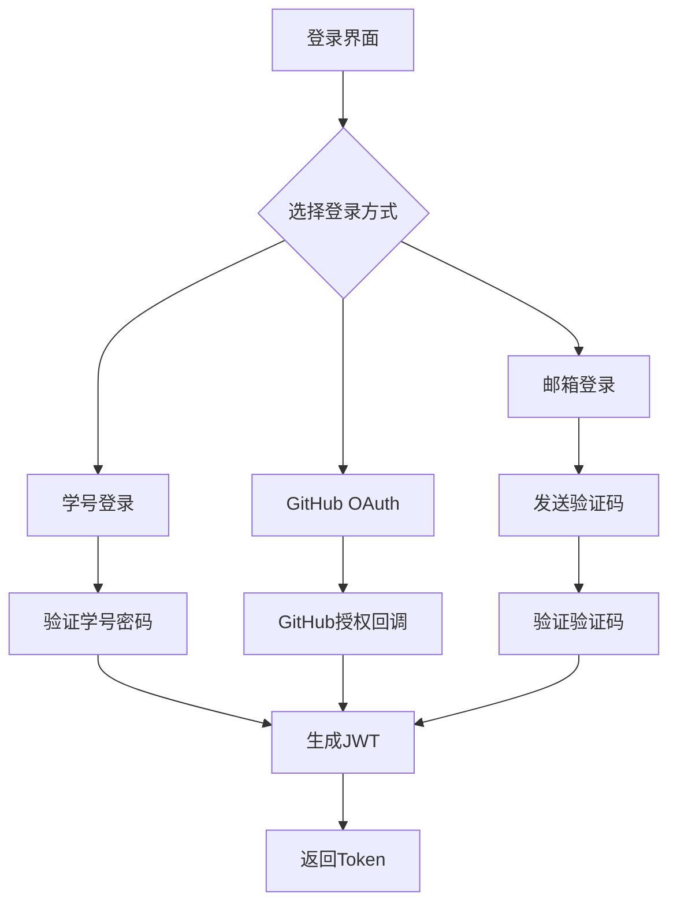
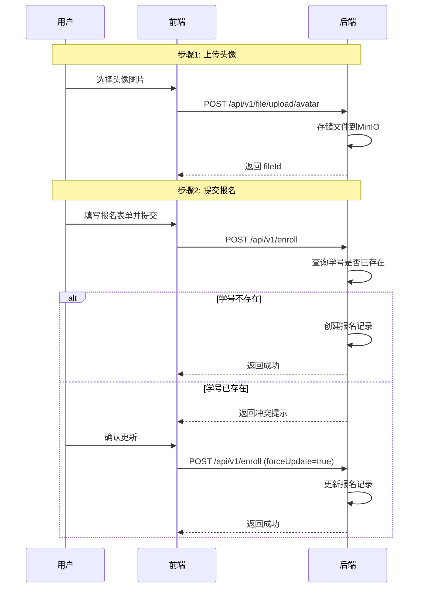
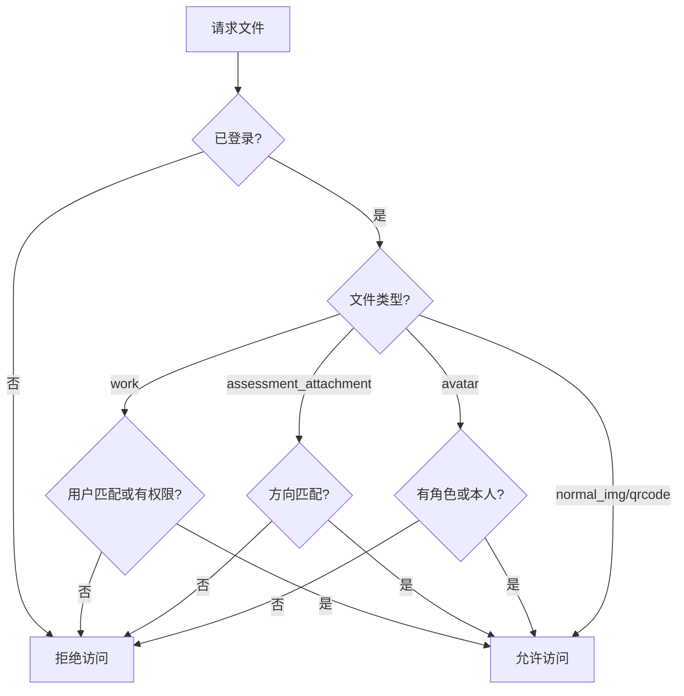
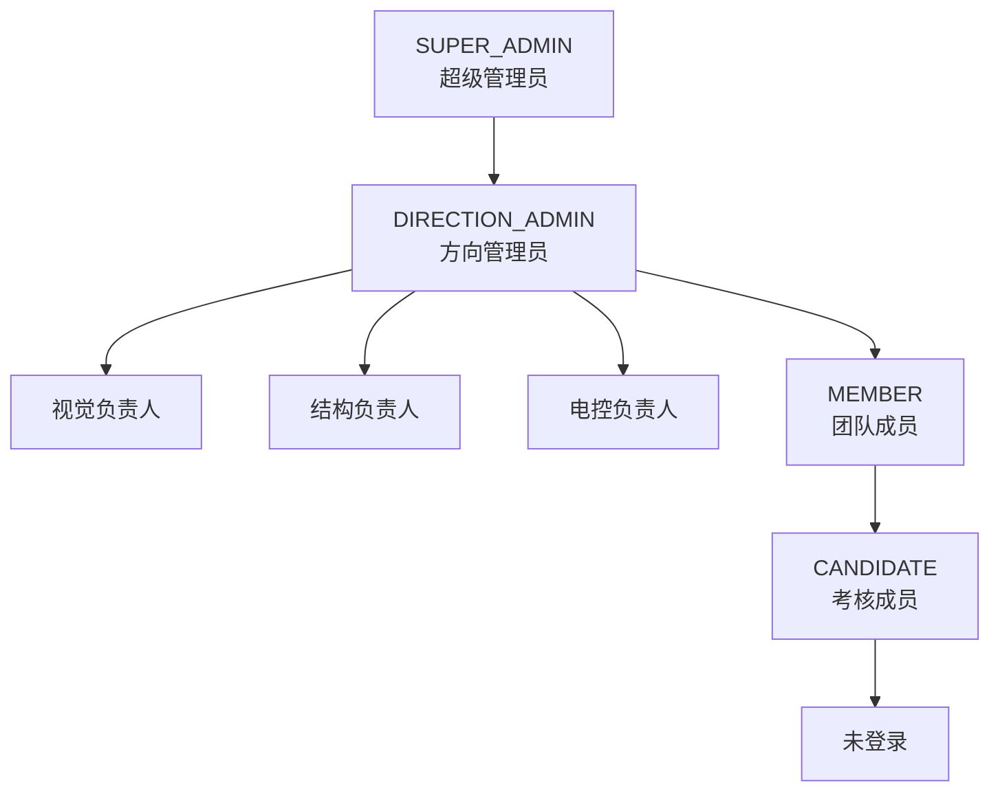

# 后端开发手册

## 技术栈

| 技术 | 版本 | 说明 |
|------|------|------|
| Java | 21 | 编程语言 |
| Spring Boot | 3.5.10 | 后端框架 |
| Spring Security | - | 安全框架 |
| Spring Data Redis | - | 缓存支持 |
| Spring Validation | - | 参数校验 |
| Spring AOP | - | 切面编程 |
| JWT (jjwt) | 0.12.5 | 认证令牌 |
| MyBatis | - | ORM框架 |
| MinIO / 阿里云 OSS | - | 对象存储 |
| MySQL | - | 关系数据库 |

## 项目结构（DDD分层架构）

```
src/backend/main/java/com/bluenet/web/
├── api/                          # API层（接口适配层）
│   ├── controller/               # 控制器
│   │   └── v1/
│   │       ├── admin/            # 管理员接口
│   │       │   ├── AdminCollegeController.java
│   │       │   ├── AdminCompetitionController.java
│   │       │   └── AdminLearningPathController.java
│   │       ├── college/
│   │       │   └── CollegeController.java
│   │       ├── competition/
│   │       │   └── CompetitionController.java
│   │       ├── enrollment/
│   │       │   ├── AdminEnrollController.java
│   │       │   └── EnrollController.java
│   │       ├── file/
│   │       │   ├── FileDownloadController.java
│   │       │   └── FileUploadController.java
│   │       ├── introduce/
│   │       │   └── IntroduceImageController.java
│   │       ├── learningpath/
│   │       │   └── LearningPathController.java
│   │       ├── member/
│   │       │   └── MemberController.java
│   │       ├── user/
│   │       │   ├── UserExperienceController.java
│   │       │   ├── UserInfoController.java
│   │       │   └── UserProfileController.java
│   │       └── AuthController.java
│   │
│   └── dto/                      # 数据传输对象
│       ├── auth/
│       ├── college/
│       ├── competition/
│       ├── enrollment/
│       ├── experience/
│       ├── file/
│       ├── introduce/
│       ├── learningpath/
│       ├── member/
│       └── user/
│
├── application/                  # 应用层（用例层）
│   ├── command/                  # 命令对象（按聚合分包）
│   │   ├── college/
│   │   │   └── CollegeCommands.java
│   │   ├── enroll/
│   │   │   └── EnrollCommands.java
│   │   └── member/
│   │       └── MemberCommands.java
│   │
│   ├── converter/                # 应用层转换器（Result → DTO）
│   │   ├── CollegeAppConverter.java
│   │   ├── MemberAppConverter.java
│   │   └── UserAppConverter.java
│   │
│   ├── service/                  # 应用服务
│   │   ├── CollegeAppService.java
│   │   ├── MemberAppService.java
│   │   └── impl/
│   │       ├── CollegeAppServiceImpl.java
│   │       ├── EnrollAppServiceImpl.java
│   │       ├── FileAppServiceImpl.java
│   │       ├── MemberAppServiceImpl.java
│   │       └── UserInfoAppServiceImpl.java
│   │
│   └── {Aggregate}Result.java    # 应用层结果对象
│
├── domain/                       # 领域层（核心业务层）
│   ├── exception/                # 领域异常
│   │   ├── BadRequest.java
│   │   ├── DataConflict.java
│   │   ├── DataNotFound.java
│   │   ├── Forbidden.java
│   │   ├── GlobalException.java
│   │   └── Unauthorized.java
│   │
│   ├── model/
│   │   ├── entity/               # 实体类
│   │   │   ├── Achievement.java
│   │   │   ├── AssessmentAnswer.java
│   │   │   ├── AssessmentQuestion.java
│   │   │   ├── AssessmentTime.java
│   │   │   ├── Audit.java
│   │   │   ├── College.java
│   │   │   ├── Comment.java
│   │   │   ├── Competition.java
│   │   │   ├── DirectionLearningStep.java
│   │   │   ├── Enroll.java
│   │   │   ├── File.java
│   │   │   ├── IntroduceImage.java
│   │   │   ├── MessageTemplate.java
│   │   │   ├── Permission.java
│   │   │   ├── Qrcode.java
│   │   │   ├── Role.java
│   │   │   ├── RolePermission.java
│   │   │   ├── User.java
│   │   │   ├── UserAchievement.java
│   │   │   ├── UserExperience.java
│   │   │   └── VerifyCode.java
│   │   │
│   │   ├── enumerate/            # 枚举类
│   │   │   ├── AchievementType.java
│   │   │   ├── Direction.java
│   │   │   ├── EnrollStatus.java
│   │   │   ├── ExperienceType.java
│   │   │   ├── FileType.java
│   │   │   ├── Gender.java
│   │   │   ├── ImageType.java
│   │   │   ├── LocalLoginType.java
│   │   │   ├── ProgrammingLanguage.java
│   │   │   ├── QrcodeType.java
│   │   │   └── QuestionType.java
│   │   │
│   │   └── vo/                   # 值对象
│   │       ├── AssessmentAnswerVO.java
│   │       ├── AssessmentQuestionVO.java
│   │       ├── AssessmentTimeVO.java
│   │       ├── CollegeVO.java
│   │       ├── CompetitionBriefVO.java
│   │       ├── CompetitionVO.java
│   │       ├── EnrollBriefVO.java
│   │       ├── EnrollStatisticsVO.java
│   │       ├── EnrollVO.java
│   │       ├── ExperienceVO.java
│   │       ├── FileVO.java
│   │       ├── IntroduceImageVO.java
│   │       ├── LearningStepVO.java
│   │       ├── MemberVO.java
│   │       ├── QrcodeVO.java
│   │       ├── TabCountsVO.java
│   │       ├── UserVO.java
│   │       └── VerifyCodeVO.java
│   │
│   ├── repository/               # 仓储接口
│   │   ├── AssessmentAnswerRepository.java
│   │   ├── AssessmentQuestionRepository.java
│   │   ├── CollegeRepository.java
│   │   ├── CompetitionRepository.java
│   │   ├── EnrollRepository.java
│   │   ├── FileRepository.java
│   │   ├── IntroduceImageRepository.java
│   │   ├── LearningPathRepository.java
│   │   ├── MemberRepository.java
│   │   ├── QrcodeRepository.java
│   │   ├── UserExperienceRepository.java
│   │   ├── UserRepository.java
│   │   └── VerificationCodeRepository.java
│   │
│   └── service/                  # 领域服务（仅保留含实际业务逻辑的）
│       └── impl/
│           ├── AssessmentDecisionDomainServiceImpl.java
│           ├── AssessmentJudgementDomainServiceImpl.java
│           ├── AuthDomainServiceImpl.java
│           ├── EnrollDomainServiceImpl.java
│           ├── FileDomainServiceImpl.java
│           └── UserDomainServiceImpl.java
│
└── BluenetBackendApplication.java
```

## 功能模块

### 1. 认证模块

**登录方式**:
- 学号 + 密码登录
- 邮箱验证码登录
- GitHub OAuth登录

**认证流程**:


### 2. 报名模块

**报名流程**:


**报名状态**:
| 状态 | 说明 |
|------|------|
| pending | 待审核 |
| approved | 已通过 |
| rejected | 已拒绝 |

### 3. 文件模块

#### 文件分类体系

系统采用两级分类体系管理文件：

**一级分类（FileType）**：文件的基本类型分类，对应对象存储中的 Key 前缀

| 枚举值 | 存储值 | 描述 | 对象 Key 前缀 | 权限控制 |
|--------|--------|------|--------------|----------|
| `AVATAR` | `avatar` | 用户头像 | `avatar/` | 团队成员可见或本人头像 |
| `NORMAL_IMG` | `normal-img` | 普通图片（介绍图片） | `normal-img/` | 公开可见 |
| `ASSESSMENT_ATTACHMENT` | `assessment-attachment` | 考题附件 | `assessment-attachment/` | 同方向用户可见 |
| `WORK` | `work` | 考生作品文件 | `work/` | 本人或团队成员可见 |
| `QRCODE` | `qrcode` | 二维码图片 | `qrcode/` | 公开可见 |

**二级分类（ImageType）**：仅针对 `FileType.NORMAL_IMG` 的进一步细分

| 枚举值 | 存储值 | 描述 | 使用场景 | 关联字段 |
|--------|--------|------|----------|----------|
| `LABORATORY` | `laboratory` | 实验室介绍 | 实验室环境展示 | - |
| `EQUIPMENT` | `equipment` | 设备介绍 | 实验设备展示 | - |
| `COMPETITION` | `competition` | 竞赛介绍 | 竞赛成果展示 | `competition_id` |

**注意**：论文/专利成就的图片不再通过 `tb_introduce_image` 表管理，而是直接在 `tb_achievement` 表中通过 `file_id` 字段关联。

#### 文件存储结构

```
对象存储 bucket（storage.bucket）
├── avatar/                    # 头像对象前缀
│   └── avatar-{uuid}.jpg
├── normal-img/                # 普通图片对象前缀
│   └── normal_img-{uuid}.jpg
├── assessment-attachment/     # 考题附件对象前缀
│   └── assessment_attachment-{uuid}.pdf
├── work/                      # 考生作品对象前缀
│   └── work-{uuid}.zip
└── qrcode/                    # 二维码对象前缀
    └── qrcode-{uuid}.png
```

#### 文件命名规则

- **格式**：`{fileType}-{uuid}.{ext}`
- **示例**：`avatar-123e4567-e89b-12d3-a456-426614174000.jpg`
- **注意**：文件名中的 fileType 使用枚举名称的小写形式（如 `normal_img`），对象 Key 前缀使用 `FileType.getValue()`（如 `normal-img`）

#### 文件访问权限控制

文件访问权限根据关联的业务实体动态控制：

| 文件类型 | 权限控制表 | 判断逻辑 |
|----------|------------|----------|
| `work`（考生答案） | `tb_assessment_answer` | `currentUser.id == answer.user_id` OR `currentUser.role >= ROLE_MEMBER` |
| `assessment_attachment`（考题附件） | `tb_assessment_question` | `currentUser.direction == question.direction` |
| `avatar`（头像） | `tb_user` / `tb_enroll` | `currentUser.role >= ROLE_MEMBER` 或 `currentUser.avatarId == fileId` |
| `normal_img`（普通图片） | `tb_introduce_image` | 公开可见 |
| `qrcode`（二维码） | - | 公开可见 |

**权限验证流程**:


#### 文件上传接口

| 接口 | 路径 | 权限 |
|------|------|------|
| 上传头像 | `POST /api/v1/file/upload/avatar` | 公开/已登录 |
| 上传考题附件 | `POST /api/v1/file/upload/assessment/attachment` | 需登录 |
| 上传考题作品 | `POST /api/v1/file/upload/assessment/work` | 需登录 |
| 上传个人二维码 | `POST /api/v1/file/upload/qrcode/self` | 需登录 |
| 上传群聊二维码 | `POST /api/v1/file/upload/qrcode/group` | 需登录 |
| 上传介绍图片 | `POST /api/v1/file/upload/introduce-image` | 需管理员权限 |
| 上传竞赛合照 | `POST /api/v1/file/upload/competition/image` | 需管理员权限 |
| 上传竞赛 Logo | `POST /api/v1/file/upload/competition/logo` | 需管理员权限 |

#### 文件下载接口

- `GET /api/v1/file/download/{fileId}` - 统一下载接口，自动根据文件类型进行权限验证

### 4. 成员模块

**成员信息**:
- 基本信息（姓名、方向、职责）
- 微信二维码
- GitHub链接
- 项目经历
- 竞赛获奖
- 实习经历

**方向负责人判定**:
- `role = DIRECTION_ADMIN` 且 `direction` 字段对应方向

### 5. 考核模块

**考核结构**:
```
方向（计算机视觉/结构设计/嵌入式开发）
├── 轮次（一轮/二轮）
│   ├── 年级（大一/大二）
│   │   ├── 题目列表
│   │   │   ├── 第一题
│   │   │   ├── 第二题
│   │   │   └── 第三题
```

**题目类型**:
| 类型 | 说明 |
|------|------|
| file_upload | 文件上传题 |
| algorithm | 算法题 |
| single_choice | 单选题 |
| multiple_choice | 多选题 |

### 6. 竞赛模块

**竞赛管理**:
- 竞赛信息CRUD
- 竞赛图片管理
- 排序管理

### 7. 学习路径模块

**学习路径**:
- 按方向配置学习步骤
- 步骤排序管理

---

## 角色权限

### 角色层级



### 权限说明

| 角色 | 权限范围 |
|------|----------|
| SUPER_ADMIN | 所有权限，可管理所有方向 |
| DIRECTION_ADMIN | 管理对应方向的考核时间、题目 |
| MEMBER | 查看报名、评论评分 |
| CANDIDATE | 参加考核、查看自己成绩 |

---

## API接口

详细接口文档请参考：[diagrams/接口总览.xmind](./diagrams/接口总览.xmind)

### 接口前缀

所有接口以 `/api/v1` 为前缀

### 主要接口模块

| 模块 | 路径 | 说明 |
|------|------|------|
| 认证 | /auth | 登录、登出 |
| 用户 | /user | 用户信息管理 |
| 消息 | /message | 验证码、消息模板 |
| 文件 | /file | 文件上传下载 |
| 介绍 | /intro | 竞赛、成就展示 |
| 报名 | /enroll | 报名管理 |
| 考核 | /evaluation | 考核时间、题目、答案 |
| 知识库 | /knowledge | AI问答 |
| 审计 | /audit | 日志查询 |

---

## 开发规范

### 分层职责

| 层级 | 职责 |
|------|------|
| API层 | 接收请求、参数校验、返回响应 |
| 应用层 | 编排业务用例、对象转换 |
| 领域层 | 核心业务逻辑、领域规则 |

### 命名规范

#### 包结构命名

```
com.bluenet.web
├── api                          # API层
│   ├── controller               # 控制器
│   │   └── v1                   # 版本号
│   │       ├── admin            # 管理端接口（Admin前缀）
│   │       └── {module}         # 业务模块
│   ├── converter                # API层转换器（RequestDTO → Command）
│   │   └── {aggregate}          # 按聚合分包
│   └── dto                      # 数据传输对象
│       └── {module}             # 按模块分包
├── application                  # 应用层
│   ├── command                  # 命令对象（按聚合分包）
│   │   └── {aggregate}          # 聚合命令包
│   ├── converter                # 应用层转换器（Result → DTO）
│   ├── service                  # 应用服务
│   │   └── impl                 # 服务实现
│   └── {Aggregate}Result.java   # 应用层结果对象
├── domain                       # 领域层
│   ├── exception                # 领域异常
│   ├── model
│   │   ├── entity               # 实体类
│   │   ├── enumerate            # 枚举类
│   │   └── vo                   # 值对象
│   ├── repository               # 仓储接口
│   └── service                  # 领域服务
│       └── impl                 # 领域服务实现
└── infrastructure               # 基础设施层
    ├── config                   # 配置类
    ├── repository
    │   ├── converter            # 显式仓储转换器（DO ↔ Entity）
    │   ├── impl                 # 仓储实现
    │   └── mapper               # MyBatis Mapper
    └── security                 # 安全相关
```

#### 类命名规范

| 类型 | 命名规则 | 示例 |
|------|----------|------|
| Controller | `XxxController.java` | `MemberController.java` |
| 管理端Controller | `AdminXxxController.java` | `AdminEnrollController.java` |
| Controller | `XxxController.java` | `MemberController.java` |
| 管理端Controller | `AdminXxxController.java` | `AdminEnrollController.java` |
| 应用服务接口 | `XxxAppService.java` | `MemberAppService.java` |
| 应用服务实现 | `XxxAppServiceImpl.java` | `MemberAppServiceImpl.java` |
| 领域服务接口 | `XxxDomainService.java` | `EnrollDomainService.java` |
| 领域服务实现 | `XxxDomainServiceImpl.java` | `EnrollDomainServiceImpl.java` |
| 仓储接口 | `XxxRepository.java` | `UserRepository.java` |
| 仓储实现 | `XxxRepositoryImpl.java` | `UserRepositoryImpl.java` |
| 仓储转换器 | `XxxRepositoryConverter.java` | `UserRepositoryConverter.java` |
| 应用层转换器 | `XxxAppConverter.java` | `MemberAppConverter.java` |
| API请求转换器 | `XxxRequestConverter.java` | `MemberRequestConverter.java` |
| 命令对象 | `XxxCommands.java` | `MemberCommands.java` |
| 结果对象 | `XxxResult.java` | `MemberResult.java` |
| Mapper | `XxxMapper.java` | `UserMapper.java` |
| 实体类 | 实体名（PascalCase） | `User.java`、`UserExperience.java` |
| 枚举类 | 实体名（PascalCase） | `Direction.java`、`EnrollStatus.java` |
| 值对象 | `XxxVO.java` | `UserVO.java`、`EnrollVO.java` |
| 配置类 | `XxxConfig.java` / `XxxProperties.java` | `SecurityConfig.java`、`JwtProperties.java` |
| 异常类 | 描述性名词 | `BadRequest.java`、`DataNotFound.java` |
| 配置类 | `XxxConfig.java` / `XxxProperties.java` | `SecurityConfig.java`、`JwtProperties.java` |
| 异常类 | 描述性名词 | `BadRequest.java`、`DataNotFound.java` |

#### DTO命名规范

| 类型 | 命名规则 | 示例 |
|------|----------|------|
| 请求DTO | `{动作}{实体}RequestDTO.java` | `CreateEnrollmentRequestDTO.java` |
| 响应DTO | `{实体}ResponseDTO.java` 或 `{实体}DTO.java` | `UserAuthResponseDTO.java`、`MemberBriefDTO.java` |
| 列表查询DTO | `{实体}ListQueryDTO.java` | `EnrollmentListQueryDTO.java` |
| 详情DTO | `{实体}DetailDTO.java` | `MemberDetailDTO.java` |
| 简要DTO | `{实体}BriefDTO.java` | `MemberBriefDTO.java` |
| 统计DTO | `{实体}StatisticsDTO.java` | `EnrollmentStatisticsDTO.java` |
| 分页DTO | `PageDTO.java` | `PageDTO<T>` |
| 通用响应 | `ResponseMessage.java` | `ResponseMessage<T>` |

#### 方法命名规范

| 操作类型 | 方法前缀 | 示例 |
|----------|----------|------|
| 查询单个 | `get` / `find` | `getMemberById()`、`findByUsername()` |
| 查询列表 | `list` / `getAll` | `listMembers()`、`getAllColleges()` |
| 分页查询 | `page` / `getPaged` | `pageEnrollments()` |
| 创建 | `create` | `createEnrollment()` |
| 更新 | `update` | `updateProfile()` |
| 删除 | `delete` / `remove` | `deleteExperience()` |
| 判断存在 | `exists` | `existsByUsername()` |
| 统计 | `count` | `countByStatus()` |
| 校验 | `validate` / `check` | `validatePermission()` |
| 转换 | `to{目标类型}` | `toDTO()`、`toVO()`、`toEntity()` |

#### 类型转换链（不可违反）

各层之间的数据流转必须遵循以下转换链：

```
RequestDTO → Command → Entity → Result → ResponseDTO
     ↑          ↑        ↑         ↑          ↑
  api/      api/     AppService  api/       api/
converter/ converter/           converter/ converter/
```

| 转换步骤 | 源类型 | 目标类型 | 转换器位置 | 示例 |
|----------|--------|----------|-----------|------|
| 1 | `RequestDTO` | `Command` | `api/converter/{aggregate}/XxxRequestConverter.java` | `toCommand(dto)` |
| 2 | `Command` | `Entity` | `AppServiceImpl` 通过工厂方法 | `Entity.create(command.field())` |
| 3 | `DO` ↔ `Entity` | `Entity` ↔ `DO` | `infrastructure/repository/converter/XxxRepositoryConverter.java` | `toEntity(do)` / `toDataObject(entity)` |
| 4 | `Entity` | `Result` | `AppServiceImpl` 直接构造 | `new Result(entity.getId(), ...)` |
| 5 | `Result` | `ResponseDTO` | `application/converter/XxxAppConverter.java` | `toDTO(result)` |

**核心规则：**
- Repository 接口只操作 `Entity`，不返回 `VO`
- `infrastructure/repository/converter/` 使用**显式字段映射**，禁止使用 `BeanUtils.copyProperties`
- 已删除的遗留工具：`RepositoryObjectConverter`（基于反射的通用转换器）

#### Entity 行为化规范

Entity 必须遵循以下模式：

```java
@Data
@NoArgsConstructor(access = AccessLevel.PRIVATE)
public class College {
    private Long id;
    private String name;

    private College(Long id, String name) {
        this.id = id;
        this.name = name;
    }

    /** 构造时校验 */
    public static College create(String name) {
        if (name == null || name.isBlank()) throw new IllegalArgumentException("...");
        return new College(null, name.trim());
    }

    /** 从数据库重建，跳过校验 */
    public static College reconstruct(Long id, String name) {
        return new College(id, name);
    }

    /** 领域行为 */
    public void rename(String newName) {
        if (newName == null || newName.isBlank()) throw new IllegalArgumentException("...");
        this.name = newName.trim();
    }
}
```

**规范要点：**
- 无参构造必须为 `PRIVATE`
- 提供 `create(...)` 工厂方法（构造时校验）
- 提供 `reconstruct(...)` 工厂方法（从数据库重建，跳过校验）
- 领域行为方法直接修改状态（如 `rename`、`updateInfo`）
- 禁止在 Entity 中使用 `Builder`（会破坏构造私有化）

#### DomainService 保留标准

重构过程中删除了大量纯代理型 DomainService，仅保留含**实际业务逻辑**的 DomainService：

| 保留的 DomainService | 保留原因 |
|---------------------|---------|
| `AssessmentDecisionDomainService` | 考生最终通过决策算法 |
| `AssessmentJudgementDomainService` | 判题逻辑、评分计算 |
| `AuthDomainService` | 本地登录校验 |
| `EnrollDomainService` | 跨聚合审批流程 |
| `FileDomainService` | 文件存储、关联查询 |
| `QrcodeDomainService` | 二维码生成、级联删除 |
| `UserDomainService` | 密码编码、档案更新 |
| `UserExperienceDomainService` | 经历领域逻辑 |
| `VerificationCodeDomainService` | 验证码生成 |

**删除标准：**
- 仅做参数透传、直接调用 Repository 的纯代理型 DomainService → **删除**
- 业务逻辑已下沉到 Entity 行为方法 → **删除**
- 含跨聚合协调、复杂算法、外部服务调用的 → **保留**

#### 变量命名规范

| 类型 | 命名规则 | 示例 |
|------|----------|------|
| 类成员变量 | camelCase | `memberRoleId`、`candidateRoleId` |
| 常量 | UPPER_SNAKE_CASE | `MAX_PAGE_SIZE`、`DEFAULT_SORT_ORDER` |
| 布尔变量 | `is`/`has`/`can` 前缀 | `isActive`、`hasPermission`、`canEdit` |
| 集合变量 | 复数形式 | `members`、`enrollmentList` |
| Map变量 | `xxxMap` 或 `xxxByKey` | `permissionMap`、`usersById` |

#### 数据库命名规范

| 类型 | 命名规则 | 示例 |
|------|----------|------|
| 表名 | `tb_` + 小写下划线 | `tb_user`、`tb_user_experience` |
| 字段名 | 小写下划线 | `student_id`、`created_at` |
| 索引名 | `idx_` + 表名 + 字段 | `idx_user_student_id` |
| 外键名 | `fk_` + 表名 + 关联表 | `fk_user_role` |

### 枚举规范

#### 枚举定义

枚举类使用 `@EnumValue` 注解标记存储值，采用**小写下划线**格式：

```java
@Getter
public enum Direction {
    COMPUTER_VISION("computer_vision", "计算机视觉"),
    STRUCTURAL_DESIGN("structural_design", "结构设计"),
    EMBEDDED("embedded", "嵌入式开发");

    @EnumValue  // 标记存储到数据库的值
    private final String value;
    private final String description;

    Direction(String value, String description) {
        this.value = value;
        this.description = description;
    }
}
```

#### 枚举格式对照

| 场景 | 格式 | 示例 |
|------|------|------|
| Java代码引用 | 大写下划线 | `Direction.COMPUTER_VISION` |
| 数据库存储 | 小写下划线 | `computer_vision` |
| API请求参数 | 小写下划线 | `?direction=computer_vision` |
| API响应JSON | 小写下划线 | `"direction": "computer_vision"` |

#### 枚举转换机制

项目使用 `EnumConverterFactory` 处理字符串到枚举的转换：

1. **优先匹配 `@EnumValue` 值**：`computer_vision` → `COMPUTER_VISION`
2. 其次尝试大写匹配：`COMPUTER_VISION` → `COMPUTER_VISION`
3. 最后不区分大小写匹配

#### API参数示例

```bash
# 成员列表按方向筛选
GET /api/v1/members?direction=computer_vision

# 报名列表按状态筛选
GET /api/v1/admin/enrollments?status=pending
```

### 测试规范

#### 角色名称定义

系统角色名称统一使用**大写下划线**格式：

| 角色名 | 说明 |
|--------|------|
| SUPER_ADMIN | 超级管理员 |
| DIRECTION_ADMIN | 方向管理员 |
| MEMBER | 团队成员 |
| CANDIDATE | 考生（报名通过后自动分配） |

#### 测试中设置用户角色

由于数据库迁移脚本中插入的角色**没有指定ID**（使用数据库自增），测试时不能直接通过ID设置用户角色，必须先通过角色名查找角色ID：

```java
@SpringBootTest
class ExampleIntegrationTest {
    
    @Autowired
    private RoleMapper roleMapper;
    
    private Long memberRoleId;
    private Long candidateRoleId;
    
    @BeforeEach
    void setUp() {
        // 正确：通过角色名查找角色ID
        Role memberRole = roleMapper.selectByName("MEMBER");
        assertNotNull(memberRole, "MEMBER 角色应存在");
        memberRoleId = memberRole.getId();
        
        Role candidateRole = roleMapper.selectByName("CANDIDATE");
        assertNotNull(candidateRole, "CANDIDATE 角色应存在");
        candidateRoleId = candidateRole.getId();
        
        // 然后使用查找到的ID创建用户
        User user = User.builder()
            .username("测试用户")
            .roleId(memberRoleId)  // 使用查找到的ID
            .build();
    }
}
```

#### 错误示例

```java
// 错误：不要硬编码角色ID
User user = User.builder()
    .roleId(1L)  // ❌ 错误：ID可能因数据库状态不同而变化
    .build();
```

#### 使用 @WithUserVO 注解

单元测试可使用 `@WithUserVO` 注解模拟已认证用户：

```java
@Test
@WithUserVO(
    userId = 1L, 
    studentId = "2024001001", 
    username = "张三", 
    roleName = "MEMBER",  // 直接使用角色名
    permissions = "user:info:me"
)
void testUserInfo() {
    // 测试逻辑
}
```

### 异常处理

使用统一异常处理：
- `BadRequest`: 400 错误请求
- `Unauthorized`: 401 未授权
- `Forbidden`: 403 禁止访问
- `DataNotFound`: 404 数据不存在
- `DataConflict`: 409 数据冲突

### 分页接口规范

**必须使用 `PageDTO<T>` 而非 Spring Data 的 `Page<T>`**

Spring Data 的 `Page<T>` 序列化后的字段与前端 `PageDTO<T>` 接口定义不匹配，所有分页接口必须返回 `PageDTO<T>`。

#### Controller 层示例

```java
// ✅ 正确
@GetMapping
public ResponseMessage<PageDTO<AchievementDTO>> getAchievements(
        @RequestParam(defaultValue = "0") Integer page,
        @RequestParam(defaultValue = "12") Integer size) {
    return ResponseMessage.success(achievementService.getAchievements(page, size, ...));
}

// ❌ 错误 - Spring Data Page 序列化格式与前端不兼容
@GetMapping
public ResponseMessage<Page<AchievementDTO>> getAchievements(...) {
    return ResponseMessage.success(achievementService.getAchievements(...));
}
```

#### Service 层示例

```java
@Override
public PageDTO<AchievementDTO> getAchievements(Integer page, Integer size, ...) {
    // 1. 创建分页请求
    Pageable pageable = PageRequest.of(page, size);
    
    // 2. 执行分页查询
    Page<AchievementVO> voPage = repository.findWithFilter(..., pageable);
    
    // 3. 转换为 DTO 分页
    Page<AchievementDTO> dtoPage = voPage.map(converter::convertToDTO);
    
    // 4. 关键：转换为 PageDTO
    return PageDTO.from(dtoPage);
}
```

#### 前端对应类型

```typescript
// 前端 PageDTO 接口定义
interface PageDTO<T> {
  content: T[]           // 内容列表
  totalElements: number  // 总元素数
  totalPages: number     // 总页数
  number: number         // 当前页码(从0开始)
  size: number           // 每页大小
  numberOfElements: number  // 当前页元素数
  first: boolean         // 是否第一页
  last: boolean          // 是否最后一页
  empty: boolean         // 是否为空
}
```

#### 注意事项

1. Controller 返回类型必须是 `ResponseMessage<PageDTO<XxxDTO>>`
2. Service 层使用 `PageDTO.from(dtoPage)` 进行转换
3. 分页参数：`page` 从 0 开始，`size` 默认值根据业务场景设置

### 审计日志

所有操作记录审计日志：
- 操作人、操作时间
- 请求参数（JSON格式）
- 客户端IP、User-Agent
- 操作结果

### 数据库规范

#### 表设计规范

- 所有表以 `tb_` 为前缀
- 所有表必须有 `deleted` 软删除字段
- **不需要** `created_at`、`updated_at`、`created_by`、`updated_by` 等审计字段，除非有特殊业务需求
- 使用 `tb_audit` 表统一记录操作审计日志

#### 迁移脚本规范

- **不要**在数据库迁移脚本中添加权限的默认值
- 权限数据应通过代码初始化或管理后台配置
- 迁移脚本只负责表结构定义，不包含业务初始数据

#### 特殊审计字段场景

以下表因业务需要保留审计字段：

| 表名 | 审计字段 | 说明 |
|------|----------|------|
| tb_competition | created_at, updated_at | 竞赛创建和更新时间 |
| tb_comment | created_at, updated_at | 评论时间记录 |
| tb_audit | action_time | 审计日志操作时间 |
| tb_user_experience | start_time, end_time | 经历时间段 |

---

## 层间返回类型约定（项目规范）

目的：统一 Mapper / Repository / Domain / Application / Controller 的返回值，减少责任混淆与隐性耦合。

### 总体原则

- 不在下层直接暴露上层类型（如 DTO）。
- Mapper 负责数据库行和 XML 查询结果映射。RepositoryImpl 负责 DO / QueryDO -> Domain Entity / Domain VO 的转换。Application 层负责 Domain -> DTO 的转换。Controller 统一返回 ResponseMessage<DTO>。
- SQL 逻辑必须写在 Mapper XML 中；Java 代码中不得通过 `QueryWrapper.apply()`、`.last()`、注解 SQL 或字符串片段承载 SQL 逻辑。

### Mapper 返回值类型

Mapper 只能返回以下三类类型，且返回对象 nullable，不使用 Optional。

1. 普通 DO
   - 适用场景：查询结果能自然映射为某张表的数据对象。
   - 典型场景：按主键查单表、按唯一字段查单表、单表分页/列表查询、单表增删改。
   - 示例：`UserDO selectById(Long id);`、`IPage<AssessmentQuestionDO> selectPageByAssessmentTimeId(...);`

2. QueryDO
   - 适用场景：查询结果不是某个单表实体的完整或自然形态，而是为某个 XML 查询场景组合出的持久化查询数据对象。
   - 典型场景：多表 join 混合字段、group by / count / sum / avg 聚合、窗口函数、排名、去重后的派生字段、报表或工作台查询结果。
   - 命名：`XxxQueryDO`。
   - 包路径：`com.bluenet.web.infrastructure.repository.dataobject.query`。
   - 限制：QueryDO 只能出现在 `infrastructure.repository.mapper`、`infrastructure.repository.impl` 和 `infrastructure.repository.dataobject.query` 内部，不允许出现在 domain repository 接口、domain service、application service 或 controller。
   - 示例：`AssessmentQuestionScoreboardQueryDO`、`AssessmentCandidateScoreQueryDO`、`AuditTrendPointQueryDO`。

3. 基础类型
   - 适用场景：查询结果只是单个标量或简单集合。
   - 典型场景：count / exists、id 集合、name/value 集合、布尔判断。
   - 示例：`long countByName(...)`、`boolean existsByRoleIdAndPermissionId(...)`、`List<Long> selectPermissionIdsByRoleId(...)`。

禁止事项：
- Mapper 禁止返回 API DTO、Application DTO、Domain VO。
- Mapper 禁止返回命名为 `Projection`、`View`、`DTO` 的查询结果类型。
- Mapper 禁止通过注解 SQL 承载查询；SQL 应写在 XML 中。
- Java 代码禁止写 SQL 片段或 SQL 函数表达式；复杂条件应下沉到 XML。

- Repository 接口（domain/repository）
  - 返回：Optional<Aggregate>、Aggregate、List<Aggregate>、Page<Aggregate>、int（受影响行数）等。
  - 示例：Optional<User> findById(Long id);
  - 说明：接口不得暴露持久层 DO、QueryDO、Mapper、IPage、MyBatis 类型。

- RepositoryImpl（infrastructure/impl）
  - 职责：调用 Mapper（获得 DO 或 QueryDO），转换为 Domain Entity/Aggregate/VO，处理空值并返回 Optional。保持转换逻辑集中。
  - 示例：public Optional<User> findById(Long id) { UserDO d = userMapper.selectById(id); return Optional.ofNullable(convert(d)); }

- 领域服务（domain/service）
  - 返回：Domain Entity/Aggregate 或领域 VO（仅用于值对象如统计）。不得返回 DTO。
  - 示例：Optional<User> getUser(Long id); TabCountsVO getTabCounts(Long userId);

- Application 层 & Controller
  - Application 返回 DTO（或 PageDTO），Controller 返回 ResponseMessage<DTO>。
  - 示例：public UserInfo getMyInfo();  Controller: public ResponseMessage<UserInfo> getMyInfo()

### Optional 与空值处理约定

- Mapper 返回 nullable 对象；RepositoryImpl 负责将 null 转为 Optional（或其它统一的空值策略）。不要在 Mapper 方法签名中使用 Optional。

### 分页约定

- Mapper 返回原始分页数据（IPage/分页 DO 或 QueryDO），RepositoryImpl 转换为 Page<Aggregate/VO>，Application 转为 PageDTO<DTO>。


## 配置说明

### 环境配置

- `dev`: 开发环境（默认）
- `test`: 测试环境
- `prod`: 生产环境

### 启动命令

```bash
# 开发环境
mvn spring-boot:run

# 指定环境
mvn spring-boot:run -Dspring.profiles.active=prod

# 打包
mvn clean package -Pprod
```
