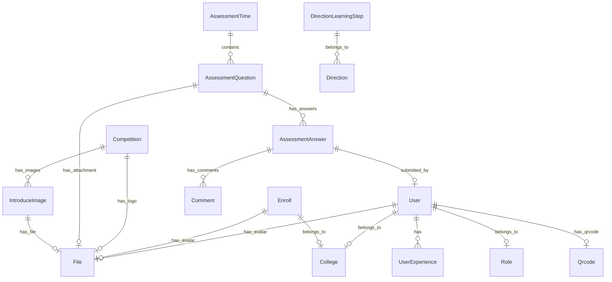

# 数据库设计

## 概述

数据库使用 MySQL，所有表以 `tb_` 为前缀，所有表都必须有 `deleted` 软删除字段。

### 数据库规范

#### 表设计规范

- 所有表以 `tb_` 为前缀
- 所有表必须有 `deleted` 软删除字段
- **不需要** `created_at`、`updated_at`、`created_by`、`updated_by` 等审计字段，除非有特殊业务需求
- 使用 `tb_audit` 表统一记录操作审计日志

#### 迁移脚本规范

- **不要**在数据库迁移脚本中添加权限的默认值
- 权限数据应通过代码初始化或管理后台配置
- 迁移脚本只负责表结构定义，不包含业务初始数据

#### 特殊审计字段场景

以下表因业务需要保留审计字段：

| 表名 | 审计字段 | 说明 |
|------|----------|------|
| tb_competition | created_at, updated_at | 竞赛创建和更新时间 |
| tb_comment | created_at, updated_at | 评论时间记录 |
| tb_audit | action_time | 审计日志操作时间 |
| tb_user_experience | start_time, end_time | 经历时间段 |

## ER图

## 数据表

### 1. 用户表 (tb_user)

用户基本信息表，存储团队成员和考生信息。

| 字段 | 类型 | 说明 |
|------|------|------|
| id | BIGINT | 主键，自增 |
| student_id | VARCHAR(20) | 学号，唯一 |
| email | VARCHAR(100) | 邮箱 |
| role_id | BIGINT | 角色ID，关联 tb_role |
| password | VARCHAR(255) | 密码（哈希存储） |
| username | VARCHAR(50) | 用户名 |
| nickname | VARCHAR(50) | 昵称 |
| college_id | BIGINT | 学院ID，关联 tb_college |
| major | VARCHAR(100) | 专业 |
| direction | ENUM | 方向（computer_vision/structural_design/embedded） |
| gender | ENUM | 性别（male/female/unknown） |
| job | VARCHAR(100) | 职责 |
| avatar_id | BIGINT | 头像文件ID，关联 tb_file |
| disable | BOOLEAN | 是否禁用 |
| qrcode_id | BIGINT | 二维码ID，关联 tb_qrcode |
| github_id | VARCHAR(100) | GitHub ID |
| github_username | VARCHAR(100) | GitHub用户名 |
| internal_referral_code | VARCHAR(10) | 内推码 |
| bio | TEXT | 个人简介 |
| deleted | BOOLEAN | 软删除标记 |

---

### 2. 角色表 (tb_role)

用户角色定义。

| 字段 | 类型 | 说明 |
|------|------|------|
| id | BIGINT | 主键，自增 |
| name | VARCHAR(50) | 角色名称 |
| deleted | BOOLEAN | 软删除标记 |

**预设角色**:
| ID | 名称 | 说明 |
|------|------|------|
| 1 | 超级管理员 | SUPER_ADMIN |
| 2 | 方向管理员 | DIRECTION_ADMIN |
| 3 | 团队成员 | MEMBER |
| 4 | 考核成员 | CANDIDATE |

---

### 3. 学院表 (tb_college)

学院信息表。

| 字段 | 类型 | 说明 |
|------|------|------|
| id | BIGINT | 主键，自增 |
| name | VARCHAR(100) | 学院名称 |
| deleted | BOOLEAN | 软删除标记 |

---

### 4. 报名表 (tb_enroll)

报名信息表。

| 字段 | 类型 | 说明 |
|------|------|------|
| id | BIGINT | 主键，自增 |
| username | VARCHAR(50) | 姓名 |
| student_id | VARCHAR(20) | 学号 |
| password | VARCHAR(255) | 初始密码（明文，发放后删除） |
| internal_referral_code | VARCHAR(10) | 内推码 |
| college_id | BIGINT | 学院ID |
| major | VARCHAR(100) | 专业 |
| grade | INT | 年级（1=大一, 2=大二） |
| direction | ENUM | 报名方向 |
| avatar_id | BIGINT | 头像文件ID |
| status | ENUM | 状态（pending/approved/rejected） |
| email | VARCHAR(100) | 邮箱 |
| introduction | TEXT | 自我介绍 |
| deleted | BOOLEAN | 软删除标记 |

---

### 5. 文件表 (tb_file)

文件元信息表。

| 字段 | 类型 | 说明 |
|------|------|------|
| id | BIGINT | 主键，自增 |
| name | VARCHAR(255) | 文件名 |
| type | ENUM | 文件类型（avatar/exam_attachment/answer/intro_image/normal_img/qrcode） |
| url | VARCHAR(500) | 文件URL |
| deleted | BOOLEAN | 软删除标记 |

---

### 6. 竞赛表 (tb_competition)

竞赛信息表。

| 字段 | 类型 | 说明 |
|------|------|------|
| id | BIGINT | 主键，自增 |
| name | VARCHAR(200) | 竞赛全称 |
| short_name | VARCHAR(100) | 竞赛简称 |
| logo_file_id | BIGINT | Logo文件ID |
| summary | VARCHAR(500) | 简介 |
| detail | TEXT | 详细介绍 |
| sort_order | INT | 排序序号 |
| enabled | BOOLEAN | 是否启用 |
| created_at | DATETIME | 创建时间 |
| updated_at | DATETIME | 更新时间 |
| deleted | BOOLEAN | 软删除标记 |

---

### 7. 介绍图片表 (tb_introduce_image)

首页介绍图片表。

| 字段 | 类型 | 说明 |
|------|------|------|
| id | BIGINT | 主键，自增 |
| type | ENUM | 图片类型（laboratory/equipment/team_photo/direction/competition/patent/paper） |
| description | VARCHAR(255) | 描述 |
| file_id | BIGINT | 文件ID |
| direction | ENUM | 关联方向（可选） |
| competition_id | BIGINT | 关联竞赛ID（可选） |
| sort_order | INT | 排序序号 |
| deleted | BOOLEAN | 软删除标记 |

---

### 8. 考核时间表 (tb_assessment_time)

考核轮次时间表。

| 字段 | 类型 | 说明 |
|------|------|------|
| id | BIGINT | 主键，自增 |
| direction | ENUM | 方向 |
| epoch | INT | 轮次（1=一轮, 2=二轮） |
| start_time | DATETIME | 开始时间 |
| end_time | DATETIME | 结束时间 |
| time_limit | BOOLEAN | 是否限时 |
| time_limit_minutes | INT | 限时分钟数 |
| deleted | BOOLEAN | 软删除标记 |

---

### 9. 考核题目表 (tb_assessment_question)

考核题目表。

| 字段 | 类型 | 说明 |
|------|------|------|
| id | BIGINT | 主键，自增 |
| assessment_time_id | BIGINT | 考核时间ID |
| question_no | INT | 题目序号 |
| question_type | ENUM | 题目类型（single_choice/multiple_choice/file_upload/algorithm） |
| title | VARCHAR(500) | 题目标题 |
| content | JSON | 题目内容（选项、答案等） |
| attachment_id | BIGINT | 附件文件ID |
| score | DECIMAL(5,2) | 分值 |
| deleted | BOOLEAN | 软删除标记 |

---

### 10. 考核答案表 (tb_assessment_answer)

考生答案表。

| 字段 | 类型 | 说明 |
|------|------|------|
| id | BIGINT | 主键，自增 |
| question_id | BIGINT | 题目ID |
| user_id | BIGINT | 用户ID |
| answer | JSON | 答案内容 |
| file_id | BIGINT | 上传文件ID（文件上传题） |
| score | DECIMAL(5,2) | 得分 |
| submitted_at | DATETIME | 提交时间 |
| deleted | BOOLEAN | 软删除标记 |

---

### 11. 评论表 (tb_comment)

考核评论表。

| 字段 | 类型 | 说明 |
|------|------|------|
| id | BIGINT | 主键，自增 |
| answer_id | BIGINT | 答案ID |
| user_id | BIGINT | 评论用户ID |
| content | TEXT | 评论内容 |
| score | DECIMAL(5,2) | 评分 |
| created_at | DATETIME | 创建时间 |
| updated_at | DATETIME | 更新时间 |
| deleted | BOOLEAN | 软删除标记 |

---

### 12. 用户经历表 (tb_user_experience)

用户项目/竞赛/实习经历表。

| 字段 | 类型 | 说明 |
|------|------|------|
| id | BIGINT | 主键，自增 |
| user_id | BIGINT | 用户ID |
| type | ENUM | 经历类型（competition/project/internship） |
| title | VARCHAR(200) | 标题 |
| content | TEXT | 内容描述 |
| start_time | DATETIME | 开始时间 |
| end_time | DATETIME | 结束时间 |
| deleted | BOOLEAN | 软删除标记 |

---

### 13. 方向学习步骤表 (tb_direction_learning_step)

各方向学习路径步骤表。

| 字段 | 类型 | 说明 |
|------|------|------|
| id | BIGINT | 主键，自增 |
| direction | ENUM | 方向 |
| step_number | INT | 步骤序号 |
| title | VARCHAR(200) | 步骤标题 |
| video_url | VARCHAR(500) | 视频链接URL |
| deleted | BOOLEAN | 软删除标记 |

---

### 14. 审计日志表 (tb_audit)

操作审计日志表。

| 字段 | 类型 | 说明 |
|------|------|------|
| id | BIGINT | 主键，自增 |
| action | VARCHAR(100) | 操作类型 |
| action_arg | VARCHAR(4000) | 操作参数（JSON格式） |
| action_user_id | BIGINT | 操作人ID |
| action_time | DATETIME | 操作时间 |
| ip_address | VARCHAR(50) | 客户端IP |
| user_agent | VARCHAR(500) | 客户端User-Agent |
| remarks | VARCHAR(500) | 备注 |
| success_state | BOOLEAN | 操作状态 |
| deleted | BOOLEAN | 软删除标记 |

---

### 15. 消息模板表 (tb_message_template)

消息通知模板表。

| 字段 | 类型 | 说明 |
|------|------|------|
| id | BIGINT | 主键，自增 |
| name | VARCHAR(100) | 模板名称 |
| type | VARCHAR(50) | 模板类型 |
| subject | VARCHAR(200) | 消息主题 |
| content | TEXT | 消息内容 |
| enabled | BOOLEAN | 是否启用 |
| deleted | BOOLEAN | 软删除标记 |

---

### 16. 验证码表 (tb_verify_code)

验证码记录表。

| 字段 | 类型 | 说明 |
|------|------|------|
| id | BIGINT | 主键，自增 |
| email | VARCHAR(100) | 邮箱 |
| code | VARCHAR(10) | 验证码 |
| type | VARCHAR(50) | 验证码类型 |
| expire_at | DATETIME | 过期时间 |
| used | BOOLEAN | 是否已使用 |
| deleted | BOOLEAN | 软删除标记 |

---

### 17. 二维码表 (tb_qrcode)

二维码信息表。

| 字段 | 类型 | 说明 |
|------|------|------|
| id | BIGINT | 主键，自增 |
| type | ENUM | 二维码类型 |
| content | VARCHAR(500) | 二维码内容 |
| file_id | BIGINT | 图片文件ID |
| deleted | BOOLEAN | 软删除标记 |

---

### 18. 成就表 (tb_achievement)

成就信息表。

| 字段 | 类型 | 说明 |
|------|------|------|
| id | BIGINT | 主键，自增 |
| title | VARCHAR(200) | 成就标题 |
| type | ENUM | 成就类型（paper/patent/competition） |
| description | TEXT | 描述 |
| deleted | BOOLEAN | 软删除标记 |

---

### 19. 用户成就关联表 (tb_user_achievement)

用户与成就的关联表。

| 字段 | 类型 | 说明 |
|------|------|------|
| id | BIGINT | 主键，自增 |
| user_id | BIGINT | 用户ID |
| achievement_id | BIGINT | 成就ID |
| deleted | BOOLEAN | 软删除标记 |

---

### 20. 权限表 (tb_permission)

权限定义表。

| 字段 | 类型 | 说明 |
|------|------|------|
| id | BIGINT | 主键，自增 |
| name | VARCHAR(100) | 权限名称 |
| value | VARCHAR(100) | 权限值 |
| url | VARCHAR(200) | 操作URL |
| method | VARCHAR(10) | HTTP方法 |
| deleted | BOOLEAN | 软删除标记 |

---

### 21. 角色权限关联表 (tb_role_permission)

角色与权限的关联表。

| 字段 | 类型 | 说明 |
|------|------|------|
| id | BIGINT | 主键，自增 |
| role_id | BIGINT | 角色ID |
| permission_id | BIGINT | 权限ID |
| deleted | BOOLEAN | 软删除标记 |

---

## 枚举值

### Direction（方向）

| 值 | 说明 |
|------|------|
| computer_vision | 计算机视觉 |
| structural_design | 结构设计 |
| embedded | 嵌入式开发 |

### EnrollStatus（报名状态）

| 值 | 说明 |
|------|------|
| pending | 待审核 |
| approved | 已通过 |
| rejected | 已拒绝 |

### Gender（性别）

| 值 | 说明 |
|------|------|
| male | 男 |
| female | 女 |
| unknown | 未知 |

### QuestionType（题目类型）

| 值 | 说明 |
|------|------|
| single_choice | 单选题 |
| multiple_choice | 多选题 |
| file_upload | 文件上传 |
| algorithm | 算法题 |

### FileType（文件类型）

| 值 | 说明 |
|------|------|
| avatar | 头像 |
| normal_img | 普通图片 |
| exam_attachment | 考题附件 |
| answer | 考生答案 |
| intro_image | 介绍图片 |
| qrcode | 二维码 |

### ExperienceType（经历类型）

| 值 | 说明 |
|------|------|
| competition | 竞赛 |
| project | 项目 |
| internship | 实习 |

### AchievementType（成就类型）

| 值 | 说明 |
|------|------|
| paper | 论文 |
| patent | 专利 |
| competition | 竞赛 |

### ImageType（介绍图片类型）

| 值 | 说明 |
|------|------|
| laboratory | 实验室介绍 |
| equipment | 设备介绍 |
| team_photo | 团队合照 |
| direction | 方向介绍 |
| competition | 竞赛介绍 |
| patent | 专利介绍 |
| paper | 论文介绍 |

---

## 索引设计

### 主要索引

| 表名 | 索引名 | 字段 | 类型 |
|------|--------|------|------|
| tb_user | uk_student_id | student_id | UNIQUE |
| tb_user | idx_email | email | INDEX |
| tb_user | idx_role_id | role_id | INDEX |
| tb_user | idx_direction | direction | INDEX |
| tb_enroll | uk_student_id | student_id | UNIQUE |
| tb_enroll | idx_status | status | INDEX |
| tb_enroll | idx_direction | direction | INDEX |
| tb_assessment_time | idx_direction_epoch | direction, epoch | INDEX |
| tb_assessment_question | idx_assessment_time_id | assessment_time_id | INDEX |
| tb_assessment_answer | idx_question_user | question_id, user_id | INDEX |
| tb_user_experience | idx_user_id | user_id | INDEX |
| tb_audit | idx_action_time | action_time | INDEX |
| tb_audit | idx_action_user_id | action_user_id | INDEX |
