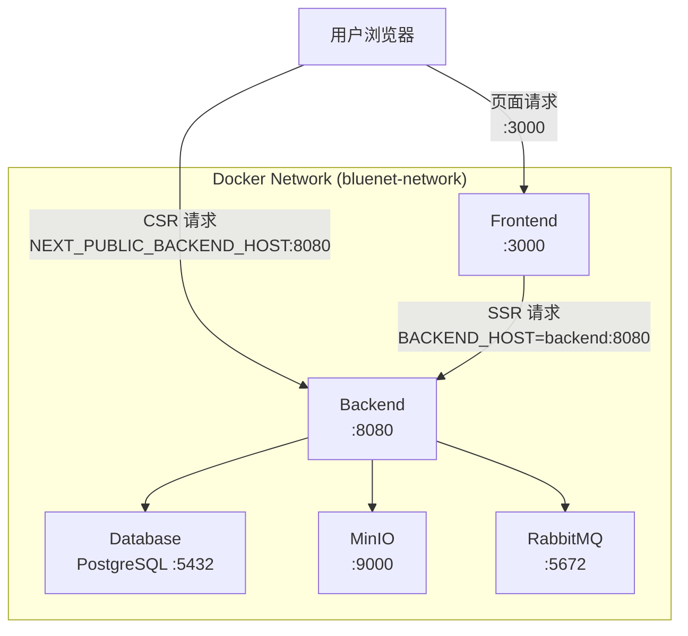

# 环境配置指南

本文档详细介绍 BlueNet 项目的环境配置，包括开发环境和生产环境的完整配置流程。

## 目录

- [环境要求](#环境要求)
- [快速开始](#快速开始)
- [服务配置详解](#服务配置详解)
- [环境变量说明](#环境变量说明)
- [开发环境配置](#开发环境配置)
- [生产环境配置](#生产环境配置)
- [Docker 部署](#docker-部署)
- [常见问题](#常见问题)

---

## 环境要求

### 后端环境

| 工具 | 版本要求 | 说明 |
|------|---------|------|
| JDK | 21+ | Java 开发环境 |
| Maven | 3.9+ | 项目构建工具 |
| PostgreSQL | 15+ / 17+ | 主数据库 |
| Redis | 7.x | 缓存服务（可选） |
| RabbitMQ | 3.x | 消息队列（可选） |
| MinIO | 最新版 | 对象存储 |

### 前端环境

| 工具 | 版本要求 | 说明 |
|------|---------|------|
| Node.js | 20+ | JavaScript 运行时 |
| pnpm | 9+ | 包管理器 |

### 开发工具

| 工具 | 说明 |
|------|------|
| Git | 版本控制 |
| Docker | 容器化部署（可选） |
| IDE | IntelliJ IDEA / VS Code |

---

## 快速开始

### 方式一：本地开发（推荐新手）

适用于本地开发调试，只需安装必要的服务。

```bash
# 1. 克隆项目
git clone https://github.com/your-org/bluenet_web2.2.git
cd bluenet_web2.2

# 2. 安装 Git Hooks
./scripts/hooks/install.sh

# 3. 安装 PostgreSQL（以 Windows 为例）
# 下载安装：https://www.postgresql.org/download/windows/

# 4. 创建数据库
psql -U postgres
CREATE DATABASE db_blue_net;

# 5. 安装 MinIO（可选，用于文件存储）
# 下载：https://min.io/download

# 6. 配置环境变量
cd src/backend
cp .env.example .env
# 编辑 .env 文件，填写实际配置

# 7. 启动后端
./mvnw spring-boot:run -Dspring-boot.run.profiles=dev

# 8. 启动前端（新终端）
cd src/frontend
pnpm install
pnpm dev
```

### 方式二：Docker Compose（推荐团队开发）

使用 Docker 一键启动所有服务。

```bash
# 1. 克隆项目
git clone https://github.com/your-org/bluenet_web2.2.git
cd bluenet_web2.2

# 2. 安装 Git Hooks
./scripts/hooks/install.sh

# 3. 创建环境变量文件
cat > .env << 'EOF'
DB_PASSWORD=your_secure_password
MINIO_PASSWORD=your_minio_password
JWT_SECRET=your_jwt_secret_key_at_least_32_characters
MAIL_USERNAME=your_email@163.com
MAIL_PASSWORD=your_smtp_password

# 客户端访问后端的外部地址（根据部署环境配置）
NEXT_PUBLIC_BACKEND_HOST=localhost
NEXT_PUBLIC_BACKEND_PORT=8080
NEXT_PUBLIC_SSL_ENABLED=false
EOF

# 4. 启动所有服务
docker compose --profile full up -d

# 5. 查看服务状态
docker compose ps
```

---

## 服务配置详解

### PostgreSQL 数据库

#### Windows 安装

1. 下载安装包：https://www.postgresql.org/download/windows/
2. 运行安装程序，设置密码和端口（默认 5432）
3. 添加环境变量：`PATH` 中添加 `C:\Program Files\PostgreSQL\17\bin`

#### Linux 安装

```bash
# Ubuntu/Debian
sudo apt update
sudo apt install postgresql postgresql-contrib

# CentOS/RHEL
sudo dnf install postgresql-server postgresql-contrib
sudo postgresql-setup --initdb
sudo systemctl enable postgresql
sudo systemctl start postgresql
```

#### macOS 安装

```bash
brew install postgresql@17
brew services start postgresql@17
```

#### 创建数据库和用户

```bash
# 连接 PostgreSQL
psql -U postgres

# 创建数据库
CREATE DATABASE db_blue_net;

# 创建用户（可选）
CREATE USER bluenet WITH PASSWORD 'your_password';
GRANT ALL PRIVILEGES ON DATABASE db_blue_net TO bluenet;

# 退出
\q
```

#### 连接参数

| 参数 | 默认值 | 说明 |
|------|--------|------|
| `DATABASE_HOST` | `localhost` | 数据库主机 |
| `DATABASE_PORT` | `5432` | 数据库端口 |
| `DATABASE_NAME` | `db_blue_net` | 数据库名称 |
| `DATABASE_USERNAME` | `postgres` | 用户名 |
| `DATABASE_PASSWORD` | - | 密码 |

---

### MinIO 对象存储

#### Windows 安装

1. 下载：https://min.io/download
2. 运行服务：
   ```powershell
   minio.exe server C:\minio-data --console-address ":9001"
   ```
3. 访问控制台：http://localhost:9001

#### Linux 安装

```bash
# 下载
wget https://dl.min.io/server/minio/release/linux-amd64/minio
chmod +x minio
sudo mv minio /usr/local/bin/

# 创建数据目录
sudo mkdir -p /data/minio

# 启动服务
minio server /data/minio --console-address ":9001"
```

#### Docker 启动

```bash
docker run -d \
  --name minio \
  -p 9000:9000 \
  -p 9001:9001 \
  -v minio_data:/data \
  -e MINIO_ROOT_USER=admin \
  -e MINIO_ROOT_PASSWORD=your_password \
  minio/minio server /data --console-address ":9001"
```

#### 存储桶说明

应用启动时会自动创建以下存储桶：

| 存储桶名称 | 用途 |
|-----------|------|
| `avatar` | 用户头像 |
| `normal-img` | 普通图片（介绍图片） |
| `assessment-attachment` | 考题附件 |
| `work` | 考生作品文件 |
| `qrcode` | 二维码图片 |

#### 连接参数

| 参数 | 默认值 | 说明 |
|------|--------|------|
| `MINIO_ENDPOINT` | `localhost` | MinIO 服务地址 |
| `MINIO_PORT` | `9000` | API 端口 |
| `MINIO_AK` | `admin` | Access Key |
| `MINIO_SK` | - | Secret Key |

---

### Redis 缓存（可选）

#### Docker 启动

```bash
docker run -d \
  --name redis \
  -p 6379:6379 \
  -v redis_data:/data \
  redis:7-alpine redis-server --appendonly yes
```

#### Linux 安装

```bash
# Ubuntu/Debian
sudo apt install redis-server
sudo systemctl enable redis-server
sudo systemctl start redis-server

# CentOS/RHEL
sudo dnf install redis
sudo systemctl enable redis
sudo systemctl start redis
```

---

### RabbitMQ 消息队列（可选）

#### Docker 启动

```bash
docker run -d \
  --name rabbitmq \
  -p 5672:5672 \
  -p 15672:15672 \
  -v rabbitmq_data:/var/lib/rabbitmq \
  -e RABBITMQ_DEFAULT_USER=admin \
  -e RABBITMQ_DEFAULT_PASS=bluenet123 \
  rabbitmq:3-management
```

管理界面：http://localhost:15672

---

### 邮件服务（SMTP）

项目默认使用 163 邮箱 SMTP 服务。

#### 163 邮箱配置

1. 登录 163 邮箱
2. 设置 → POP3/SMTP/IMAP → 开启 SMTP 服务
3. 获取授权码（非登录密码）

#### 其他邮箱配置

修改 `application.yml` 中的邮件配置：

```yaml
spring:
  mail:
    host: smtp.example.com    # SMTP 服务器
    port: 465                 # 端口（SSL）
    username: your_email      # 邮箱地址
    password: your_password   # 授权码/密码
```

常用 SMTP 配置：

| 邮箱 | SMTP 服务器 | 端口 |
|------|------------|------|
| 163 | smtp.163.com | 465 |
| QQ | smtp.qq.com | 465 |
| Gmail | smtp.gmail.com | 587 |
| Outlook | smtp.office365.com | 587 |

---

## 环境变量说明

### 完整环境变量列表

创建 `.env` 文件（从 `.env.example` 复制）：

```bash
# ===========================================
# Database Configuration (PostgreSQL)
# ===========================================
DATABASE_HOST=localhost
DATABASE_PORT=5432
DATABASE_NAME=db_blue_net
DATABASE_USERNAME=postgres
DATABASE_PASSWORD=your_database_password

# ===========================================
# Mail Service Configuration (SMTP)
# ===========================================
MAIL_USERNAME=your_email@163.com
MAIL_PASSWORD=your_email_smtp_password

# ===========================================
# MinIO Object Storage Configuration
# ===========================================
MINIO_ENDPOINT=localhost
MINIO_PORT=9000
MINIO_AK=admin
MINIO_SK=your_minio_secret_key

# ===========================================
# JWT Configuration
# ===========================================
JWT_SECRET=your_jwt_secret_key_at_least_32_characters_long

# ===========================================
# System User Configuration
# ===========================================
SYSTEM_USER_USERNAME=system
SYSTEM_USER_PASSWORD=your_system_user_password
SYSTEM_USER_STUDENT_ID=000000000000

# ===========================================
# Cookie Configuration
# ===========================================
COOKIE_DOMAIN=
COOKIE_SECURE=false
COOKIE_SAME_SITE=Lax
COOKIE_MAX_AGE=43200

# ===========================================
# CORS Configuration
# ===========================================
CORS_ALLOWED_ORIGINS=*
```

### 环境变量详解

#### 数据库配置

| 变量名 | 必填 | 默认值 | 说明 |
|--------|------|--------|------|
| `DATABASE_HOST` | 否 | `localhost` | 数据库主机地址 |
| `DATABASE_PORT` | 否 | `5432` | 数据库端口 |
| `DATABASE_NAME` | 否 | `db_blue_net` | 数据库名称 |
| `DATABASE_USERNAME` | 否 | `postgres` | 数据库用户名 |
| `DATABASE_PASSWORD` | **是** | - | 数据库密码 |

#### MinIO 配置

| 变量名 | 必填 | 默认值 | 说明 |
|--------|------|--------|------|
| `MINIO_ENDPOINT` | 否 | `localhost` | MinIO 服务地址 |
| `MINIO_PORT` | 否 | `9000` | API 端口 |
| `MINIO_AK` | 否 | `admin` | Access Key |
| `MINIO_SK` | **是** | - | Secret Key |

#### JWT 配置

| 变量名 | 必填 | 默认值 | 说明 |
|--------|------|--------|------|
| `JWT_SECRET` | **是** | - | JWT 签名密钥，至少 32 字符 |

> ⚠️ **安全提示**：生产环境必须使用强密钥，不要使用默认值。

#### Cookie 配置

| 变量名 | 默认值 | 说明 |
|--------|--------|------|
| `COOKIE_DOMAIN` | 空 | Cookie 域名，跨子域时设置为 `.example.com` |
| `COOKIE_SECURE` | `false` | 是否仅 HTTPS 传输，生产环境必须 `true` |
| `COOKIE_SAME_SITE` | `Lax` | SameSite 属性 |
| `COOKIE_MAX_AGE` | `43200` | 有效期（秒），12 小时 |

#### CORS 配置

| 变量名 | 默认值 | 说明 |
|--------|--------|------|
| `CORS_ALLOWED_ORIGINS` | `*` | 允许的前端域名，多个用逗号分隔 |

> ⚠️ **安全提示**：生产环境必须配置具体域名，如 `https://example.com,https://www.example.com`

#### 前端服务端配置（SSR 请求）

以下变量用于 Next.js 服务端渲染（SSR）时访问后端 API，在 Docker 环境中使用容器内部网络地址：

| 变量名 | 默认值 | 说明 |
|--------|--------|------|
| `BACKEND_HOST` | `localhost` | 后端主机地址（Docker 内部为 `backend`） |
| `BACKEND_PORT` | `8080` | 后端端口 |
| `SSL_ENABLED` | `false` | 是否启用 HTTPS |
| `API_PREFIX` | `/api/v1` | API 路径前缀 |

#### 前端客户端配置（CSR 请求）

以下变量带有 `NEXT_PUBLIC_` 前缀，会被 Next.js 注入到客户端代码中，用于浏览器端（CSR）访问后端 API。浏览器无法解析 Docker 内部主机名，因此需要配置外部可访问的地址：

| 变量名 | 默认值 | 说明 |
|--------|--------|------|
| `NEXT_PUBLIC_BACKEND_HOST` | `localhost` | 客户端访问后端的主机地址 |
| `NEXT_PUBLIC_BACKEND_PORT` | `8080` | 客户端访问后端的端口 |
| `NEXT_PUBLIC_SSL_ENABLED` | `false` | 客户端是否启用 HTTPS |
| `NEXT_PUBLIC_API_PREFIX` | `/api/v1` | 客户端 API 路径前缀 |

> ⚠️ **重要提示**：`NEXT_PUBLIC_` 前缀的变量会被打包到客户端 JavaScript 中，**不要包含任何敏感信息**（如密钥、密码等）。这些变量仅用于构建 API 请求地址。

**不同环境下的配置示例**：

```bash
# 本地开发（前后端都在 localhost）
NEXT_PUBLIC_BACKEND_HOST=localhost
NEXT_PUBLIC_BACKEND_PORT=8080

# 服务器部署（HTTP）
NEXT_PUBLIC_BACKEND_HOST=your-server-ip
NEXT_PUBLIC_BACKEND_PORT=8080

# 服务器部署（HTTPS + Nginx 反向代理）
NEXT_PUBLIC_BACKEND_HOST=your-domain.com
NEXT_PUBLIC_BACKEND_PORT=443
NEXT_PUBLIC_SSL_ENABLED=true
```

---

## 开发环境配置

### 配置文件

开发环境使用 `application-dev.yml`，默认激活。

### 特点

- 数据库密码默认 `000000`
- CORS 允许所有来源（`*`）
- Cookie Secure 为 `false`（允许 HTTP）
- 邮件调试模式开启

### 启动命令

```bash
# 后端（默认 dev 环境）
./mvnw spring-boot:run

# 或显式指定
./mvnw spring-boot:run -Dspring-boot.run.profiles=dev

# 前端
cd src/frontend
pnpm dev
```

### 访问地址

| 服务 | 地址 |
|------|------|
| 后端 API | http://localhost:8080 |
| API 文档 | http://localhost:8080/swagger-ui.html |
| 前端页面 | http://localhost:3000 |
| MinIO 控制台 | http://localhost:9001 |

---

## 生产环境配置

### 配置文件

生产环境使用 `application-prod.yml`。

### 安全要求

1. **Cookie Secure**：必须为 `true`（HTTPS）
2. **CORS**：必须配置具体域名
3. **JWT Secret**：必须使用强密钥
4. **数据库密码**：必须使用强密码

### 环境变量配置

```bash
# 生产环境 .env 文件
DATABASE_HOST=your-db-host
DATABASE_PORT=5432
DATABASE_NAME=db_blue_net
DATABASE_USERNAME=bluenet
DATABASE_PASSWORD=<strong_password>

MINIO_ENDPOINT=oss.your-domain.com
MINIO_PORT=9000
MINIO_AK=admin
MINIO_SK=<strong_secret_key>

JWT_SECRET=<strong_jwt_secret_at_least_32_characters>

MAIL_USERNAME=noreply@your-domain.com
MAIL_PASSWORD=<smtp_password>

COOKIE_DOMAIN=.your-domain.com
COOKIE_SECURE=true
COOKIE_SAME_SITE=Lax

CORS_ALLOWED_ORIGINS=https://your-domain.com,https://www.your-domain.com
```

### 启动命令

```bash
# 后端
./mvnw spring-boot:run -Dspring-boot.run.profiles=prod

# 或使用 JAR 包
java -jar target/bluenet-backend-*.jar --spring.profiles.active=prod
```

---

## Docker 部署

### 服务架构



> **说明**：前端同时支持 SSR（服务端渲染）和 CSR（客户端渲染）两种请求模式。SSR 请求在 Docker 内部网络中使用 `backend` 主机名；CSR 请求由用户浏览器发起，需要使用外部可访问的地址（`NEXT_PUBLIC_BACKEND_HOST`）。

### Profile 分组

| Profile | 包含服务 | 用途 |
|---------|----------|------|
| `full` | 所有服务 | 完整部署 |
| `infra` | database, rabbitmq, oss | 仅基础设施 |
| `app` | backend, frontend | 仅应用服务 |

### 常用命令

```bash
# 启动所有服务
docker compose --profile full up -d

# 仅启动基础设施（本地开发后端）
docker compose --profile infra up -d

# 仅启动应用服务（使用外部数据库）
docker compose --profile app up -d

# 查看日志
docker compose logs -f backend
docker compose logs -f frontend

# 停止服务
docker compose --profile full down

# 重新构建
docker compose --profile full build --no-cache
docker compose --profile full up -d
```

### 端口映射

| 服务 | 容器端口 | 主机端口 | 说明 |
|------|---------|---------|------|
| Frontend | 3000 | 3000 | 前端服务 |
| Backend | 8080 | 8080 | 后端 API |
| Backend Debug | 8088 | 18088 | 远程调试 |
| PostgreSQL | 5432 | 15432 | 数据库 |
| RabbitMQ | 5672 | 5672 | 消息队列 |
| RabbitMQ UI | 15672 | 15672 | 管理界面 |
| MinIO API | 9000 | 7000 | 对象存储 API |
| MinIO Console | 9001 | 7001 | 管理控制台 |

---

## 常见问题

### 数据库连接失败

**错误信息**：`Connection refused` 或 `Authentication failed`

**排查步骤**：

1. 确认 PostgreSQL 服务已启动
   ```bash
   # Linux
   sudo systemctl status postgresql
   
   # Windows（服务管理器）
   # 查找 postgresql-x64-17 服务
   ```

2. 检查连接参数
   ```bash
   psql -h localhost -U postgres -d db_blue_net
   ```

3. 检查 `pg_hba.conf` 配置
   ```bash
   # 允许密码认证
   host    all    all    127.0.0.1/32    md5
   ```

4. 检查防火墙
   ```bash
   # Linux
   sudo ufw allow 5432
   
   # Windows
   # 防火墙设置中允许 5432 端口
   ```

### MinIO 连接失败

**错误信息**：`Connection refused` 或 `Access Denied`

**排查步骤**：

1. 确认 MinIO 服务已启动
   ```bash
   curl http://localhost:9000/minio/health/live
   ```

2. 检查 Access Key 和 Secret Key
   - 登录 MinIO 控制台验证凭据

3. 检查存储桶是否创建
   - 应用启动时会自动创建
   - 或手动在控制台创建

### JWT 相关错误

**错误信息**：`JWT signature does not match` 或 `JWT expired`

**解决方案**：

1. 确保 `JWT_SECRET` 配置正确
2. 密钥长度至少 32 字符
3. 生产环境与开发环境使用不同密钥

### Cookie 无法设置

**可能原因**：

1. **域名不匹配**：`COOKIE_DOMAIN` 配置错误
2. **Secure 属性**：HTTP 环境下 `COOKIE_SECURE=true`
3. **SameSite 限制**：跨站请求被阻止

**解决方案**：

```bash
# 开发环境
COOKIE_SECURE=false
COOKIE_SAME_SITE=Lax

# 生产环境（HTTPS）
COOKIE_SECURE=true
COOKIE_SAME_SITE=Lax
COOKIE_DOMAIN=.your-domain.com
```

### CORS 跨域错误

**错误信息**：`CORS policy: No 'Access-Control-Allow-Origin'`

**解决方案**：

1. 开发环境可使用 `*`
   ```bash
   CORS_ALLOWED_ORIGINS=*
   ```

2. 生产环境必须配置具体域名
   ```bash
   CORS_ALLOWED_ORIGINS=https://your-domain.com,https://www.your-domain.com
   ```

### Flyway 迁移失败

**错误信息**：`Flyway migration failed`

**排查步骤**：

1. 检查迁移脚本语法
2. 查看数据库当前版本
   ```bash
   ./mvnw flyway:info
   ```

3. 清理并重新迁移（仅开发环境）
   ```bash
   ./mvnw flyway:clean
   ./mvnw flyway:migrate
   ```

### 端口被占用

**错误信息**：`Port 8080 already in use`

**解决方案**：

```bash
# Windows - 查找占用进程
netstat -ano | findstr :8080
taskkill /PID <pid> /F

# Linux/macOS
lsof -i :8080
kill -9 <pid>
```

或修改端口：
```yaml
# application.yml
server:
  port: 8081
```

---

## 附录

### 默认账号密码

| 服务 | 用户名 | 密码 | 说明 |
|------|--------|------|------|
| PostgreSQL | `postgres` | 安装时设置 | 数据库管理员 |
| MinIO | `admin` | `MINIO_SK` | 对象存储 |
| RabbitMQ | `admin` | `bluenet123` | 消息队列 |
| 系统用户 | `system` | `SYSTEM_USER_PASSWORD` | 后端系统用户 |

### 配置文件位置

| 文件 | 路径 | 说明 |
|------|------|------|
| 环境变量模板 | `src/backend/.env.example` | 后端环境变量示例 |
| 前端环境变量模板 | `src/frontend/.env.example` | 前端环境变量示例 |
| Docker 环境变量模板 | `docker/.env.example` | Docker 部署环境变量示例 |
| 主配置 | `src/backend/src/main/resources/application.yml` | 主配置文件 |
| 开发配置 | `src/backend/src/main/resources/application-dev.yml` | 开发环境 |
| 生产配置 | `src/backend/src/main/resources/application-prod.yml` | 生产环境 |
| Docker Compose | `docker/docker-compose.yml` | Docker 编排 |

### 相关文档

- [自动部署配置指南](./自动部署配置指南.md)
- [数据库设计](./数据库设计.md)
- [后端开发手册](./后端开发手册.md)
- [前端开发手册](./前端开发手册.md)
