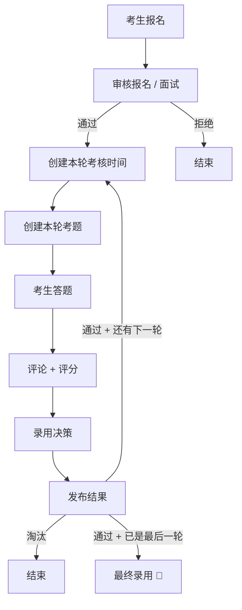
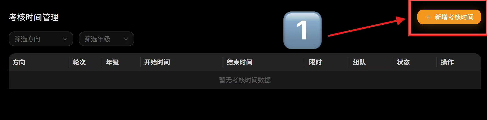
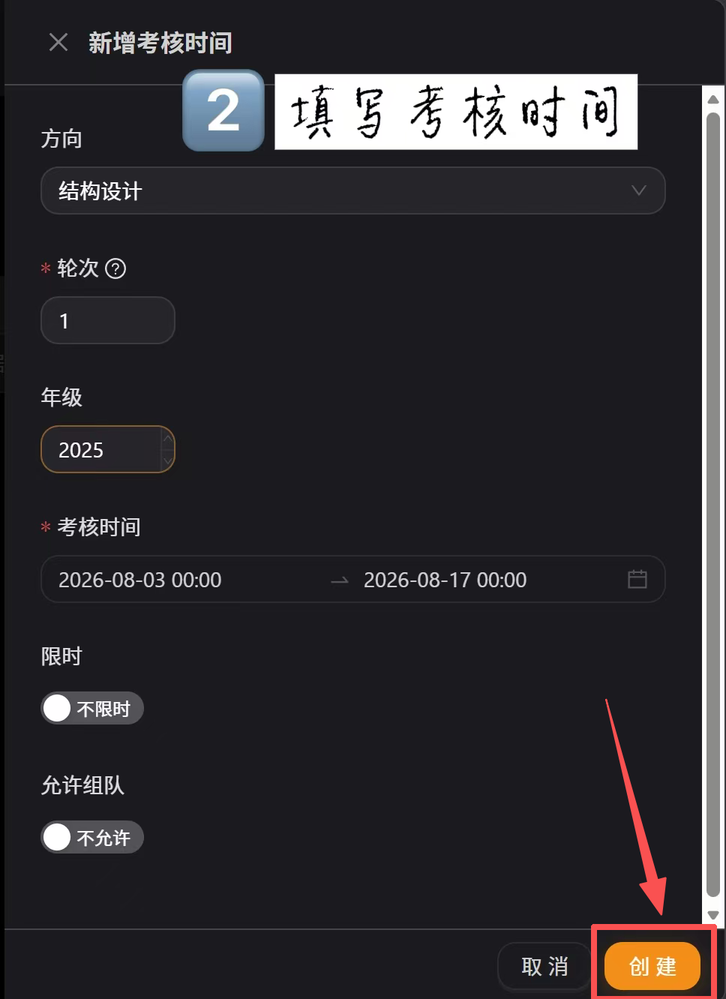
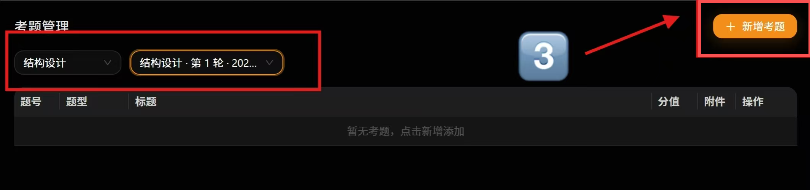
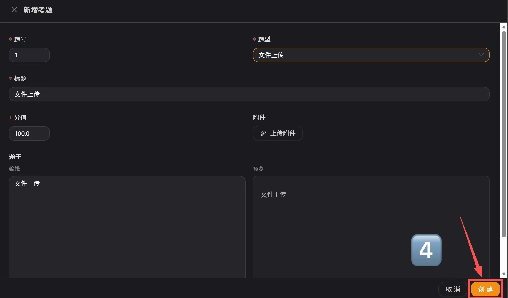

# 蓝网考核模块使用手册

> 线上环境：`https://bluenet.dev.iven-self.cn/` 

---

## 一、整体流程

```
① 考生报名 → ② 审核报名（面试） → ③ 创建考核时间 → ④ 出题
→ ⑤ 考生答题 → ⑥ 评论评分 → ⑦ 录用决策 → ⑧ 发布结果
```

以上流程在**第一轮、第二轮、第三轮**各执行一遍。第三轮额外多一步"组队"。

> 📌 **关于"第三轮"的说法**：本文中的"第三轮"指常规安排中的**最后一轮（全局轮）**，即不限方向、不限年级的全局考核。系统内部以"全局最终轮"实现该概念，并不强制轮次数量必须是三轮——如果某届只安排两轮，则第二轮就是"第三轮"所指的全局轮。



> **循环的含义**：发布结果后，如果还有下一轮，通过的考生回到"创建考核时间"这一步，开始新一轮考核。三轮全部通过才算最终录用。

---

## 二、报名审核（面试）

> 面试筛选 = 报名审核。学生提交报名后，管理员在后台决定"通过"或"拒绝"。

### 2.1 操作路径

管理后台 → 左侧菜单「报名管理」

| 步骤 | 做什么                                                            |
|----|----------------------------------------------------------------|
| 1  | 点击一条报名记录，打开详情抽屉                                                |
| 2  | 查看考生信息（方向、学号、自我介绍等）                                            |
| 3  | 如果对方是留级（降级转专业）导致学号的入学年份与真实所在年级不同，需要设置*考核届别*，该设置指定这个用户后续参加考核的年级 |
| 4  | 点击「通过」或「拒绝」                                                    |

- **点通过**：系统自动创建考生账号 → 考生可登录参加后续考核
- **点拒绝**：不创建账号 → 可填拒绝原因（可选，填写后会随拒绝通知邮件发给考生）→ 该生无法登录

> 💡 来面试就通过，不来就拒绝

---

## 三、考核时间

> 必须先建考核时间，才能建题目、考生才能看到考核。

### 3.1 在哪里操作

管理后台 → 左侧菜单「考核管理」→「考核时间」

### 3.2 创建考核时间

点击「新增考核时间」，填写以下字段：

| 字段 | 说明 | 怎么填                                  |
|------|------|--------------------------------------|
| **方向** | 面向哪个方向 | 第一、二轮选具体方向；最终轮（全局）                   |
| **轮次** | 第几轮 | 1 / 2 / 3，只有非最后一轮需要填写轮次， 各个方向的轮次可以不同 |
| **年级** | 面向哪个年级 | 按入学年份填，如 2025，全局考核不限年级               |
| **开始时间** | 考核窗口开启时间 | 本轮考核开始时间                             | 
| **结束时间** | 考核窗口关闭时间 | 本轮考核结束时间                             |
| **限时** | 是否限制答题时长 | 限时考核开关，可以在考核时间段内限制作答时间，一般有一轮限时       |
| **允许组队** | 能否组队答题 | 一般仅第三轮打开                             |





> ⚠️ **约束**：同一方向 + 同一轮次 + 同一年级，只能有一条考核时间。重复创建会报错"已存在"。

### 3.4 常见操作

- 考核开始后**不能改开始时间**，结束时间和其他字段可以改
- 删除考核时间时，系统仅校验其下是否还有**关联题目**（有题目则禁止删除）；答案、评分等数据不会被自动校验或清理，删除前请自行确认无残留数据

> ⚠️ **重要提醒**：本轮考核结束前，必须创建好下一轮的考核时间。否则本轮结果发布后，通过者无法看到下一轮考核。

---

## 四、考题类型与创建

> 考核时间建好后，就可以在该时间下创建题目了。

**操作路径**：管理后台 → 左侧菜单「考核管理」→「考核题目」

### 4.1 创建步骤

① 筛选方向 → ② 选择对应的考核时间 → ③ 点击「新增题目」





### 4.2 四种题型

系统目前支持四种题型：

#### 单选题

考生从多个选项中选一个正确答案。

| 配置项 | 说明 |
|--------|------|
| 题干 | Markdown 格式，描述问题 |
| 选项 | A/B/C/D 等，每个选项一行 |
| 正确答案 | 指定哪个选项是正确的 |

**适用场景**：基础知识考察、技术选择题

#### 多选题

考生从多个选项中选多个正确答案。

| 配置项 | 说明 |
|--------|------|
| 题干 | Markdown 格式 |
| 选项 | 多个选项 |
| 正确答案 | **多个**正确选项 |

**适用场景**：多知识点综合考察

> 评分规则：考生必须**全部选对**才得分，漏选或错选均不得分。

#### 文件上传题

考生上传文件（.zip / .pdf / .docx 等），管理员下载后人工评审。

| 配置项 | 说明 |
|--------|------|
| 题干 | Markdown 格式，写清楚要求和评分标准 |

**适用场景**：作品提交、项目文档、代码包。这是考核最常用的题型。

#### 算法题（Beta 测试版）

> ⚠️ 该题型处于 Beta 阶段，功能可能不稳定，建议先小范围试用。

考生在**在线代码编辑器**中编写代码并提交，系统**自动编译运行并判题**，无需人工评分。

此部分功能较为复杂

### 4.3 出题分工

| 轮次 | 谁出题（添加题目的操作，不包含题目讨论） | 出什么 |
|------|----------------------|--------|
| 第一轮 | 各方向管理员               | 自己方向的题目 |
| 第二轮 | 各方向管理员               | 自己方向的题目（难度高于第一轮） |
| 第三轮 | 超级管理员                | 全局题目（所有方向共享，组队完成） |

---

## 五、评论与评分

> 这一环节涉及两个角色：**团队成员**和**方向管理员**，各自职责不同。

**操作路径**：管理后台 → 左侧菜单「考核管理」→「题目评分」

### 5.1 角色分工

| 角色 | 能做什么 | 通俗理解 |
|------|----------|----------|
| **团队成员** | 查看考生答案 → 发表评论 + 给出参考评分 | 评委，各自发表意见 |
| **方向管理员** | 上述全部 + **确认最终评分** | 评审组长，综合意见后拍板 |

### 5.2 第一步：团队成员发表评论

进入 考核 -> 题目评分

| 步骤 | 操作 |
|------|------|
| ① | 筛选方向 + 考核时间 |
| ② | 左侧点击题目 → 右侧出现考生提交列表 |
| ③ | 点击某个考生的提交 → 打开评分抽屉 |
| ④ | 下载/查看考生上传的文件 |
| ⑤ | 在评论区输入评价 → 给出参考分数 → 点击「添加评论」 |

- 多个团队成员可以各自评论，互不干扰
- 每条评论包含文字评价 + 参考分数（可选）

### 5.3 第二步：方向管理员确认最终评分

| 步骤 | 操作 |
|------|------|
| ① | 打开某考生的评分抽屉 |
| ② | 查看团队成员的评论（确保**至少有一条**） |
| ③ | 综合参考后，在「最终评分」栏填写分数 |
| ④ | 填写最终评语 |
| ⑤ | 点击「确认评分」 |

> ⚠️ **重要约束**：
> - 执行确认的方向管理员**本人必须先对该答案发表过评论**，才能确认评分（否则报错）
> - 「确认评分」按钮**只有方向管理员**（及超级管理员）能看到和点击
> - 评分确认后仍可再次修改，以最后一次确认的分数为准

---

## 六、录用决策与结果发布

> 评分全部完成后，由**方向管理员**逐个决定考生"通过"还是"淘汰"，然后统一发布。

**操作路径**：管理后台 → 左侧菜单「考核管理」→「录用决策」

发布决策会向通过和淘汰的学生发送相关邮件进行通知

### 6.1 谁来做决策

| 轮次 | 决策者 |
|------|--------|
| 第一、二轮 | 各方向的方向管理员 |
| 第三轮 | 超级管理员（因为是全局考核） |

### 6.2 操作步骤

| 步骤 | 操作 |
|------|------|
| ① | 筛选方向 + 考核时间 |
| ② | 查看候选人列表（显示每人评分） |
| ③ | 逐个设置决策：**通过** 或 **淘汰**，填写备注 |
| ④ | 确认无误后，点击「**发布结果**」 |

### 6.3 发布后

- 考生登录前端即可看到自己的评分、评论和结果
- 通过者自动有资格参加下一轮
- 系统自动发送邮件通知（考生需填写真实邮箱才能收到）
- 邮件标题固定为「[蓝网] 考核结果通知」，正文措辞不同：第三轮（最终轮）显示「录取/淘汰」，第一二轮显示「通过/未通过」

---

## 七、组队（仅第三轮）

> 注意，按运营约定第三轮应该有且仅有一道文件上传题，用于提交三轮参赛文档（系统对此不做强制校验，请出题时自觉遵守）。组队入口位于题目详情中——只要考核时间开启了「允许组队」，该考核下的文件上传题详情页就会出现组队面板。

> 第三轮允许组队答题。**队长创建队伍 → 队员加入 → 队长提交答案 → 全队共享。**

### 7.1 考生端操作

| 角色 | 操作 |
|------|------|
| **队长** | 进入第三轮考核 → 点击「创建队伍」→ 输入队名 → 获得邀请码 → 把邀请码发给队员 |
| **队员** | 进入第三轮考核 → 输入邀请码 → 点击「加入队伍」 |
| **队长** | 回到答题页 → 上传文件 → 提交答案 |

### 7.2 规则约束

| 操作 | 允许？ |
|------|--------|
| 队员上传文件 | ❌ 只有队长能上传，队员看不到上传入口 |
| 队长离开队伍 | ❌ 队长不能直接退出（需先转让队长或解散队伍） |
| 队员离开队伍 | ✅ 可以退出；但**队伍一旦提交过答案即锁定，所有成员（含队员）都不可再退出** |
| 错误邀请码 | ❌ 提示邀请码无效 |

---

## 八、常见问题

### 报名与面试

**Q：面试在系统里怎么体现？**
A：面试 = 报名审核。来面试的 → 通过报名审核；不来面试的 → 拒绝报名审核。

**Q：报名审核通过后会发生什么？**
A：系统自动创建考生账号，考生用学号+初始密码登录，可在考核中心看到自己方向的考核。初始密码在邮箱中查看，登录后可修改。

**Q：拒绝后还能改回通过吗？**
A：不能。

---

### 权限

**Q：方向管理员能看到其他方向的考生吗？**
A：在**评分、录用决策**页面不能——筛选方向时只有自己负责的方向可选，超级管理员可以看全部。但**「报名管理」页面目前不按方向过滤**，方向管理员可以看到全部方向的报名记录，操作时请自行留意。

**Q：谁可以创建全局考核（第三轮）？**
A：只有超级管理员。方向管理员不能创建 direction 和 grade 都为空的考核。

---

### 考核时间与题目

**Q：为什么考核时间创建失败？**
A：同一方向 + 同一轮次 + 同一年级只能有一条，检查是否已存在。

**Q：必须先创建考核时间再创建题目吗？**
A：是的。创建题目时需要选择挂到哪个考核时间下面。

**Q：算法题怎么用？**
A：算法题目前是 Beta 版本，建议小范围试用。在新增题目时题型选「算法」即可，需配置时间/内存限制。

**Q：选择题和算法题的评分是自动的吗？**
A：单选题、多选题、算法题都是系统自动判分，不需要人工评分。文件上传题需要人工评分。多选题必须全部选对才得分。

---

### 评分

**Q：为什么点确认评分时报错？**
A：确认评分的方向管理员**本人**必须先对该答案发表过至少一条评论。先自己发一条评论再确认。

**Q：团队成员的参考分数算数吗？**
A：参考分数只是建议。最终以方向管理员确认的分数为准。

**Q：超级管理员能给所有方向评分吗？**
A：能。
---

### 考生端

**Q：考生登录后看不到考核？**
A：检查：考核时间的方向和年级是否跟考生一致。

**Q：第三轮队员能看到队长提交的文件吗？**
A：能。队员打开题目可以看到队长上传的文件，但不能自己上传。

---

## 九、Bug 反馈

页面右下角 Bug 按钮（🐛）提交，自动同步到 `github.com/Blue-Net-Team/official-web2/issues`。

---
