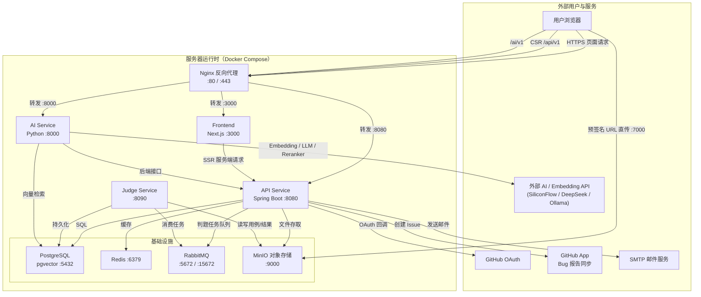

# 蓝网官方网站 - 项目概述

## 项目简介

蓝网官方网站是蓝网实验室的官方门户系统，用于展示实验室信息、管理招新报名、进行考核评估等功能。

## 技术架构

### 前端技术栈

| 技术 | 版本 | 说明 |
|------|------|------|
| React | 19.2.0 | UI框架 |
| Next.js | 15.1.0 | 全栈框架，支持SSR |
| TypeScript | 5.9.3 | 类型安全 |
| Ant Design | 6.3.0 | UI组件库 |
| Zustand | 5.0.11 | 状态管理 |
| Axios | 1.13.5 | HTTP客户端 |
| pnpm | 9.15.0 | 包管理器 |

### 后端技术栈

| 技术 | 版本 | 说明 |
|------|------|------|
| Java | 21 | 编程语言 |
| Spring Boot | 3.5.10 | 后端框架 |
| Spring Security | - | 安全框架 |
| Spring Data Redis | - | 缓存支持 |
| Spring Validation | - | 参数校验 |
| Spring AOP | - | 切面编程 |
| JWT (jjwt) | 0.12.5 | 认证令牌 |
| MyBatis-Plus | 3.5.7 | ORM框架 |
| MinIO / 阿里云 OSS | - | 对象存储 |
| PostgreSQL | - | 关系数据库 |

## 项目结构

```
bluenet_web2.2/
├── src/
│   ├── frontend/          # 前端项目
│   │   ├── src/
│   │   │   ├── apis/      # API接口定义
│   │   │   ├── app/       # Next.js页面路由
│   │   │   ├── assets/    # 静态资源
│   │   │   ├── components/# 公共组件
│   │   │   ├── stores/    # 状态管理
│   │   │   └── utils/     # 工具函数
│   │   └── package.json
│   │
│   └── backend/           # 后端项目
│       └── main/java/com/bluenet/web/
│           ├── api/          # API层（Controller、DTO）
│           ├── application/  # 应用层（Service、Converter）
│           ├── domain/       # 领域层（Entity、Repository、VO）
│           └── infrastructure/ # 基础设施层（Mapper、RepositoryImpl、Config）
│
├── docs/                  # 文档目录
│   ├── diagrams/          # 架构图（xmind文件）
│   ├── 项目概述.md
│   ├── 前端开发手册.md
│   ├── 后端开发手册.md
│   └── 数据库设计.md
│
└── docker/               # Docker配置
```

## 系统架构图

下图展示蓝网官方网站的服务器运行时架构与核心通信链路（不含 CI/CD 流程，CI/CD 详见 [自动部署配置指南](./自动部署配置指南.md)）。AI 服务请求在生产环境通过 Nginx 反向代理到 `/ai/v1`，与 `/api/v1` 统一入口；本地开发可按配置直连 `ai-service:8000`。



## 核心功能模块

### 1. 引流模块
- 首页展示实验室介绍、团队信息
- 方向介绍（计算机视觉、结构设计、嵌入式开发）
- 竞赛成就、专利论文展示

### 2. 报名系统
- 学号唯一标识报名
- 头像上传、内推码功能
- 报名审核流程

### 3. 考核系统
- 多轮次考核时间管理（方向+轮次+入学年份）
- 多种题型支持（文件上传、算法题、单选题、多选题）
- 评分评论系统
- 限时考核与会话管理
- 考核结果发布与录取决策
- 组队答题支持

### 4. 算法判题系统
- 算法题在线判题（支持正式判题与自测运行）
- 测试用例管理与生成
- 通过 RabbitMQ 异步分发判题任务

### 5. 成员管理
- 成员信息展示
- 个人主页
- 经历管理

### 6. Bug 报告系统
- 用户提交 Bug 报告（支持截图上传）
- 可选同步到 GitHub Issue
- 管理员查看与处理

### 7. 权限系统
- 基于角色的访问控制（RBAC）
- 多角色支持（超级管理员、方向管理员、团队成员、考生）

## 开发指南

- 前端开发请参考：[前端开发手册.md](./前端开发手册.md)
- 后端开发请参考：[后端开发手册.md](./后端开发手册.md)
- 数据库设计请参考：[数据库设计.md](./数据库设计.md)
- 接口设计请参考：[diagrams/接口总览.xmind](./diagrams/接口总览.xmind)
