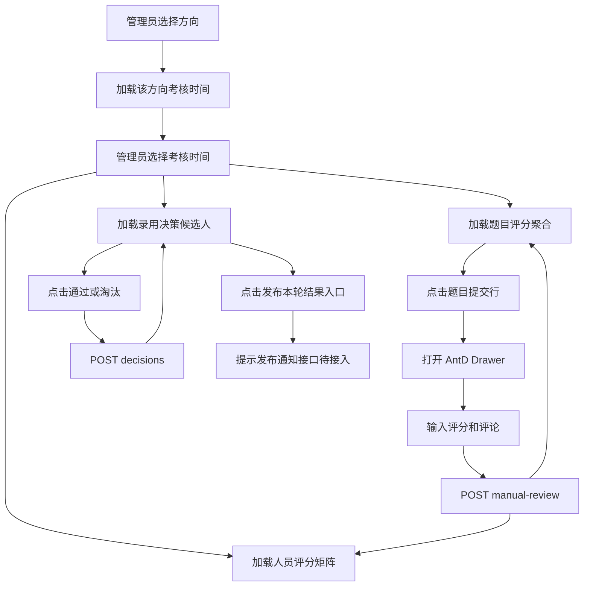

## Context

现有考核评判能力已经覆盖单题评判记录、文件上传题人工评分、客观题自动评判和考生最终通过决策：

- `AdminAssessmentJudgementController` 提供按题目查询评判、按答案查询最新评判、人工评分、最终决策写入。
- `AssessmentJudgementServiceImpl.reviewFileUploadAnswer` 只允许文件上传题人工评分，并校验分数不能超过题目满分。
- `AssessmentJudgementServiceImpl.decideAssessment` 只允许方向管理员及以上设置最终通过/淘汰，底层 `AssessmentDecisionDomainServiceImpl.saveDecision` 对 `userId + assessmentTimeId` 做覆盖保存。
- 算法题正式提交由 `AlgorithmJudgeWorker` 自动创建评判记录，`AC` 得满分，其他结果得 0 分。
- 管理端已有考核时间、考核题目页面，并已使用 AntD 暗色主题、`Select`、`Table`、`Drawer`、`Pagination`、`App.useApp().message` 等模式。

当前缺口是“管理工作台”层：现有 API 更偏底层记录查询，缺少按考核时间聚合的题目提交列表、人员评分矩阵、录用决策候选人列表和统计数据。前端如果只使用现有接口，会无法可靠展示考生姓名、学号、提交文件、每题得分、总分、已有决策和待决策统计。

## Goals / Non-Goals

**Goals:**

- 提供管理端题目评分页面，支持按方向与考核时间定位考题。
- 提供题目视图：按题目查看考生提交，算法题展示该考生最佳评判记录，并可展开查看历史评判；点击表格行打开右侧 AntD Drawer 评分。
- 提供人员视图：按考生查看各题得分、总分、未评分项和提交状态，点击考生行打开评分明细 Drawer。
- 提供录用决策页面：按考核时间查看候选人表现和当前决策，点击“通过”或“淘汰”立即保存。
- 提供统计卡片：候选人、待决策、通过、淘汰。
- 后端新增聚合读接口，避免前端 N+1 请求和不完整数据拼接。
- 保持现有自动评判、人工评分、最终决策写入语义不变。

**Non-Goals:**

- 不实现发布本轮结果后的邮件发送、站内通知或异步任务。
- 不修改算法题评分规则，不支持人工覆盖算法题、单选题、多选题的分数。
- 不新增左侧页面 sidebar；页面运行在现有后台布局内，页面内部不额外设计 sidebar。
- 不修改已应用 Flyway 迁移；本变更预期不新增表。
- 不引入新的前端依赖。

## Decisions

### 1. 使用后端聚合读接口支撑工作台

新增聚合查询，而不是让前端用现有接口循环拼接数据。

建议接口：

- `GET /api/v1/admin/assessment-judgements/scoreboard/questions`
  - 参数：`assessmentTimeId`、`questionType?`、`keyword?`
  - 返回：题目、题型、满分、提交数、已评分数、待评分数、平均分。
- `GET /api/v1/admin/assessment-judgements/scoreboard/questions/{questionId}/submissions`
  - 参数：`keyword?`、`status?`
  - 返回：该题下考生提交、考生信息、答案摘要、文件 ID、提交时间、展示评判和历史评判记录。算法题展示评判按最高分优先，非算法题按最新已评记录。
- `GET /api/v1/admin/assessment-judgements/scoreboard/candidates`
  - 参数：`assessmentTimeId`、`keyword?`
  - 返回：考生信息、每题提交/评分状态、总分、满分、未评分数量。
- `GET /api/v1/admin/assessment-judgements/decisions`
  - 参数：`assessmentTimeId`、`keyword?`、`decisionStatus?`
  - 返回：候选人表现、总分、题目完成情况、已有通过/淘汰决策、统计卡片数据。

理由：

- 评分与决策页面都是跨题目、答案、评判、用户、决策的组合视图。
- 后端更适合处理展示评判去重、算法题最佳记录、权限范围、排序和分页。
- 前端只负责筛选条件、展示状态和触发写操作，避免复杂数据一致性问题。

备选方案：

- 前端调用题目列表后逐题调用 `listByQuestionId` 并自行拼接。该方案会造成 N+1 请求，且缺少考生姓名、学号、答案文件等展示字段，不适合落地。

### 2. 写接口沿用现有语义

人工评分继续使用 `POST /api/v1/admin/assessment-judgements/manual-review`，最终决策继续使用 `POST /api/v1/admin/assessment-judgements/decisions`。

理由：

- 现有写接口已经包含权限校验和业务校验。
- 评分记录是追加式 judgement 记录，决策是按考生和考核时间唯一覆盖保存，符合用户对“点击通过后自动保存”的预期。
- 避免为了 UI 新增重复写接口。

### 3. 前端用 AntD 组件实现工作台，不复制设计稿的自定义控件

页面背景使用现有暗色主题，允许接近全黑。核心控件直接使用 AntD：

- 筛选：`Select`、`Input.Search`
- 视图切换：`Tabs`
- 列表：`Table`
- 评分：`Drawer`、`Form`、`InputNumber`、`Input.TextArea`
- 统计：`Card`、`Statistic`
- 状态：`Tag`、`Progress`
- 反馈：`Spin`、`Empty`、`App.useApp().message`

理由：

- 项目现有后台已经采用 AntD 暗色主题。
- 使用 AntD Drawer 可以满足用户“直接用 antd 的抽屉”的要求。
- Table 行点击打开 Drawer，避免操作列造成视觉和操作冗余。

### 4. 页面拆分为评分和录用决策两个工作区

建议路由：

- `/admin/assessment/judge/score`：题目评分。
- `/admin/assessment/judge/decision`：录用决策。

后台侧边栏在“考核”分组下提供两个独立菜单项：“题目评分”和“录用决策”。`/admin/assessment/judge` 仅作为兼容入口重定向到题目评分页。

理由：

- 用户明确表达评分和决定录用谁更像两个页面。
- 两个页面的权限、数据结构、操作风险不同，拆分路由和菜单有利于维护，也避免把录用决策误解为评分页内的一个普通 Tab。

### 5. 发布本轮结果先做前端入口，不做后端发送

录用决策页面提供 `发布本轮结果` 主按钮，但本次只做占位行为：

- 若没有后端接口，按钮可以禁用并提示“发布通知接口待接入”。
- 或按钮点击后弹出 `Modal`，说明将来会向通过/淘汰考生发送邮件，但当前不执行。

理由：

- 用户明确说邮件通知“先不做这个代码”。
- 保留入口可以让页面流程完整，但不能让用户误以为已经发送通知。

## Data Flow

## Risks / Trade-offs

- [风险] 聚合接口查询跨多张表，容易出现算法题最新提交覆盖最佳成绩的问题。  
  缓解：后端查询统一生成展示评判；算法题按最高分、AC、更新时间选最佳记录，非算法题按 `updated_at DESC, id DESC` 选最新已评记录，并补充单元测试覆盖历史记录标记。

- [风险] 候选人范围不清晰，可能把未参加该轮考核的人纳入决策。  
  缓解：候选人范围以已通过报名并创建用户、方向匹配、考核年份匹配为基础；若实现复杂，先以该考核时间下有答案或评判记录的考生作为评分/决策列表，并在规格中明确。

- [风险] 发布本轮结果按钮容易造成误解。  
  缓解：在按钮旁或确认弹窗中明确“邮件通知接口待接入，本次不会发送邮件”，实现后再改为真实发布。

- [风险] 方向管理员越权查看其他方向数据。  
  缓解：聚合接口必须复用后端角色/方向校验，SUPER_ADMIN 可看全部，DIRECTION_ADMIN 只能看本方向。

- [风险] 文件上传题评分输入超过满分。  
  缓解：前端 `InputNumber` 设置 `min=0`、`max=maxScore`，后端继续保留强校验。

## Migration Plan

1. 新增后端 DTO、service 方法和 mapper 查询，不修改既有表结构。
2. 扩展 `AdminAssessmentJudgementController` 聚合读接口，保留既有写接口。
3. 扩展前端 API 类型与 service。
4. 新增评分页面和录用决策页面。
5. 更新后台菜单指向或增加二级入口。
6. 添加后端 service/repository 测试和前端类型检查。

回滚策略：

- 新增接口和页面可独立回滚，不影响已有考核时间、考核题目、答题、自动判题、人工评分写接口。
- 若聚合查询性能或权限存在问题，可先隐藏菜单入口，保留现有底层接口。

## Open Questions

- 候选人列表是否必须包含“报名已通过但完全未提交答案”的考生？当前建议包含，否则录用决策统计可能漏掉未参加考核者。
- `发布本轮结果` 在后端未实现前，按钮应禁用还是允许打开说明弹窗？当前建议允许打开说明弹窗但不执行发送。
- 评分页是否需要展示客观题详情？当前建议展示只读结果，人工评分 Drawer 仅允许文件上传题打开可编辑表单。
