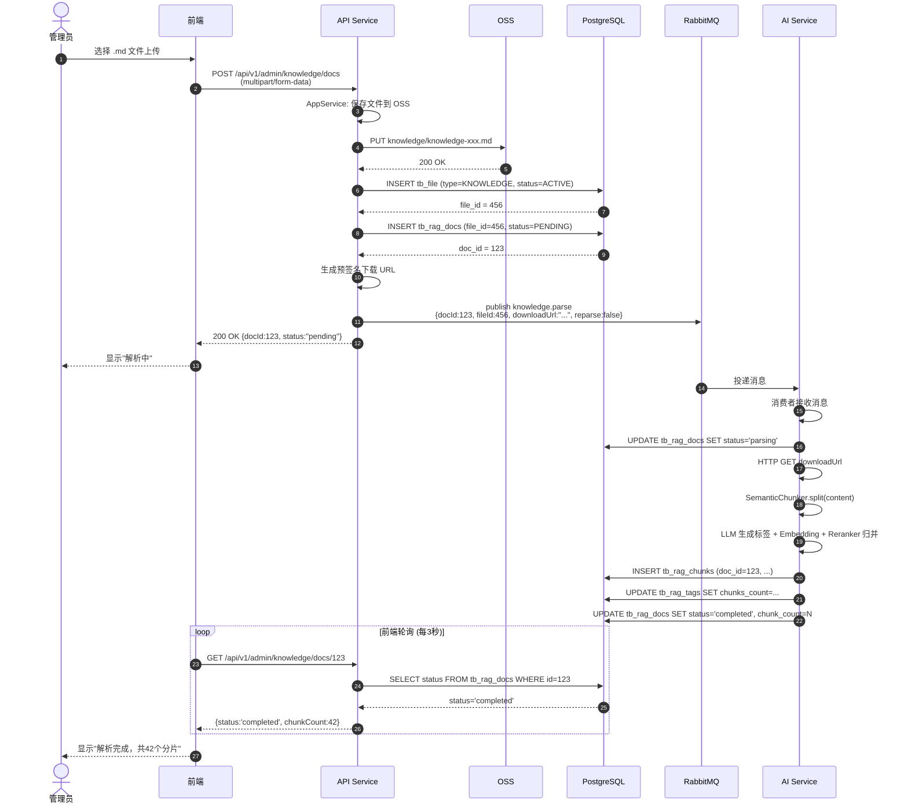
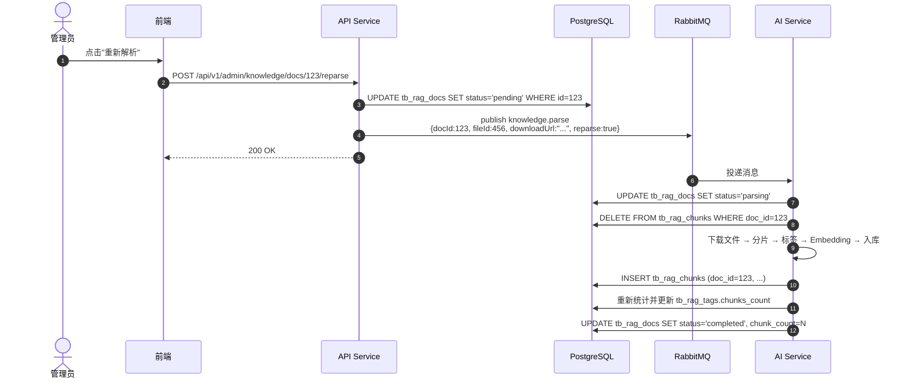
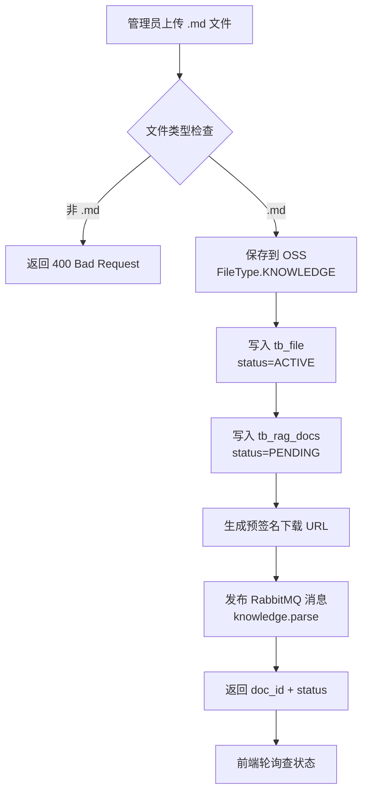
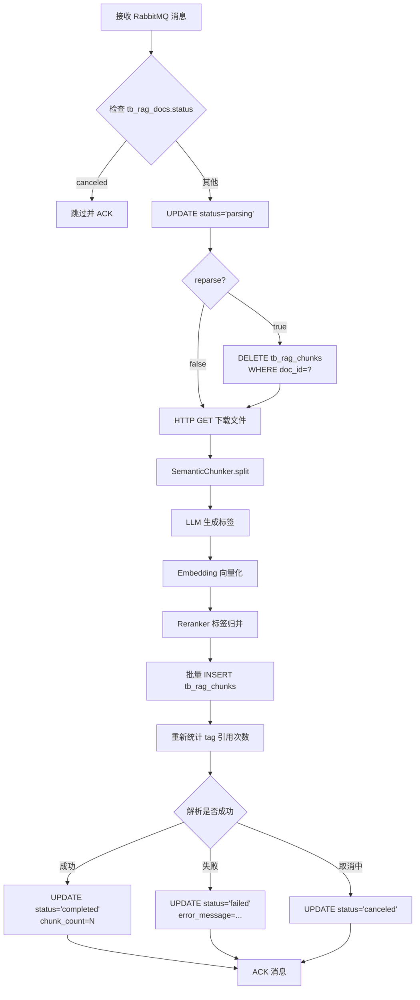
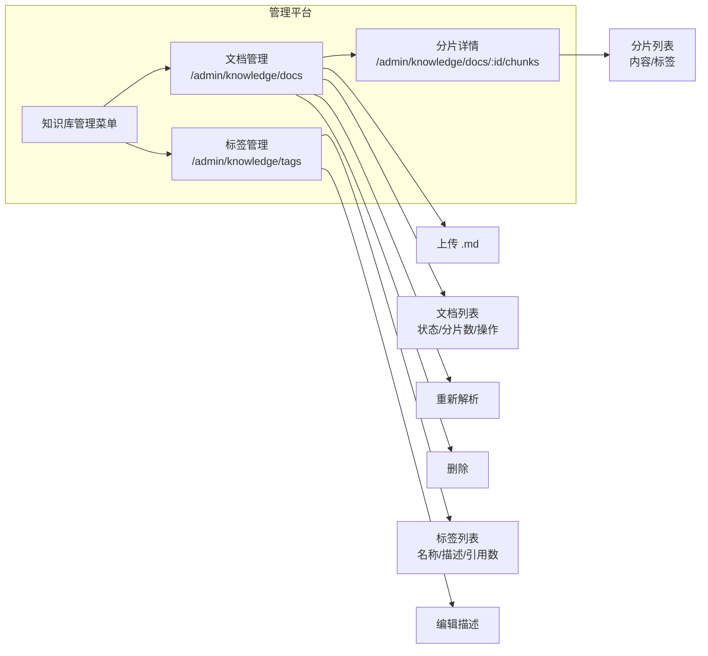

## Context

当前 AI 客服（RagAgent）的知识库由离线脚本 `load2db_pipeline.py` 维护，从本地 `docs/ai-knowledge-base` 目录读取 markdown 文件，经 `SemanticChunker` 分片、LLM 生成标签、Embedding 向量化后入库。管理平台没有任何知识库管理能力，管理员无法上传新文档、查看分片内容或管理标签。

本项目后端采用 DDD 分层架构（Controller → AppService → Domain → Infrastructure），前端采用 Next.js App Router + Ant Design 6。AI Service 是独立的 FastAPI 进程，通过 RabbitMQ 与 API Service 解耦。

## Goals / Non-Goals

**Goals:**
- 管理平台支持上传 `.md` 文件并异步解析入库
- 管理平台支持查看文档列表、解析状态、分片详情
- 管理平台支持标签管理（查看、编辑描述）
- 支持重新解析已有文档（覆盖旧分片）
- 解析进度通过数据库状态字段查询，不实时调用 AI Service
- AI Service 通过 RabbitMQ 消费解析任务，零耦合下载文件

**Non-Goals:**
- 不支持 `.txt` / `.pdf` / `.docx` 等其他格式
- 不在 AI Service 中直接访问 OSS 或查询 `tb_file`
- 不引入 Spring ApplicationEvent（有 RabbitMQ 无需领域事件）
- 不实现实时进度推送（前端轮询即可）

## Decisions

### 1. 消息发布放在应用层（AppService）

Controller 只负责接收 HTTP 请求和返回响应。`KnowledgeBaseAppService`（应用层）编排完整的用例流程：保存文件 → 创建文档记录 → 发布 RabbitMQ 消息。Publisher 作为基础设施被 AppService 调用，不侵入领域层。

### 2. 预签名下载 URL 放在消息体中

API Service 在发布消息时生成 OSS 预签名下载 URL（有效期 1 小时）一并发送。AI Service 通过 HTTP GET 直接下载，无需知道 OSS 配置、API Service 地址或 `tb_file` 表结构。低耦合优先，消息堆积问题通过提升消费速度解决。

### 3. AI Service 解析逻辑抽出公共函数

将 `load2db_pipeline.py` 的批量导入逻辑拆分为 `pipeline/document_parser.py` 中的 `parse_single_document()` 函数，供 RabbitMQ 消费者和离线脚本共用。避免新建 `knowledge_consumer.py` 这样的冗余文件，消费者入口放在 `messaging/parse_consumer.py`，只负责收消息和调用解析函数。

### 4. 解析状态直接查数据库

`tb_rag_docs.status` 字段由 AI Service 在解析过程中更新，API Service 的查询接口直接 `SELECT` 返回，不转发请求到 AI Service。前端轮询频率建议 3 秒。

### 5. 枚举值采用小写 ValueEnum

新增 `DocParseStatus` 和 `FileType.KNOWLEDGE` 均实现 `ValueEnum` 接口，数据库中存储小写字符串（如 `"pending"`、`"parsing"`），通过 `ValueEnumTypeHandler` 自动映射。

## Risks / Trade-offs

| Risk | Mitigation |
|------|------------|
| 预签名 URL 在队列中过期 | 设置 1 小时有效期；知识库上传频率低，正常情况下几分钟内即被消费 |
| AI Service 重启丢失正在解析的任务 | RabbitMQ 消息消费后 ACK 才删除；解析中失败会更新 `tb_rag_docs.status = failed`，管理员可手动重试 |
| 大文档解析耗时过长阻塞消费者 | 单消费者单线程顺序消费足够（知识库更新低频）；后续可扩展为多个消费者实例 |
| 重新解析时标签统计不准确 | 每次解析完成后全量重新统计 `tb_rag_tags.chunks_count`，保证一致性 |

## Migration Plan

1. **数据库迁移**：执行 `V18__update_rag_docs_for_knowledge_management.sql`
2. **API Service 启动**：新增枚举、Controller、AppService、Repository、RabbitMQ 配置随 Spring Boot 启动自动生效
3. **AI Service 启动**：新增 RabbitMQ 环境变量，消费者随 lifespan 启动
4. **前端部署**：新增菜单和页面路由
5. **回滚**：删除 Flyway 迁移不现实（已有数据），回滚时停用 Controller 和 RabbitMQ 消费者即可

## Open Questions

- 是否需要限制单个文档的最大大小？（当前 multipart 限制 500MB，但 markdown 通常几 MB 以内）
- 是否需要支持批量上传？（当前设计为单文件上传，后续可扩展）

---

## 时序图

### 文档上传与解析

### 重新解析（覆盖旧分片）

## 流程图

### API Service 文档上传流程

### AI Service 消费者解析流程

### 前端页面路由

