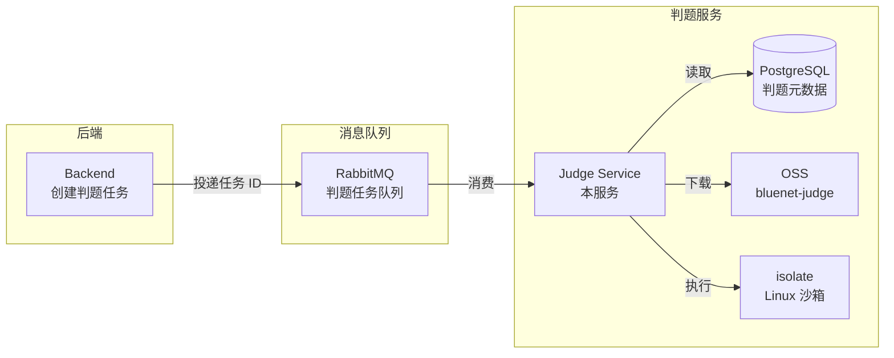

# BlueNet 判题服务

`judge-service` 是一个可独立运行的 Spring Boot 服务，专门负责算法题的测试数据生成和正式判题。它通过 RabbitMQ 消费判题任务 ID，从 PostgreSQL 读取判题元数据，从独立的判题 OSS bucket（`bluenet-judge`）获取测试资产，并在 Linux 沙箱（isolate）中执行代码。

完整的功能使用文档（含管理员配置、Generator 编写规范、考生作答指南）请见 [`docs/05-参考手册/05-03-算法判题指南.md`](../../docs/05-参考手册/05-03-算法判题指南.md)。

## 架构



## 职责

| 工作流 | 说明 |
|--------|------|
| **测试数据生成** | 按配置逐用例运行 generator 生成 `.in` 输入文件，再运行主标准解生成 `.out` 期望输出文件，上传至判题 OSS bucket |
| **Benchmark 测速** | 对各语言标准解在生成的测试数据上多次运行，采集 p95 / 最大耗时和内存峰值，推导建议限时 |
| **正式判题** | 从 OSS 下载测试用例文件，在沙箱中以确认的语言限制运行考生代码，比对 stdout 与期望输出，按权重计算得分 |

## 支持语言

沙箱当前支持：`python` / `python3`、`c`、`cpp` / `c++`、`java`、`javascript` / `js`

## 约束

- 数据库迁移由 `src/backend` 统一管理，本服务所有运行环境必须设置 `spring.flyway.enabled=false`，禁止在启动时创建或修改表结构
- Windows 本地开发可以编译并启动 Spring 服务，但沙箱执行依赖 Linux。启用真实判题前，必须在 WSL2 或 Linux 宿主机上安装 `isolate`

## 环境变量

| 变量 | 说明 | 示例 |
|------|------|------|
| `DATABASE_*` | PostgreSQL 连接配置 | 与后端一致 |
| `RABBITMQ_*` | RabbitMQ 连接配置 | 与后端一致 |
| `MINIO_*` / `OSS_*` | 对象存储连接配置 | 与后端一致 |
| `JUDGE_STORAGE_BUCKET` | 判题专用存储桶名称 | `bluenet-judge` |
| `SANDBOX_ENGINE` | 沙箱引擎 | `isolate` |
| `SANDBOX_PROCESS_LIMIT` | 单次运行最大进程数 | `50` |
| `SANDBOX_WALL_TIME_SECONDS` | 默认 wall-clock 超时秒数 | `10` |
| `SANDBOX_MEMORY_LIMIT_MB` | 默认内存限制 | `512` |
| `SANDBOX_OUTPUT_LIMIT_KB` | 默认输出限制 | `1024` |
| `SANDBOX_NETWORK_DISABLED` | 是否禁用沙箱网络 | `true` |

## Docker 调试

先构建 jar 包，再构建镜像：

```bash
mvn -pl src/judge-service -am -DskipTests package
```

在仓库根目录构建调试镜像：

```bash
docker build -f docker/judge-service.Dockerfile -t bluenet-judge-service:debug .
```

运行容器，暴露 Spring Boot 端口和 JDWP 调试端口：

```bash
docker run --rm --name bluenet-judge-service \
  -p 8090:8090 \
  -p 5005:5005 \
  -e JUDGE_DEBUG_SUSPEND=y \
  -e DATABASE_HOST=host.docker.internal \
  -e DATABASE_PORT=15432 \
  -e DATABASE_NAME=db_blue_net \
  -e DATABASE_USERNAME=postgres \
  -e DATABASE_PASSWORD=000000 \
  -e RABBITMQ_HOST=host.docker.internal \
  -e RABBITMQ_PORT=5672 \
  -e RABBITMQ_USERNAME=admin \
  -e RABBITMQ_PASSWORD=bluenet123 \
  -e STORAGE_PROVIDER=minio \
  -e MINIO_ENDPOINT=host.docker.internal \
  -e MINIO_PORT=7000 \
  -e MINIO_AK=admin \
  -e MINIO_SK=admin123 \
  -e MINIO_USE_SSL=false \
  -e JUDGE_STORAGE_BUCKET=bluenet-judge \
  bluenet-judge-service:debug
```

在 IntelliJ IDEA 中附加远程 JVM 调试：

```text
Host: localhost
Port: 5005
Debugger mode: Attach to remote JVM
```
